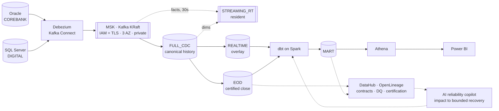
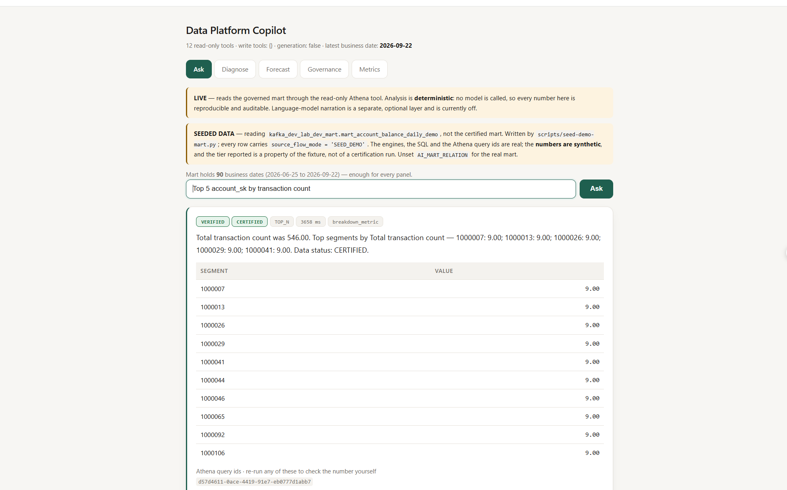
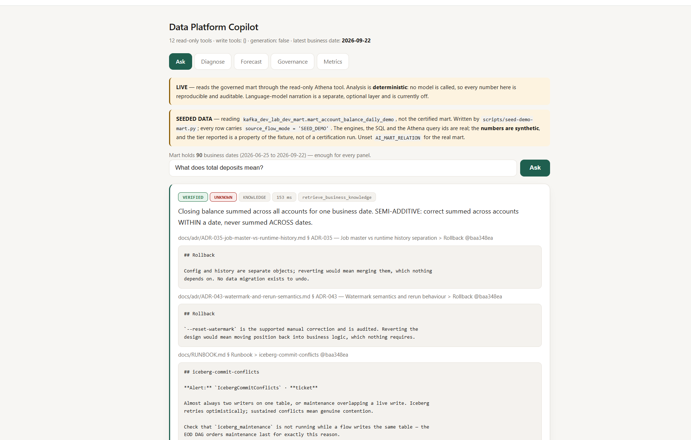
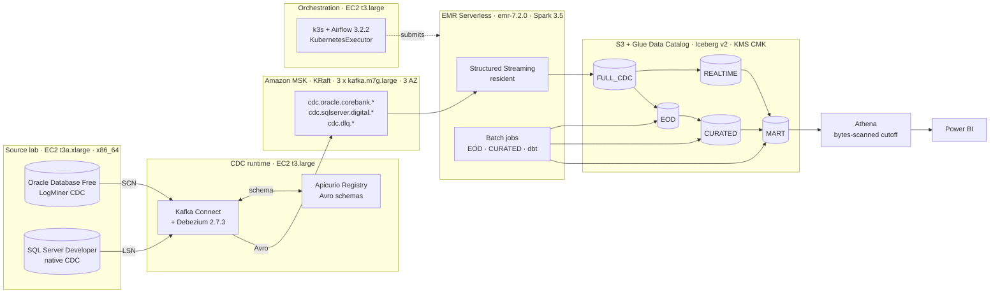

# AWS CDC Lakehouse + Data Reliability Platform

A production-shaped change-data-capture lakehouse on AWS, with a governance, lineage and
bounded-recovery plane on top of it.

Oracle and SQL Server → Debezium → MSK (Kafka, KRaft) → Spark Structured Streaming →
Apache Iceberg on S3 (Glue Data Catalog) → dbt → Athena → BI — plus **DataHub**,
**OpenLineage**, data contracts, data quality, reconciliation, certification, lineage-driven
impact analysis, bounded recovery, and an **AI reliability copilot** that can be asked in
English to investigate a defect and repair only what it actually affected.

**Validated end-to-end in a cost-optimized AWS lab · production-oriented architecture ·
not an operated production system.**

[Architecture](#architecture-at-a-glance) · [Demo](#demo--the-copilot-in-six-screenshots) ·
[Lakehouse layers](#components) · [Governance](#11-data-governance) ·
[AI agents](#the-ai-reliability-copilot) · [Lab vs production](#cost-optimized-lab-vs-production-target) ·
[Design decisions](#engineering-decisions-worth-reading) · [Docs index](docs/README.md)

---

### The one-paragraph version

Change data capture is easy to demo and hard to get right. This platform is built around the
case that actually costs money: **every pipeline is green and the number is still wrong.**
It keeps one canonical CDC history, derives the realtime and end-of-day views as *siblings*
from it, proves each build with data-quality and reconciliation runs before certifying it,
and — when something is wrong — uses column-level lineage to rebuild **only the rows that
actually broke**, behind a human approval gate. An AI copilot drives that in English, reads
its diagnosis from four operational ledgers rather than guessing, and refuses outright on the
six root causes where a rerun would make things worse.

| | |
|---|---|
| **Scale built** | 425 Python files · 14 Terraform modules · 17 Airflow DAGs · 83 ADRs |
| **Scale published** | **194 Python files** — the AI/ML platform, the governance plane and the CDC correctness code · **652 tests passing** · the full decision record ([what is withheld, and why](PORTFOLIO_SCOPE.md)) |
| **Tested** | **3,529 tests passing, 0 failing** · docs validator 14/14 |
| **Governed** | 84 catalogued assets, 100% owned · 81-node lineage graph · 67 column edges |
| **AI surface** | 27 typed tools — 18 read, 7 plan, **2 that may mutate**, closed by name |
| **Cost** | ~$1.40/day running · the entire AI layer and test suite run offline for **$0** |

**If you read one thing:** [`docs/RERUN_ONLY_WHAT_BROKE.md`](docs/RERUN_ONLY_WHAT_BROKE.md) —
the green-pipeline-wrong-number case, end to end, with real output.

**If you have five minutes:** [`docs/PORTFOLIO_OVERVIEW.md`](docs/PORTFOLIO_OVERVIEW.md).

**If you want to judge the engineering:**
[`docs/ENGINEERING_JOURNAL.md`](docs/ENGINEERING_JOURNAL.md) — every defect found, why it was
invisible, and what it changed. It is the most honest file here and the one worth reading
first if you are hiring.

> **Sanitized public copy.** The AWS account id, CLI profile, email and home paths are
> placeholders — see [`SANITIZATION.md`](SANITIZATION.md) for what was replaced and what
> was left out, and [`SECURITY.md`](SECURITY.md) for how to report an exposure. The
> identity guard in `scripts/lib.sh` will refuse to run until you set your own values.
> No credentials appear anywhere in this repository; secrets are read from SSM and
> Secrets Manager at runtime.

## Architecture at a glance



**REALTIME and EOD are siblings of FULL_CDC, not a chain** — the one fact to take from this
diagram. Solid arrows are rows moving; dotted arrows are claims about those rows.

This is the *logical* shape. For the physical one — instance types, the service chosen at
each hop and the alternative rejected — see [AWS architecture](#aws-architecture).

### In detail — the data plane

```text
                              DATA PLANE

  Oracle (corebank)      SQL Server (digital)
        │                        │
        └────────┬───────────────┘
                 ▼
             Debezium  (Kafka Connect, per-table include lists)
                 ▼
          Kafka / MSK  (KRaft, IAM + TLS, 3 AZ, private brokers)
                 ▼
          CDC Normalizer  (decode, validate, canonical key, quarantine)
                 ▼
             FULL_CDC  ◄── canonical, append-only, every I/U/D
              /      \
             /        \
      REALTIME        EOD          ◄── SIBLINGS, never a chain
      (overlay)    (certified close)
             \        /
              \      /
             dbt-Spark
                 ▼
               MART
                 ▼
          Serving / Athena
                 ▼
             Power BI
```

**Two structural facts people get wrong:**

1. **REALTIME and EOD are siblings**, both derived from FULL_CDC. There is no
   `REALTIME → EOD` path. If an EOD number differs from a REALTIME number, the answer is
   never "REALTIME was stale when EOD read it" — EOD never read it.
2. **FULL_CDC is written straight from Kafka.** No intermediate landing layer in the
   reporting path. It is the canonical append-only record and the replay source for
   everything above it.
3. **STREAMING_RT is a third sibling, not a stage.** It takes its *facts* from Kafka
   directly and its *dimensions* from FULL_CDC, so it is fast where it can be and canonical
   where it must be. It feeds its own serving tables — nothing in the certified path depends
   on it. See §5.

---

## Demo — the copilot in six screenshots

<table>
<tr>
<td width="50%"></td>
<td width="50%"></td>
</tr>
<tr>
<td><b>A business question, with its receipts.</b> "Compare total deposits with the previous
day" → <code>757,039,147 VND versus 761,989,193 (day before), −4,950,046 (−0.65%)</code>, in
109&nbsp;ms. Badged <code>VERIFIED</code> and <code>CERTIFIED</code>, and carrying <b>Athena
query ids you can re-run yourself</b>. No model is called: the SQL is compiled from a
governed metric definition, so every number is reproducible.</td>
<td><b>A forecast that shows its work.</b> Six methods backtested over 21 walk-forward points
— <code>ses</code> wins at 13.32% MAPE and is chosen for that reason, not by preference. The
interval is <b>± the backtested error, not a confidence interval from a fitted
distribution</b>: it says how wrong this method usually was <i>here</i>.</td>
</tr>
<tr>
<td></td>
<td></td>
</tr>
<tr>
<td><b>The answer it refuses to fake.</b> Against the real mart — which holds one business
date — the same question returns the value <i>and says the comparison did not happen</i>:
<code>comparison unavailable — the day before has no data; this is a single value, not a
change</code>. Until this was fixed it returned the bare number, badged CERTIFIED, with an
empty <code>limitations</code> list. Every word of that was true and the answer was still
wrong.</td>
<td><b>It reasons about declared metrics only.</b> Each carries its measure, owner,
additivity and the dimensions it may be cut by — and the ones it may <b>not</b>:
<code>blocked: product_code, currency, branch_code, status</code>. A non-additive measure
cannot be decomposed by contribution, so the engine refuses rather than emitting parts that
do not sum to the whole.</td>
</tr>
</table>

<table>
<tr>
<td width="50%"></td>
<td width="50%"></td>
</tr>
<tr>
<td><b>A ranked breakdown, routed without being told.</b> "Top 5 account_sk by transaction
count" → intent <code>TOP_N</code>, tool <code>breakdown_metric</code>, a segment table and
the total it sums to. The copilot picks the <i>tool</i>; it never picks the number.</td>
<td><b>Retrieval over the repository's own ADRs.</b> A definition question answers from the
<b>governed metric registry</b> — <code>SEMI-ADDITIVE: correct summed across accounts WITHIN
a date, never summed ACROSS dates</code> — and cites repo passages <b>pinned to a commit</b>
(<code>@baa348ea</code>), with numeric claims stripped so prose can never become a figure.
Note the <code>UNKNOWN</code> badge: a definition queries no data, so there is no
certification tier to report, and it says so rather than inheriting one.</td>
</tr>
</table>

### The reliability copilot — "green pipeline, wrong number"

<table>
<tr>
<td width="50%"></td>
<td width="50%"></td>
</tr>
<tr>
<td><b>The diagnosis is read, not guessed.</b> Four operational ledgers are queried and the
failing rows printed with their identifiers. <code>0/0 rows</code> is <b>not</b> a pass —
three of those checks examined nothing, so the real finding (<code>1/670</code>) is ranked
above them rather than buried. <i>Unread is never treated as clean.</i></td>
<td><b>A plan, and a gate that holds it.</b> Turn 1 is a quality barrier: the root is
rebuilt, re-checked, reconciled and certified <i>before</i> any descendant runs.
<code>APPROVAL_REQUIRED</code> states its two reasons. <b>Plan built. Not submitted: the
request asked for a plan, not an execution.</b></td>
</tr>
</table>

Narrow it with `--column` and `--keys` and the descendants drop from `COB_DATE` to
`BUSINESS_KEY_SET` — **6 of 16 downstream assets, three keys, not a whole day**. Full
walkthrough: [`docs/RERUN_ONLY_WHAT_BROKE.md`](docs/RERUN_ONLY_WHAT_BROKE.md).

> The first two and the fifth read a 90-date seeded relation (`--seeded`, banner shown); the
> rest read the real certified mart. All are live Athena — see
> [`docs/SEEDED_DEMO_DATA.md`](docs/SEEDED_DEMO_DATA.md).

## Start here

| You are… | Read |
|---|---|
| **reviewing this for a role** | [`docs/PORTFOLIO_OVERVIEW.md`](docs/PORTFOLIO_OVERVIEW.md) — the whole project in five minutes |
| wondering what is *not* here | [`PORTFOLIO_SCOPE.md`](PORTFOLIO_SCOPE.md) — **what is published and what is deliberately withheld**, and the licensing position |
| judging the engineering | [`docs/ENGINEERING_JOURNAL.md`](docs/ENGINEERING_JOURNAL.md) — every defect found, and what each taught |
| looking for real scenarios | [`docs/USE_CASES.md`](docs/USE_CASES.md) — nine, end to end, with actual output |
| going to run it | [`docs/HOW_TO_USE_AND_VERIFY.md`](docs/HOW_TO_USE_AND_VERIFY.md) — every capability, the command, the expected result |
| here for the AI copilot | [`docs/AI_COPILOT_TRANSCRIPTS.md`](docs/AI_COPILOT_TRANSCRIPTS.md) — **real sessions from both copilots, and what each one demonstrates** |
| **"green pipeline, wrong number"** | [`docs/RERUN_ONLY_WHAT_BROKE.md`](docs/RERUN_ONLY_WHAT_BROKE.md) — **how the AI reruns only the affected tables, and refuses when a rerun is wrong** |
| capturing screenshots | [`docs/DEMO_CAPTURE_GUIDE.md`](docs/DEMO_CAPTURE_GUIDE.md) — **24 questions covering every capability, with verified output** |
| running it against real AWS | [`docs/LIVE_MODE_SETUP.md`](docs/LIVE_MODE_SETUP.md) — **what live mode can answer today, and how to get more business dates** |
| want a full series on real Athena | [`docs/SEEDED_DEMO_DATA.md`](docs/SEEDED_DEMO_DATA.md) — **90 seeded business dates in their own relation, never the certified mart** |
| want the full question list | [`docs/AI_COPILOT_SAMPLE_QUESTIONS.md`](docs/AI_COPILOT_SAMPLE_QUESTIONS.md) — 15 questions and what each proves |

---

> **Status — all three checkpoints reached.**
>
> | | |
> |---|---|
> | `DRP12_DATA_RELIABILITY_PLATFORM_PRODUCTION_READY` | 25 PASS · 0 FAIL · 1 N/A |
> | `AIGR12_AI_DATA_RELIABILITY_COPILOT_PRODUCTION_READY` | 27 PASS · 0 FAIL · 1 blocked externally |
> | `AI_DATA_RELIABILITY_CONTEXT_REHYDRATED_READY` | context rehydration document written and current |
> | tests | **3,529 passing, 0 failed** |
> | AWS spend for the metadata + AI programme | **$0** |
>
> Every claim below is scored against live evidence in
> [`docs/validation/`](docs/validation/). Where something has not run, it says so.

### The thing this repository is actually about

Ask it in English:

> *"The BALANCE column in EOD ACCOUNT for COB 2026-09-28 is wrong for A001, A002 and A003.
> Investigate it and repair only the affected downstream data."*

On **2026-09-30** that request ran against real infrastructure and:

- resolved `"EOD ACCOUNT"` against the real 84-asset governance inventory;
- read the real lineage graph — 16 impacted assets, 16 executable;
- read column lineage as **`VALIDATED`** — because a real validation run confirmed
  `BALANCE` exists on the actual table — and narrowed the recovery to that column;
- wrote a real BLOCKER DQ verdict to `ops.dq_result_v2`;
- built a plan where `eod_build` widened to `COB_DATE` and `reporting` kept
  `BUSINESS_KEY_SET` — because those are the scopes **those jobs actually support**;
- took a real approval record with an expiry, executed a real Athena repair through the
  Recovery Control Service, and verified the mart at **1600.0 → 1000.0**, violations 3 → 0.

The LLM never chose any of that. It classifies intent and writes the summary; every value
that could authorize a write came from a tool.

---

## Table of contents

**Read these four and you have the project:**
[Portfolio overview](docs/PORTFOLIO_OVERVIEW.md) (five minutes) ·
[Engineering journal](docs/ENGINEERING_JOURNAL.md) (the defects, and what each taught) ·
[Use cases](docs/USE_CASES.md) (nine scenarios, end to end) ·
[How to use and verify](docs/HOW_TO_USE_AND_VERIFY.md) (every capability, with its command)

- [Architecture at a glance](#architecture-at-a-glance)
- [Demo — the copilot in six screenshots](#demo--the-copilot-in-six-screenshots)
- [Start here](#start-here)
- [Why this project exists](#why-this-project-exists)
- [Key engineering capabilities](#key-engineering-capabilities)
- [The two planes](#the-two-planes)
- [Components](#components)
  - [1. Source systems and CDC capture](#1-source-systems-and-cdc-capture)
  - [2. Kafka on MSK](#2-kafka-on-msk)
  - [3. The lakehouse layers](#3-the-lakehouse-layers)
  - [4. REALTIME — the overlay](#4-realtime--the-overlay)
  - [5. STREAMING_RT — the resident serving layer](#5-streamingrt--the-resident-serving-layer)
  - [6. EOD — the certified close](#6-eod--the-certified-close)
  - [7. CURATED and MART](#7-curated-and-mart)
  - [8. Serving and BI](#8-serving-and-bi)
  - [9. Orchestration](#9-orchestration)
  - [10. The OPS control plane](#10-the-ops-control-plane)
  - [11. Data governance](#11-data-governance)
  - [12. Data lineage](#12-data-lineage)
  - [13. Data quality, contracts and certification](#13-data-quality-contracts-and-certification)
  - [14. Incidents and bounded recovery](#14-incidents-and-bounded-recovery)
  - [15. The AI agent](#15-the-ai-agent)
  - [16. Observability, security and cost](#16-observability-security-and-cost)
- [The AI reliability copilot](#the-ai-reliability-copilot)
- [AWS architecture](#aws-architecture)
- [Cost-optimized lab vs production target](#cost-optimized-lab-vs-production-target)
- [What is and is not proven](#what-is-and-is-not-proven)
- [What you can run here](#what-you-can-run-here)
- [Proving it works — capture guide](#proving-it-works--capture-guide)
- [Engineering decisions worth reading](#engineering-decisions-worth-reading)
- [Selected implementation](#selected-implementation)
- [Documentation](#documentation) · [Full documentation index](docs/README.md)
- [Repository layout](#repository-layout)
- [Licence and provenance](#licence-and-provenance)

---

## Why this project exists

Most CDC demos move rows and stop. The hard part starts afterwards:

> *A pipeline can move rows perfectly and still be wrong, and it can fail to move rows while
> every health check stays green.*

This platform has produced both — an ingest reporting `SUCCESS` with `batches: 0, rows: 0`,
and a "certified" close that had never run a quality check. So the project is built around
the questions that come after the pipeline runs:

| Question | Answered by |
|---|---|
| What is this table, who owns it, what's in it? | **Governance** — derived, not hand-written |
| Where did this number come from? | **Lineage** — with an evidence class per edge |
| Is it right? | **Data quality** — six verdicts, not two |
| Does it agree with the layer below? | **Reconciliation** |
| If it's wrong, what's the smallest safe thing to rerun? | **Impact + bounded recovery** |

---

## Key engineering capabilities

Every row exists for a correctness, operability, governance or cost reason. The third column
is that reason — it is the column worth reading.

| Capability | Implementation | Engineering reason |
|---|---|---|
| CDC capture | Debezium on Kafka Connect, per-table include lists, Avro + Apicurio registry | A schema contract per topic means a source DDL change fails loudly at decode instead of silently changing what a column means |
| Per-key ordering | Topic key is the canonical primary key | The same PK always lands on the same partition; without it, per-key ordering breaks silently and nothing alerts |
| Canonical history | Append-only Iceberg v2 `FULL_CDC` holding every I/U/D with source, Kafka and platform metadata | One replay source for audit, and for rebuilding REALTIME and EOD **independently** of each other |
| Event ordering | Source-native commit SCN (Oracle) and LSN (SQL Server); `source_ts_ms`, partition, offset only as tie-breakers | Arrival order makes two runs disagree about which version of a row is real. Offsets are comparable **within** a partition only |
| Near-real-time state | REALTIME overlay: Airflow-triggered finite Spark on an incremental Iceberg snapshot cursor, two declared shapes | A resident job would hold cluster capacity 24/7 to serve a window that is read for minutes |
| Resident streaming serving | STREAMING_RT: four apps, two of them processes with their own trigger loop | A late dimension is published **flagged** and repaired later, so the fast path's latency is bounded by construction rather than by a retry budget |
| Certified close | EOD: explicit cutoff, dedup by PK, last event by source order, stated delete policy, DQ + reconciliation **before** certification | "Certified" has to mean reproducible, not "the job exited 0" |
| Config-driven onboarding | `cdc/registry/*.yaml` → validation → compiled deterministic plan → provisioning | A new table is a config change, not a new DAG and a new Spark application |
| Orchestration | Airflow 3.2.2 on k3s, `KubernetesExecutor`; a test asserts every `PythonOperator` callable is a registered adapter | Transformation cannot leak out of Spark into a DAG, where it would be untestable and unversioned |
| Dependency truth | dbt manifest plus registered external dependencies, resolved into topological turns | The graph that runs is the graph that was declared; attempt number is not dependency depth |
| Iceberg maintenance | Threshold-driven compaction, manifest rewrite, snapshot expiry, orphan cleanup with a safe retention floor | Streaming tables die of small files; orphan cleanup with too short a retention deletes state a running job still needs |
| Data quality | Six check types, three verdicts, every result appended to `ops.dq_result_v2` | `0/0 rows` is not a pass — a check that examined nothing must not read as clean |
| Reconciliation | Layer-to-layer agreement runs, recorded per build | A layer can be internally valid and still disagree with the one below it |
| Certification ladder | Five tiers, eight gates; a lower tier may never overwrite a higher one | Stops a provisional number being read, and reported, as a final one |
| Lineage | OpenLineage runtime events into a DataHub graph: 81 nodes, 67 column edges, **an evidence class per edge** | A fuzzy column mapping on a critical field is worse than no mapping, because it will be trusted |
| Impact vs execution | DataHub answers *what* is affected; the dbt/Airflow execution graph answers *how* it reruns | Two different questions. Conflating them produces plans that name tables nothing can actually rebuild |
| Bounded recovery | Column lineage narrows a repair to the affected keys; six root causes refuse a rerun outright | On a schema drift or a source-side correction, rerunning the same job makes the data worse |
| AI reliability copilot | LangGraph, 27 typed tools — 18 read, 7 plan, **2 that may mutate** — every plan hashed and held at a human approval gate | Large observation surface, small mutation surface, closed by name rather than by code review |
| Business AI | Metric resolver + safe Athena over MART/SERVING, answers returned as an EvidencePack | Certified numbers come from governed data with query ids attached, never from the model's memory |
| Infrastructure | 14 Terraform modules, each `enable_*` gated with a destroy path; no NAT gateway, SSM instead of SSH, KMS throughout, no static credentials | A lab that cannot be left running by accident, and cannot be accessed by a key that leaked |

---

## The two planes

```text
                    METADATA / GOVERNANCE / RELIABILITY

  Debezium / Kafka Connect metadata ─┐
  Kafka metadata ────────────────────┤
  Spark OpenLineage ─────────────────┤
  Airflow OpenLineage ───────────────┤
  dbt manifest / catalog / run_results┤
  Glue / Iceberg metadata ───────────┤──► DataHub ──► Catalog · Lineage · Governance
  Athena metadata / usage ───────────┤                       │
  Power BI metadata ─────────────────┤                       ├─ Impact
  DQ results ────────────────────────┤                       ├─ Root cause
  Reconciliation ────────────────────┤                       ├─ Column lineage
  OPS execution metadata ────────────┘                       └─ Run lineage
                                                             │
                                                             ▼
                                              DATA RELIABILITY ENGINE
                                                             │
                                 ┌───────────────────────────┼───────────────────────┐
                                 ▼                           ▼                       ▼
                                DQ                   Reconciliation           Certification
                                 └───────────────────────────┼───────────────────────┘
                                                             ▼
                                                         Incident
                                                             ▼
                                                  Lineage Impact Analysis
                                                             ▼
                                                    Recovery Subgraph
                                                             ▼
                                              Airflow topological rerun
                                                             ▼
                                                   DQ + Reconciliation
                                                             ▼
                                                     Re-certification
```

**Read the arrows differently in each plane.** In the data plane an arrow is *rows moving*.
In the metadata plane it is *a claim about those rows*. That distinction is the whole reason
the reliability plane exists.

---

## Components

### 1. Source systems and CDC capture

**Oracle Database Free** and **SQL Server Developer** in containers on a single EC2
instance (no RDS — the two engines on RDS are $1.1620/hr against $0.1888/hr for identical
transaction-log semantics).
Ten captured tables across two engines:

| Source | Schema | Tables |
|---|---|---|
| Oracle `coredb` | `corebank` | account, customer, branch, loan, transaction |
| SQL Server `digital` | `dbo` | app_user, digital_event, channel, merchant, payment_method |

Debezium connectors are **generated from a registry**, not hand-written:
`cdc/registry/sources.yaml` is the single source of truth for every table's primary key,
partition spec, REALTIME shape, EOD policy, DQ rules, maintenance settings and governance
metadata. Adding a table is a config change (ADR-067 … ADR-073).

**A correctness trap this encodes:** Oracle folds unquoted identifiers to uppercase, so
`cdc.oracle.corebank.account` is a topic Debezium never writes to. With
`auto.create.topics.enable=false` the connector reports RUNNING, the topic sits at offset 0,
and every health check stays green. `cdc/naming.py::topic_for` is the one function that knows
the casing rule.

### 2. Kafka on MSK

MSK Provisioned, Kafka 3.9.x **KRaft**, IAM + TLS, three AZs, private brokers, no public
access. Topic key is the canonical primary key, so the same key always lands on the same
partition — without that, per-key ordering breaks silently.

### 3. The lakehouse layers

All Apache **Iceberg v2** on S3, catalogued in **AWS Glue**, queryable from Athena. The
`Rule` column is the contract — it is what makes a rebuild reproduce the original answer.

| Layer | Glue database | Grain | Rule |
|---|---|---|---|
| **FULL_CDC** | `…_full_cdc` | one row per CDC **event** | Written straight from Kafka. Every I/U/D preserved with source, Kafka and platform metadata. Idempotent by `event_id` on rerun. **No business dedup, ever** |
| **REALTIME** | `…_stream` | shape-dependent (§4) and the resident serving tables (§5) | "What is true now." A sibling of EOD, bounded `T-N → T` instead of `<= T-1` |
| **EOD** | `…_snapshot` | one active row per PK per COB | Dedup by PK, keep the last event by `event_order`, cutoff on `source_commit_ts`. Deletes excluded from the active table, kept flagged in `_history` |
| **CURATED** | `…_curated` | conformed entities + Kimball | SCD2 dimensions, a transaction fact and a periodic snapshot fact. Grain and referential integrity validated *before* write |
| **MART** | `…_mart` | business grain | 13 dbt models. **The only layer BI reads** |
| **OPS** | `…_ops` | one row per run / check / incident | Append-only. "Why was COB 28 blocked" is answerable only from records that were later superseded |
| **QUARANTINE** | `…_quarantine` | one row per poison record | Error class, stack hash, source topic/partition/offset, and a reference to the original payload |

Plus `serving` for approved views. A Terraform validation refuses to let any of the seven
layer databases go missing, **by name rather than by count** — a count cannot tell an added
database from a missing one.

#### The ordering key, in precedence order

```text
position_primary   →  Oracle commit SCN (zero-padded)  | SQL Server commit LSN
position_secondary →  Oracle change SCN                | SQL Server event_serial_no
source_ts_ms       →  tie-break
kafka_partition    →  tie-break
kafka_offset       →  tie-break   ← NEVER used for global ordering
```

**The two engines normalise in opposite directions.** An Oracle SCN is numeric, so `'9' > '10'`
as a string: it must be **zero-padded** to a fixed width for string compare to equal numeric
compare. A SQL Server LSN is already fixed-width hex: it must be **validated**, and padding it
would corrupt it. A single "just pad it" helper would silently break one of them. An over-wide
SCN is *refused*, not truncated — truncation reorders history, quietly, forever.

**`kafka_offset` only increases within one partition.** Comparing offsets across partitions is
the classic CDC bug: a higher SCN sitting on a lower offset in a different partition must still
win. Arrival order is never used for ordering, because it makes two runs of the same data
disagree about which version of a row is real.

#### Deterministic event identity

```text
event_id = sha256(f"{topic}:{partition}:{offset}")
```

Replay and backfill are therefore idempotent: reprocessing the same Kafka message produces the
same row, so the MERGE into FULL_CDC is a no-op rather than a duplicate.

→ [`docs/CDC_CONTRACT_IMPLEMENTATION.md`](docs/CDC_CONTRACT_IMPLEMENTATION.md) ·
[`docs/DATA_CONTRACTS.md`](docs/DATA_CONTRACTS.md) ·
[`spark/jobs/l1_stream/ordering.py`](spark/jobs/l1_stream/ordering.py)

### 4. REALTIME — the overlay

Two **shapes**, and they are genuinely different tables (ADR-081, ADR-082):

| Shape | Contract | Write strategy |
|---|---|---|
| `event_window` | every event in a bounded rolling window | `append` on an incremental cursor |
| `latest_state` | one row per business key, deletes as tombstones | `guarded_merge` |

`shape` is the **contract** (what is in the table); `write_strategy` is the **mechanism**.
One word used to answer both, so a consumer asking "may I read this as current state?" had to
know which of three strings implied it.

**The incremental cursor** (ADR-083) reads Iceberg `start-snapshot-id` (exclusive) →
`end-snapshot-id` (inclusive), with the cursor MERGEd into `ops.realtime_info`. Five
untrustworthy-cursor conditions all fall back to a full window scan **with a recorded
reason** — because an incremental read is wrong *silently* when the cursor is stale, while a
full scan is merely expensive.

**EOD-certified rebase** (ADR-085): when a COB certifies, the overlay drops what EOD now
holds, or the same change is counted twice. The rebase DELETEs, so it refuses on six guards
and matches on `dv_event_id` as well as the key.

### 5. STREAMING_RT — the resident serving layer

Section 4 is an Airflow-triggered window. This is the other kind. `spark/realtime/` holds
four applications, and **two of them are processes, not jobs** — they own their own loop and
exit only when told to.

| App | Lifetime | Cadence | Writes |
|---|---|---|---|
| **STREAM** — `rt_stream_app.py` | **long-running** | 30 s micro-batch | `rt_account_stream` + two pointer tables |
| **AUTOCORRECT** — `rt_autocorrect.py` | finite, exits | periodic (ref: 3 h) | `rt_account_base`, resolves pointers |
| **EOD** — `rt_eod_base.py` | finite, exits | nightly | rebuilds BASE, moves the watermark |
| **DATAMART** — `rt_datamart_app.py` | **long-running** | 45 s poll | `rt_datamart_metrics` |

One rule holds the design together: **the stream does not fix its own mistakes.** When a
fact arrives before its dimension, the fast path publishes the row *flagged*
(`dim_complete=false`, dims NULL) and writes a pointer saying what it could not do. A slower
pass rebuilds the dimension from the canonical layer and repairs it. The tempting
alternative — retry inside the micro-batch until the dimension appears — is what makes
streaming pipelines fall over: the retry holds the batch open, backpressure builds, and one
missing dimension becomes an outage.

Four decisions in it are worth more than the pipeline itself:

- **Pointer before row.** If the pointer lands and the row does not, a correction repairs an
  account that was never published — harmless. Reverse it and a failure publishes a
  dim-incomplete row with *nothing* flagging it, and no query can tell.
- **A partial `foreachBatch` failure raises.** Swallowing the exception tells Spark the batch
  succeeded, so it commits the offsets and the rows are gone — not in the target, not in a
  queue, nowhere. The reference system lost ~100K offsets exactly that way.
- **Dedup by event time, not arrival.** The source is a history table, so a retroactive
  correction can arrive *after* the current row. Ordering by Kafka offset would publish a
  stale balance, silently, with every pipeline green.
- **One source materialisation per cycle.** Not a speed trick — it is what makes two sections
  of the same report read the *same instant* of a table that is still being written.

The merge view prefers STREAM for anything newer than the watermark, and BASE otherwise —
with one exception, [RT-1](docs/REALTIME_STREAMING_RT.md#7-rt-1--the-gap-the-first-live-run-exposed-and-how-it-was-closed):
a BASE row also wins when it was *built* after the stream row was *written*, so a repair is
not masked until the next close.

**Run live end to end twice** — 2026-09-03 (6 EMR Serverless jobs, all SUCCESS) and again on
2026-09-06 after a full platform rebuild. The late-dimension loop fired both times, the
repair closed it both times, and the datamart reconciles to the cent:
`2,031,894,187.94 − 2,031,880,937.77 = 13,250.17`, decomposed account by account.

→ [`docs/REALTIME_STREAMING_RT.md`](docs/REALTIME_STREAMING_RT.md) — the design, both live
windows, and the three rules that are easy to get backwards.

### 6. EOD — the certified close

Deterministic function of FULL_CDC and a cutoff: `source_commit_ts < T00:00`, dedup by PK,
last event by source order, delete policy applied explicitly. Re-runnable and reproducible —
which is what "certified" has to mean.

**A COB close sees only events dated to that COB** (an `event_date` partition prune of ±1 day
around the cutoff, on top of the timestamp filter). A close that certifies `rows=0` usually
means the event dates, not a broken close.

### 7. CURATED and MART

**CURATED** (`kafka_dev_lab_dev_curated`, 20 tables) — conformed entities projected out of
the EOD payload, plus a Kimball layer: SCD2 dimensions, a transaction fact, a periodic
snapshot fact, conformed date/time/currency dimensions.

**MART** (`kafka_dev_lab_dev_mart`, 13 dbt models) — `mart_customer_360_daily`,
`mart_account_balance_daily`/`_monthly`, `mart_account_risk_daily`,
`mart_channel_engagement_daily`, `mart_channel_performance_daily`,
`mart_transaction_monitoring_10m`, plus staging and intermediate models.

`reporting/curated/entities.yaml` is the conformance contract — and because the job *reads*
it, it also yields **column-level lineage through a non-SQL transformation**.

### 8. Serving and BI

Athena is the core engine (workgroup with a bytes-scanned cutoff and output lifecycle).
Redshift Serverless and Trino exist as feature flags, default off, never both at once. BI
never reads FULL_CDC or REALTIME — only marts or approved serving views.

### 9. Orchestration

**Airflow 3.2.2 on single-node k3s** (`t3.large`, 2 vCPU / 8 GiB), with `KubernetesExecutor`.
The Helm chart is pinned to **1.22.0**, whose `appVersion` is 3.2.2, and the image tag is
pinned to that same `appVersion` rather than to the newest Airflow on PyPI — the chart is
tested against its own `appVersion`, and pushing a newer image past it is how a cluster comes
up green and fails on the first real task. The chart **tarball's SHA-256 is recorded and
verified**, because a chart that resolves to a different artifact than the one reviewed is
not the chart that was reviewed.

| | |
|---|---|
| Executor | `KubernetesExecutor` — one pod per task, no idle worker fleet. Not `CeleryExecutor`: a Celery pool is a 24/7 cost for a platform whose work is bursty, and not `CeleryKubernetesExecutor`, which is the old name for a hybrid nobody here needs |
| Runtime | k3s `v1.36.3+k3s1`, pinned exactly — resolved from the stable channel, never `latest` |
| Metadata DB | Postgres container on a PVC. Adequate for a lab, and named as the first thing production-like deployment would move to RDS |
| Access | SSM port-forward. The web UI is never exposed, and there is no ingress |
| DAGs | **17**, across 13 files — 4 of them produced by a shared factory in `reporting_common.py` |

**DAGs are orchestration only, and a test enforces it.** Every `PythonOperator` callable must
be a registered coordination adapter; a DAG cannot grow a transformation. That check exists
because transformation inside a DAG is untestable without Airflow, unversioned against the
data contract, and invisible to lineage — three different failures from one convenience.

Spark work is submitted as an **external job** with a run ID, a timeout, retries, and the
business date and cutoff passed as parameters. The DAG never computes a date for itself: a
self-computed date makes a rerun produce a different answer than the original run, which is
the one thing a rerun must not do.

**Five processing flows** — `EOD`, `AUTO_CORRECT`, `FULFILL`, `STREAM_BATCH`, `STREAMING_RT`.
The last is *supervised* rather than scheduled (§5): scheduling a resident stream starts a
second consumer of the same topics, and two writers sharing a checkpoint corrupt it.

Policy is explicit rather than defaulted: `catchup=False` and `max_active_runs=1` on the
scheduled DAGs, with pools and concurrency set per flow. Catchup left on is how one paused
weekend turns into forty concurrent backfill runs against the same tables.

→ [`docs/AIRFLOW_K8S.md`](docs/AIRFLOW_K8S.md) ·
[`docs/REPORTING_ORCHESTRATION.md`](docs/REPORTING_ORCHESTRATION.md) (turns, gates, same-turn
parallelism) · [`docs/DEPENDENCY_ORCHESTRATION.md`](docs/DEPENDENCY_ORCHESTRATION.md)

### 10. The OPS control plane

Fourteen live Iceberg tables in `kafka_dev_lab_dev_ops` — `eod_run`, `eod_info`,
`realtime_run` (31 columns), `realtime_info`, `streaming_batch_ledger`, `streaming_app_state`
and more. **This is the operational truth**: what actually ran, with what cursor, producing
how many rows.

Plus five reliability ledgers added by this programme: `dq_result_v2`,
`reconciliation_run`, `data_incident`, `recovery_plan`, `recovery_execution`. All
append-only — *"why was COB 28 blocked"* is answerable only from the records that were later
superseded.

### 11. Data governance

**84 assets, 100% owned**, derived from config rather than hand-maintained.

The design is a direct response to a measurement: an audit found a careful, well-argued,
hand-written registry describing **12 datasets of which 1 existed**, while **72 of 73** live
tables carried no owner, classification, retention or SLA. The file had a header arguing
against exactly that failure.

```bash
python3 -c "import sys; sys.path.insert(0,'.'); \
  from cdc.governance_plan import compile_inventory; i=compile_inventory(); \
  print(i.config_version(), i.coverage()); [print(' ',f) for f in i.findings]"
# gv1:3d3914603e0fd5a4 {'assets': 84, 'owned': 84, 'owned_pct': 100.0} …
```

| | |
|---|---|
| Inheritance | global → domain → source → asset, with **provenance** per field |
| Accumulate vs override | `tags`, `glossary_terms`, `pii_fields` **accumulate**; scalars override |
| Classification | 54 confidential, 30 internal — one home, refused anywhere else |
| PII | 35 assets, **categorised** (financial 27, pseudonymous 16, direct identifier 14, behavioural 5) |
| Glossary | Git-controlled; an unknown term **fails the compile** |
| Retention | a governance *band* checked against the executable *number* |

**A rule that fired 15 times on real config:** `pii_requires_classification` — `account`,
`transaction` and `digital_event` declared PII while classified `internal`. The masking views
and the AI deny list read *classification*, not the PII list, so those columns were marked and
unprotected.

### 12. Data lineage

**81 nodes, 80 edges, 67 column edges, 0 cycles, 0 audit findings** — and one authority per
segment, with an **evidence class** on every edge:

| Class | Meaning | May a recovery act on it? |
|---|---|---|
| `observed` | a runtime emitted an event for this run | **yes** |
| `derived` | computed from the producer's own artefact | **yes** |
| `declared` | asserted from config; no telemetry | **no — plan only** |
| `absent` | no edge at all | — |

The eight-hop chain resolves, source column to certified mart:

```
src:oracle.coredb.corebank.account → topic:cdc.oracle.COREBANK.ACCOUNT
  → full_cdc:… → eod:… → curated:banking_account
  → curated:fact_account_daily_snapshot → mart:stg_… → mart:mart_account_balance_daily
```

Published to DataHub and verified in its own graph index: **18 assets downstream of the
Oracle source, the mart at hop 7**, with REALTIME and EOD appearing together at hop 3.

**Column lineage is prioritised, not universal.** A fuzzy mapping on a critical field is worse
than none, because it looks authoritative and stops the investigation.

### 13. Data quality, contracts and certification

**Six verdicts, not two:**

| Status | Blocks a certified publish? |
|---|---|
| `PASS` / `WARN` / `SKIPPED` | no |
| `FAIL` / `ERROR` / **`NOT_EVALUATED`** | **yes** |

`SKIPPED` ("we chose not to look") and `NOT_EVALUATED` ("we looked and there was nothing")
are kept apart deliberately — a uniqueness query returning zero rows means *no duplicates* if
the table has data and **nothing at all** if it is empty.

**Four severities, because there are four behaviours:**

| | certify | advance watermark |
|---|---|---|
| `BLOCKER` | no | **no** — snapshot marked INVALID |
| `ERROR` | no | yes |
| `WARN` / `INFO` | yes | yes |

**The publish gate:** `transform → commit → DQ → reconciliation → certification → watermark`.
The commit happens first and is not undone, so a BLOCKER marks the snapshot invalid and holds
the watermark. Deleting it would destroy the evidence; advancing would let the next run start
from a corrupt partition.

**The certification ladder** — `CERTIFIED > RECONCILED > PROVISIONAL_CORRECTED >
PROVISIONAL_NRT > REALTIME`, with eight gates. A lower tier may never overwrite a higher one.

> **A Spark job exiting 0 is not certification.**

### 14. Incidents and bounded recovery

```
DQ / recon FAIL → incident → lineage impact → blast radius
  → intersect with REGISTERED EXECUTABLE JOBS → topological plan → policy gate
    ├─ AUTO ─────────────────────────────────────┐
    └─ APPROVAL                                  │
                                                 ▼
  repair root → DQ + recon → root CERTIFIED → rerun affected descendants only
    → DQ + recon → re-certify → incident closed
```

Ten conditions must all hold for automatic recovery. Two of them are not theoretical:
**no source-system write** and **no offset or checkpoint reset** — on 2026-09-29 a checkpoint
outlived its MSK cluster and the ingest reported `SUCCESS` with zero rows; a recovery
permitted to reset checkpoints would have *hidden* that.

**DataHub can never execute a job.** The planner resolves each affected node to a
pre-registered job id; anything that does not resolve becomes an operator decision. Metadata
is untrusted execution input.

On the real graph an EOD defect impacts 14 assets across 6 turns and comes back
**REQUIRES_APPROVAL**, because a `declared` edge (a Kimball fact producer that exists only in
Python) is on the path. That refusal is the system working.

### 15. The AI agent

A LangGraph business-insights agent over the certified marts: Athena tool, analytics
registry, a knowledge corpus built from the docs and ADRs, and a guard layer that enforces
the same classification rules as the rest of the platform — BI-readability is decided by the
governance registry, not by the model.

### 16. Observability, security and cost

**18 metrics, 7 SLOs (3 enforceable, 4 proposed), 6 alerts.** Two rules in code: a `measured`
target must cite its evidence, and a **PAGE may not rest on a `proposed` target**. Every alert
declares a `group_by` — an alert storm is one condition arriving as fifty.

**Security invariants** (enforced and tested): no static credentials anywhere; no IAM users or
access keys; no `0.0.0.0/0` inbound; no SSH or key pairs (SSM Session Manager only); S3 Block
Public Access + KMS + TLS-only bucket policy; secrets from SSM SecureString at runtime; every
version pinned with a verified checksum.

**Cost posture:** `lab_low_cost` by default. No NAT Gateway. No RDS. EMR Serverless with
auto-stop and a job timeout. Athena with a bytes-scanned cutoff. The whole reliability
programme cost **$0** in AWS — DataHub runs locally on demand, and every ingestion recipe
defaults to a file sink so phases progress with nothing running.

---

## The AI reliability copilot

`ai/reliability/` — a governed agent that can start a bounded recovery, and cannot do
anything else.

### The rule the whole design enforces

> The LLM decides what the user **meant**. It never decides whether data is correct, what is
> affected, or that a repair worked.

Dataset URNs, job ids, DAG ids, SQL, Kafka offsets, Iceberg snapshots, SCN/LSN, business
keys, certification status — all come from tools. None is ever produced by a model.

### The mutation surface is closed by name, not by review

`ToolSpec` used to refuse every mutating tool in code (ADR-057). **ADR-092** replaces that
with one class, `recovery_submit`, whose membership is a frozenset of exactly two names.

```python
MUTATING_TOOLS = frozenset({"submit_recovery_plan", "request_recovery_cancel"})
```

`run_shell`, `execute_sql`, `trigger_any_dag`, `reset_kafka_offset`, `delete_checkpoint`,
`delete_s3`, `terraform_apply`, `spark_submit` **cannot be constructed** — twelve tests
assert each raises at construction, not at review.

Why membership rather than behaviour: a reviewed surface grows. `retry_job` is reasonable.
`clear_task` is reasonable. `refresh_partition` is reasonable. Each is defensible alone and
the aggregate is an agent that can do anything. Adding a mutation here is an ADR amendment.

And note what `submit_recovery_plan` takes:

```python
submit_recovery_plan(plan_id, approval_id, idempotency_key)   # and nothing else
```

No job, no DAG, no SQL, no scope, no date. **The agent cannot describe the work** — only
submit something a deterministic planner built and a policy gate approved.

### Two questions this design refuses to conflate

```
column lineage      →  WHICH jobs are affected     (dependency selection)
RecoveryCapability  →  WHAT a job can recompute    (execution granularity)
```

Knowing only `BALANCE` is wrong does **not** mean Spark can rewrite one column. It means
fewer jobs run — each at the narrowest scope it declares. In the live run that produced a
single plan where one job rebuilt a whole COB and another rebuilt three keys.

### Six causes where a rerun is the wrong answer

14 root-cause categories, each with a disposition. 8 are recoverable; the six that block
recovery outright:

| category | why a rerun is wrong |
|---|---|
| `BAD_SOURCE_VALUE` | rebuilding reproduces the bad value; the platform must never write the source |
| `MISSING_SOURCE_EVENT` | there is nothing to rebuild from |
| `SCHEMA_DRIFT` | the contract changed; a rebuild under the old shape is not a repair |
| `TRANSFORM_LOGIC_DEFECT` | the same code produces the same wrong answer, more expensively |
| `DQ_RULE_DEFECT` | the data may be correct; repairing it repairs the wrong thing |
| `UNKNOWN` | nothing has been established; rebuilding destroys the evidence |

The last two were **inexpressible** before this work — both mapped onto classes the platform
treated as repairable by rerun.

### Try it — a CLI and a browser UI

```bash
python3 scripts/reliability-ui.py        # -> http://127.0.0.1:8899   (15 sample questions)
scripts/reliability-ask.py --samples     # the same list, runnable in the terminal
scripts/reliability-ask.py "Who owns EOD ACCOUNT?"
```

> Restart the UI after changing anything under `ai/reliability/` — Python does not
> hot-reload, and a stale page looks exactly like a bug that was already fixed.

Both are **read-only and plan-only**: neither wires a Recovery Control Service, so no
question asked through them can change data. Running a recovery is a separate, explicit act
(`scripts/ai-recovery-drill.py --execute`).

The one to try first:

```
A duplicate CDC event doubled the BALANCE column in EOD ACCOUNT for COB 2026-09-28
on accounts A001, A002 and A003. Investigate and repair only the affected downstream data.
```

```
intent      INVESTIGATE
asset       eod:oracle_coredb_corebank_account   owner=my-aws-profile
column      BALANCE  confidence=VALIDATED   <- may narrow the recovery
plan        turn 0  eod_build   EOD_REBUILD  COB_DATE          eod:...corebank_account
            turn 1  reporting   MART_RERUN   BUSINESS_KEY_SET  ...curated.banking_account
policy      AUTO_EXECUTE_ALLOWED
```

**The refusals are the interesting half.** `Fix it` refuses (nothing resolved). `EOD` refuses
(ambiguous, and it names the candidates). `EOD ACCOUNT for 2026-09-28 is wrong` returns
**UNKNOWN** — *wrong* is a symptom, not a cause, and UNKNOWN authorizes nothing. A source
defect returns `WAITING_SOURCE_CORRECTION`; a transform bug returns `CODE_FIX_REQUIRED`.

Full list with expected output:
[`docs/AI_COPILOT_SAMPLE_QUESTIONS.md`](docs/AI_COPILOT_SAMPLE_QUESTIONS.md)

### Honest limits

- **Bedrock is gated at the account level** — *"Model use case details have not been
  submitted"*. Two invocations succeeded before the gate applied, so the wiring is proven
  and the entitlement is not. Intent falls back to a deterministic rule and narration is
  skipped; **nothing about correctness depends on the model**.
- **28 of 67 column edges are `VALIDATED`** — confirmed against real data, not relabelled.
  The other 39 stay `DERIVED` and cannot narrow a recovery: dbt `int_*`/`stg_*` models are
  ephemeral, and some EOD tables are empty so their `payload_after` keys cannot be read.
- 8 of 19 governance use cases are modelled rather than tested, and 4 are not built. Each is
  labelled in [`docs/AI_GOVERNANCE_USE_CASES.md`](docs/AI_GOVERNANCE_USE_CASES.md).

Detail: [copilot target](docs/AI_DATA_RELIABILITY_COPILOT_TARGET.md) ·
[action boundary](docs/AI_AGENT_ACTION_BOUNDARY.md) ·
[tool catalogue](docs/AI_AGENT_TOOL_CATALOG.md) ·
[safety matrix](docs/validation/AI_RECOVERY_SAFETY_MATRIX.md) ·
[live E2E](docs/validation/AI_DATA_RECOVERY_E2E.md) ·
[final review](docs/validation/AIGR12_FINAL_REVIEW.md)

---

## AWS architecture

### The physical topology



Access to every box above is **SSM Session Manager**. There is no SSH, no key pair, no
bastion and no inbound rule from `0.0.0.0/0` anywhere.

### Why each service, and why not the obvious alternative

The second column is the one worth reading — a service chosen without a rejected alternative
is a default, not a decision.

| Service | What it runs here | Why not the alternative |
|---|---|---|
| **MSK Provisioned** | `3 × kafka.m7g.large`, KRaft, 20 GiB EBS per broker, IAM auth + TLS, private brokers across 3 AZ | MSK Serverless gives no KRaft control; self-managed Kafka on EC2 is far cheaper but throws away IAM auth and managed brokers, which are the point |
| **EC2 source lab** | `t3a.xlarge`, Oracle Database Free + SQL Server Developer in containers, bound to the private IP only | RDS for both engines is **$1.1620/hr against $0.1888/hr — 6.2×** for identical transaction-log semantics (ADR-032). AMD `t3a` is 10.6% cheaper than `t3` for the same x86_64 the Oracle image requires |
| **EC2 CDC runtime** | `t3.large`, Kafka Connect + Debezium + Apicurio co-located | MSK Connect cannot run Apicurio; separate hosts double the cost for one lifecycle (ADR-002) |
| **EMR Serverless** | `emr-7.2.0` (Spark 3.5), ARM64, auto-stop, max capacity and per-job timeouts | EMR on EC2 bills a cluster 24/7; Glue ETL costs more per DPU-hour for the same Spark |
| **S3** | One lake bucket: Iceberg v2 + Parquet, KMS CMK, Block Public Access, bucket-owner-enforced, TLS-only policy | — |
| **Glue Data Catalog** | Eight databases, 78 tables | A Hive metastore needs a server to keep running; Glue is serverless and free at this size |
| **Athena** | Workgroup with a bytes-scanned cutoff and an output lifecycle | **No idle cost** — it bills bytes scanned, so an unused engine costs nothing |
| **k3s on EC2** | `t3.large` (2 vCPU / 8 GiB), Airflow 3.2.2, `KubernetesExecutor` | EKS is ~$73/month for the control plane alone before a single node. k3s demonstrates the same executor behaviour; EKS stays a feature flag with a destroy path |
| **KMS** | One CMK for the lake | $1/key-month. The Terraform state bucket uses free SSE-S3 instead (ADR-030) |
| **VPC endpoints** | S3 + DynamoDB (Gateway, free), Glue (Interface) | Twelve interface endpoints would be **~$341/month — 11× the entire budget** |
| **NAT Gateway** | **none** | ~$32/month plus data processing, for egress a private lab does not need (ADR-022) |
| **SSM Parameter Store / Secrets Manager** | Every credential, read at container and job start | A password in user-data is a password in the instance metadata, readable by anything on the host |

### The lake, physically

Eight Glue databases: the seven layer databases a Terraform validation refuses to let you
drop — `stream`, `full_cdc`, `snapshot`, `curated`, `mart`, `ops`, `quarantine` — plus
`serving`. The validation checks them **by name, not by count**: a count cannot tell an added
database from a missing one, and a missing `full_cdc` means the ingest job creates it
implicitly in the wrong place and nothing surfaces until reconciliation disagrees.

```
s3://<lake-bucket>/
├── warehouse/{stream,full_cdc,snapshot,curated,mart,ops,quarantine}/
├── checkpoints/            ← Spark streaming state. NEVER under warehouse/
├── query-results/athena/   ← 7-day lifecycle
├── quarantine-payloads/    ← 30-day
├── dq-results/             ← 30-day
├── logs/{airflow,emr-serverless}/   ← 3-day
└── bootstrap/{source-lab,cdc-runtime}/
```

`checkpoints/` sits beside `warehouse/`, never inside it. Iceberg's `remove_orphan_files`
walks table locations and deletes what no snapshot references — which is exactly what a
streaming checkpoint looks like to it. The stream app refuses to start if its checkpoint
path contains `/warehouse/` rather than trusting anyone to remember.

### Infrastructure as code

**Terraform 1.15.8, 14 modules**, every one behind an `enable_*` flag with a destroy path:

```
vpc_endpoints   data_lake      lake_iam        glue_catalog    athena
kafka_platform  cdc_runtime_ec2  source_lab_ec2  emr_serverless
airflow_k3s     reporting_ops  ai_runtime      ai_knowledge    budget_guardrails
```

Every resource carries `Project`, `Environment`, `ManagedBy`, `Owner`, `CostCenter` and
**`AutoDestroyAfter`** — the last one exists so a forgotten lab is visible rather than
expensive. `budget_guardrails` filters on the project tag, so a tag typo means the budget
silently watches nothing; that is why the tag is validated rather than conventional.

Optional, flag-gated and default **off**: Redshift Serverless, Trino, Marquez, Lake
Formation, Glue Data Quality, Bedrock, DataHub. Redshift and Trino may never be enabled at
the same time without an explicit cost approval.

Full inventory, with the three traps that bite on a rebuild:
[`docs/PLATFORM_RESOURCE_INVENTORY.md`](docs/PLATFORM_RESOURCE_INVENTORY.md) · unit prices:
[`docs/PRICE_REFERENCE.md`](docs/PRICE_REFERENCE.md) · the lab/production split:
[`docs/LAB_VS_PRODUCTION.md`](docs/LAB_VS_PRODUCTION.md)

---

## Cost-optimized lab vs production target

This repository is **one architecture deployed two ways**. The code, the contracts and the
correctness rules are identical; the sizing, the availability posture and the lifetime are
not. Saying which one a claim belongs to is the difference between a defensible portfolio
and an overstated one.

| Concern | Cost-optimized lab (what ran) | Production target (designed, not operated) |
|---|---|---|
| Lifetime | Applied, exercised, destroyed inside a metered window | Long-running, with the streaming layer resident |
| Availability | Single-node Airflow, single region, no automated failover | Multi-AZ Airflow, HA metadata store, documented RTO/RPO |
| Kafka | MSK Provisioned, 3 AZ, KRaft, private brokers, smallest viable brokers | Same topology, sized to throughput, with tiered storage for replay depth |
| Compute | EMR Serverless with auto-stop, max capacity and job timeouts | Same, with pre-initialized capacity for the resident streams only |
| Airflow metadata | Postgres container on a PVC | Managed RDS, backed up, with a retention policy |
| Networking | Private subnets, **no NAT gateway**, SSM Session Manager for access | Private subnets with controlled egress; SSM retained in place of SSH |
| Secrets | SSM Parameter Store / Secrets Manager, read at runtime | Unchanged — this one does not scale differently |
| Encryption | KMS CMKs for lake and MSK; TLS-only bucket policies | Unchanged, plus key rotation and separated per-domain CMKs |
| Serving | Athena only (bytes-scanned cutoff, output lifecycle) | Athena for ad-hoc; Redshift Serverless or Trino behind a benchmark gate |
| Governance plane | DataHub run locally, $0 | DataHub deployed privately, with ingestion on a schedule |
| Cost | **~$1.40/day while up**, $0 at rest | A budget decision, not an architecture one |

**What does not change between the two**: the CDC ordering contract, FULL_CDC as the single
canonical history, REALTIME and EOD as siblings, the certification gates, the lineage
evidence classes, and the closed mutation surface on the AI layer. Those are correctness
properties, and a correctness property that only holds at one size was never one.

Detail, with the resource inventory and the three post-rebuild traps:
[`docs/LAB_VS_PRODUCTION.md`](docs/LAB_VS_PRODUCTION.md) ·
[`docs/PLATFORM_RESOURCE_INVENTORY.md`](docs/PLATFORM_RESOURCE_INVENTORY.md)

---

## What is and is not proven

Honesty about evidence is a design principle here, not a disclaimer.

### Proven live

| | Evidence |
|---|---|
| Data plane, end to end | ingest both engines; `REALTIME succeeded=7 incremental=7 rows=5770`; `EOD closed=10 certified=5 rows=3404` **with the readiness gate enforced** |
| Governance compile | 84 assets, 100% owned, deterministic `config_version` |
| Lineage graph | 81 nodes, 0 cycles, 0 audit findings; 8-hop chain resolves |
| DataHub | started, smoke test 9/9, **373 governance + 87 lineage aspects published**, 18-asset multi-hop traversal confirmed in GMS |
| Reliability ledgers | six tables in Glue holding **160 DQ verdicts**, 5 reconciliations, an incident, a recovery plan and a quarantined poison record |
| DQ rules | **35 datasets / 153 checks**, generated from the registry, every one resolving to a live table (was 7 declared / 1 live) |
| DQ execution | 160 real verdicts produced by running those rules against live Glue tables via Athena |
| Incident lifecycle | `inc-b3-proof` advanced **OPEN → PLANNED** with an `AUTOMATIC` plan attached |
| Recovery planning | `rp1:45b21f325ca10ec5` — radius 14, 6 topological turns, all 14 targets resolving to registered entrypoints |
| **Recovery execution** | the **full loop in 96 s** on real Iceberg/Glue/Athena: defect → DQ FAIL → incident → plan → repair → root validated → descendants reran → re-certified → **RESOLVED**, mart sum corrected 80.0 → 60.0 |
| Spark runtime lineage | **12 real OpenLineage events**, Spark 3.5.0, producer string matching the pin |
| Airflow runtime lineage | **DEPLOYED AND EMITTING.** Helm revision 2 runs `airflow-openlineage:3.2.2-ol2.20.2` (provider 2.20.2, `openlineage-python` 1.53.0 — matching the Spark jar pin). A real KubernetesExecutor run emitted `START` + `FAIL` events carrying the DAG's real owner and docstring. Getting here found a config defect that had silently disabled the plugin while every DAG ran green |
| Scenario 1 on EMR | **one correlated run** — `eod-scenario1-cob20`: 320 rows, `dq=PASS recon=PASS status=CERTIFIED`, snapshot `80230069689276128` → `3683870259747946533` |
| Ingestion recipes | **executed** — Glue **493 events** + dbt **248 events** into live DataHub; 147 datasets (they had never run) |
| E2E scenarios | **10 of 10** carry live evidence. Scenario 2 created `ops.dq_quarantine`, which had never existed; scenario 5 proved a late `AUTO_CORRECT` is refused against a `CERTIFIED` day; scenario 6 proved `FULL_FILL` patches unresolved keys without touching the tier |
| Outage behaviour | with DataHub stopped: data flows continue and record `degraded`; metadata flows and impact analysis refuse |
| **AI-driven recovery** | **LIVE 2026-09-30.** A natural-language request resolved a real asset, read real lineage, **refused to narrow on `DERIVED` lineage**, wrote a real DQ verdict, built a capability-aware plan, took a real approval, executed a real Athena repair and verified the mart **1600.0 → 1000.0**, violations 3 → 0 |
| Copilot safety | **52 safety-matrix rows**, 105 AIGR tests, **zero reachable unauthorized mutations**; 8 dangerous tool names cannot be constructed |
| Tests | **3,529 passing** |

### Not proven — stated plainly

| Gap | Why it is not a gate |
|---|---|
| **Bedrock is gated at the account level** — *"Model use case details have not been submitted"* | two invocations succeeded before the gate applied, so the wiring is proven and the entitlement is not. Intent falls back to a deterministic rule; **correctness never depended on the model** |
| 39 of 67 column edges remain `DERIVED` | dbt `int_*`/`stg_*` models are ephemeral and some EOD tables are empty, so nothing can confirm them. They stay unvalidated and **cannot narrow a recovery** — which is the correct behaviour, verified live |
| the `kafka` recipe needs a Python `oauth_cb` for MSK IAM | YAML cannot carry a callable, so `datahub ingest -c kafka.yaml` alone will not authenticate. The mechanism name is now correct; the callback needs a driver script |
| 8 of 19 governance use cases modelled, 4 not built | each labelled in `AI_GOVERNANCE_USE_CASES.md`; the core recovery cases are tested |
| Spark emits the APPLICATION event on EMR but **no dataset events** | OpenLineage and Iceberg load under different classloaders, and EMR Serverless *rejects* the documented cure (`extraClassPath`). Needs a custom EMR image |
| `kafka` / `kafka-connect` recipes need an **in-VPC host** | MSK resolves to private addresses and is unreachable from the workstation — verified by TCP connect. That is security invariant 3 working |
| Production DataHub sizing unmeasured | B9 |
| No Power BI workspace exists in this account | the one N/A gate — a connector with nothing to ingest returns an empty result indistinguishable from a broken one |

**Verdicts**

| Checkpoint | Score | Scoring |
|---|---|---|
| `DRP12_DATA_RELIABILITY_PLATFORM_PRODUCTION_READY` | 25 pass · 0 fail · 1 N/A | [`DRP12_FINAL_REVIEW.md`](docs/validation/DRP12_FINAL_REVIEW.md) |
| `AIGR12_AI_DATA_RELIABILITY_COPILOT_PRODUCTION_READY` | 27 pass · 0 fail · 1 blocked externally | [`AIGR12_FINAL_REVIEW.md`](docs/validation/AIGR12_FINAL_REVIEW.md) |

Both were scored by the same rule, and both returned NOT_READY before they earned READY —
DRP12 twice. A programme whose later phases grade themselves more kindly than its earlier
ones has stopped measuring.

---

## What you can run here

Offline, in seconds, at **$0** — no AWS, no credentials:

```bash
pip install -r requirements.txt

# 652 tests over everything published: the AI copilot's safety surface, the feature
# platform, the governance and contract model, the CDC ordering contract and the
# resident streaming layer.
make test

# The documentation gates: cross-document consistency, then every link and anchor.
make validate-docs
make check-links
```

The platform's remaining tests (3,529 in total) cover the Spark reporting framework, the
DAGs, the dbt models and the Terraform modules, which are not published here —
[`PORTFOLIO_SCOPE.md`](PORTFOLIO_SCOPE.md).

Everything else in this README was run against real AWS and is recorded as **evidence**
rather than as a command to repeat: EMR Serverless job ids, Athena query ids, row counts and
Iceberg snapshot ids live in [`artifacts/`](artifacts/) and
[`docs/validation/`](docs/validation/), and
[`docs/CAPABILITY_MATRIX.md`](docs/CAPABILITY_MATRIX.md) grades every claim by the *kind* of
evidence behind it.

---

## Proving it works — capture guide

For a portfolio, screenshots and a short screen recording are worth more than prose. This
repository ships a script that produces the evidence in a repeatable order:

```bash
bash scripts/capture-evidence.sh            # writes artifacts/evidence/<timestamp>/
```

**Recommended shot list** (about 8 minutes of recording):

| # | Shot | Command | What it proves |
|---|---|---|---|
| 1 | Identity + region | `aws sts get-caller-identity` | the real account |
| 2 | Glue catalogue | `aws glue get-tables …` per database | 78 real tables |
| 3 | Athena query on a mart | Athena console | data is queryable |
| 4 | Governance compile | the Quickstart snippet | 84 assets, 100% owned |
| 5 | Lineage audit | the Quickstart snippet | 81 nodes, 0 cycles |
| 6 | 8-hop lineage path | `LINEAGE_AND_RECOVERY_TEST_GUIDE.md` §1b | source → mart |
| 7 | Column lineage | §1c | `BALANCE → balance`, derived |
| 8 | **DataHub UI** | `datahub-local.sh up --execute`, then `localhost:9002` | catalogue, ownership, lineage graph |
| 9 | Impact analysis | §4 | 14 impacted, 14 executable |
| 10 | Recovery refusal | §5 | `REQUIRES_APPROVAL` + the reason |
| 11 | Ledgers in Athena | §3 | a real DQ FAIL and an open incident |
| 12 | Full test suite | `make test` | 3,301 passing |

Shot 8 is the one that lands: the DataHub lineage graph showing the Oracle source flowing all
the way to the mart, with owners and tags on the nodes.

> **Note.** The capture script collects terminal output and JSON evidence. It cannot record
> video or take screenshots — run the commands and record your own screen.

---

## Engineering decisions worth reading

90 ADRs. The ones that carry the most weight:

| ADR | Decision |
|---|---|
| [ADR-082](docs/adr/ADR-082-realtime-shape-and-write-strategy.md) | `shape` (contract) and `write_strategy` (mechanism) replace one overloaded word |
| [ADR-083](docs/adr/ADR-083-realtime-incremental-cursor.md) | an incremental cursor that falls back to a full scan on five untrustworthy conditions |
| [ADR-085](docs/adr/ADR-085-realtime-eod-certified-rebase.md) | rebasing the overlay onto a certified close — and a timezone defect found by a test |
| [ADR-086](docs/adr/ADR-086-stream-batch-declares-its-cdc-sources.md) | a mart served a stale number while looking healthy; the link is now declared and checked |
| [ADR-087](docs/adr/ADR-087-datahub-primary-metadata-plane-and-openlineage-runtime.md) | DataHub as the metadata plane — and why the catalogue must be *derived* |
| [ADR-088](docs/adr/ADR-088-governance-is-derived-and-the-ladder-gains-a-realtime-tier.md) | governance derived from config; the ladder could not number a tier 0 |
| [ADR-089](docs/adr/ADR-089-metadata-plane-modes-and-one-urn-per-table.md) | three plane modes, one URN per table, fabric enforced on every emit |
| [ADR-090](docs/adr/ADR-090-lineage-identity-is-carried-not-inferred.md) | identity is **carried**, never inferred — inference drifts in two codebases |

**Defects found by running it, not by reading it** — a recurring theme worth stating:

- `SELECT * EXCEPT (…)` is Databricks SQL; Spark 3.5 rejects it. `latest_state` had never run.
  Invisible because tests asserted on generated SQL *text*.
- A timestamp collected into Python renders in the **driver's** zone; formatting it back into
  SQL shifted a rebase cutoff by the driver's offset.
- An ingest reporting `SUCCESS` with `batches: 0` — a checkpoint that outlived its cluster.
- The first live DataHub publish found three schema defects in fifteen minutes that 48 offline
  tests had not, because a recording transport accepts any dict.
- A lineage traversal run seconds after a publish reached **3** assets; minutes later, **18**.
  It does not fail — it under-reports, confidently.

---

## Selected implementation

The AI/ML platform, the governance plane and the CDC correctness code are published in full —
194 modules. The Spark reporting framework, the Airflow DAGs, the dbt models, the Terraform
modules and the operator tooling are not; see [`PORTFOLIO_SCOPE.md`](PORTFOLIO_SCOPE.md).

These are the files to open first, because each carries a decision that is expensive to get
wrong and invisible when it is wrong.

| File | Why it is worth reading |
|---|---|
| [`spark/jobs/l1_stream/ordering.py`](spark/jobs/l1_stream/ordering.py) | Source-position normalisation: how an Oracle SCN and a SQL Server LSN become one comparable `event_order`, and why offsets are only valid inside a partition |
| [`spark/jobs/l1_stream/envelope.py`](spark/jobs/l1_stream/envelope.py) | The Debezium envelope → L1 row contract, including what happens to a record that cannot be decoded (it is quarantined, not dropped) |
| [`spark/snapshot/build_snapshot.py`](spark/snapshot/build_snapshot.py) | The snapshot: an explicit cutoff, dedup by PK, last event by source order, and deletes handled by a stated policy rather than by accident |
| [`spark/eod/window.py`](spark/eod/window.py) | The EOD cutoff window and the late-arrival sweep — the two together are what make a close reproducible |
| [`spark/realtime/rt_common.py`](spark/realtime/rt_common.py) | Event-time dedup, and the watermarked BASE/STREAM merge written in plain Python so its semantics are testable without a warehouse |
| [`cdc/compile.py`](cdc/compile.py) | The config compiler: YAML in, a deterministic plan out. Two compiles of the same registry produce identical bytes, which is what makes the plan reviewable |
| [`cdc/impact.py`](cdc/impact.py) | Lineage-driven impact analysis and the recovery planner. It plans; it never executes — the separation is the safety property |
| [`ai/reliability/model.py`](ai/reliability/model.py) | The typed root-cause taxonomy, bounded scope and execution capability. The six categories that refuse a rerun are data here, not a branch in a prompt |
| [`ai/reliability/policy.py`](ai/reliability/policy.py) | The deterministic policy gate that decides auto-approve, require-approval or refuse — before the LLM sees anything |
| [`ai/agent_tools/contract.py`](ai/agent_tools/contract.py) | The central tool contract every tool passes through, and which none can opt out of. This is where "2 of 27 may mutate" is actually enforced |
| [`spark/tests/test_ordering.py`](spark/tests/test_ordering.py) · [`spark/tests/test_realtime_rt.py`](spark/tests/test_realtime_rt.py) | The guards, as tests: ordering counter-cases, and the 34 rules of the resident streaming layer |
| [`cdc/registry/`](cdc/registry/) | The source of truth a new table is onboarded by — read one file here and the config-driven claim is either true or it is not |

Narrative walkthrough, file by file, with the invariant each one protects:
[`docs/CODE_WALKTHROUGH.md`](docs/CODE_WALKTHROUGH.md).

---

## Documentation

### AI reliability copilot

| Document | What it covers |
|---|---|
| [`AI_DATA_RELIABILITY_COPILOT_TARGET.md`](docs/AI_DATA_RELIABILITY_COPILOT_TARGET.md) | target architecture and the AI/data boundary |
| [`AI_RECOVERY_CURRENT_STATE_AUDIT.md`](docs/AI_RECOVERY_CURRENT_STATE_AUDIT.md) | what already existed and what had to be extended |
| [`AI_AGENT_ACTION_BOUNDARY.md`](docs/AI_AGENT_ACTION_BOUNDARY.md) | what the agent may and may never do |
| [`AI_AGENT_TOOL_CATALOG.md`](docs/AI_AGENT_TOOL_CATALOG.md) | 27 tools — 18 read, 7 plan, 2 mutating |
| [`AI_RECOVERY_SCOPE_MODEL.md`](docs/AI_RECOVERY_SCOPE_MODEL.md) | scope, capability, root-cause dispositions |
| [`AI_RECOVERY_PLANNER.md`](docs/AI_RECOVERY_PLANNER.md) | how a plan is built, and why nothing impacted may vanish |
| [`RECOVERY_CONTROL_API.md`](docs/RECOVERY_CONTROL_API.md) | the only path from a plan to running work |
| [`AI_RECOVERY_APPROVAL_POLICY.md`](docs/AI_RECOVERY_APPROVAL_POLICY.md) | policy outcomes and approval records |
| [`AI_DATA_RELIABILITY_LANGGRAPH.md`](docs/AI_DATA_RELIABILITY_LANGGRAPH.md) | the bounded graph |
| [`AI_DATA_RECOVERY_RUNBOOK.md`](docs/AI_DATA_RECOVERY_RUNBOOK.md) | operator runbook |
| [`AI_COLUMN_LEVEL_IMPACT_RUNBOOK.md`](docs/AI_COLUMN_LEVEL_IMPACT_RUNBOOK.md) | column-level impact |
| [`AI_TABLE_LEVEL_RECOVERY_RUNBOOK.md`](docs/AI_TABLE_LEVEL_RECOVERY_RUNBOOK.md) | table-level fallback |
| [`AI_GOVERNANCE_USE_CASES.md`](docs/AI_GOVERNANCE_USE_CASES.md) | 19 use cases, each labelled tested/modelled/not built |
| [`AI_RECOVERY_SECURITY.md`](docs/AI_RECOVERY_SECURITY.md) · [`AI_RECOVERY_OBSERVABILITY.md`](docs/AI_RECOVERY_OBSERVABILITY.md) · [`AI_RECOVERY_COST.md`](docs/AI_RECOVERY_COST.md) | security, observability, cost |
| [`AI_DATA_RELIABILITY_EVAL.md`](docs/AI_DATA_RELIABILITY_EVAL.md) | what is measured, and what is deliberately not |
| [`validation/AI_DATA_RECOVERY_E2E.md`](docs/validation/AI_DATA_RECOVERY_E2E.md) · [`validation/AI_RECOVERY_SAFETY_MATRIX.md`](docs/validation/AI_RECOVERY_SAFETY_MATRIX.md) | live E2E and the 52-row safety matrix |
| [`PORTFOLIO_OVERVIEW.md`](docs/PORTFOLIO_OVERVIEW.md) | **the whole project in five minutes — scale, evidence, and what is not done** |
| [`ENGINEERING_JOURNAL.md`](docs/ENGINEERING_JOURNAL.md) | **every defect found, reproduced and fixed, and what each one taught** |
| [`USE_CASES.md`](docs/USE_CASES.md) | **nine real scenarios end to end, with actual output** |
| [`AI_COPILOT_TRANSCRIPTS.md`](docs/AI_COPILOT_TRANSCRIPTS.md) | **real transcripts from both copilots — diagnosis, planning, and four refusals** |
| [`RERUN_ONLY_WHAT_BROKE.md`](docs/RERUN_ONLY_WHAT_BROKE.md) | **the four recovery commands, how scope is narrowed to the affected rows, and the six root causes that refuse a rerun** |
| [`DEMO_CAPTURE_GUIDE.md`](docs/DEMO_CAPTURE_GUIDE.md) | **24 questions that cover every capability, each with the output it produces** |
| [`LIVE_MODE_SETUP.md`](docs/LIVE_MODE_SETUP.md) | **live vs demo, measured data coverage, and the backfill path** |
| [`SEEDED_DEMO_DATA.md`](docs/SEEDED_DEMO_DATA.md) | **90 seeded business dates: what is in them, why they live in a separate table** |
| [`AI_COPILOT_SAMPLE_QUESTIONS.md`](docs/AI_COPILOT_SAMPLE_QUESTIONS.md) | **what to ask the copilot, and what each answer proves** |
| [`HOW_TO_USE_AND_VERIFY.md`](docs/HOW_TO_USE_AND_VERIFY.md) | **every capability, the command to run it, and the output that proves it** |
| [`AI_DATA_RELIABILITY_CONTEXT_REHYDRATION.md`](docs/AI_DATA_RELIABILITY_CONTEXT_REHYDRATION.md) | **start here in a new session** |


### Runbooks (Phase J)

| Document | What |
|---|---|
| [`ADD_A_CDC_TABLE.md`](docs/ADD_A_CDC_TABLE.md) | the whole onboarding path + how to verify each hop in S3/Glue/Athena |
| [`FULL_CDC_STREAMING_RUNBOOK.md`](docs/FULL_CDC_STREAMING_RUNBOOK.md) | execution modes, checkpoints, restart without deleting one |
| [`REALTIME_WINDOW_RUNBOOK.md`](docs/REALTIME_WINDOW_RUNBOOK.md) | shape, write strategy, the window, and why it is not STREAM_BATCH |
| [`REALTIME_CURRENT_STATE_CONTRACT.md`](docs/REALTIME_CURRENT_STATE_CONTRACT.md) | the ONE governed way to read "now": certified EOD + overlay, tombstone rule included |
| [`REALTIME_EOD_REBASE_RUNBOOK.md`](docs/REALTIME_EOD_REBASE_RUNBOOK.md) | dropping what a certified close now holds, and why it usually skips |
| [`REALTIME_FAILURE_RECOVERY.md`](docs/REALTIME_FAILURE_RECOVERY.md) | every failure here is silent — what to query first |
| [`REALTIME_DISABLE_RUNBOOK.md`](docs/REALTIME_DISABLE_RUNBOOK.md) | turning a table off: preview, blockers, and what is NOT deleted |
| [`REALTIME_PERFORMANCE_BENCHMARK.md`](docs/REALTIME_PERFORMANCE_BENCHMARK.md) | the cost model (config) and the benchmark (measured) |
| [`REALTIME_STREAMING_RT.md`](docs/REALTIME_STREAMING_RT.md) | **the resident four-app serving layer** — late dimensions published flagged, pointer-before-row, the watermarked merge, and two live windows |
| [`PLATFORM_RESOURCE_INVENTORY.md`](docs/PLATFORM_RESOURCE_INVENTORY.md) | **every resource, the full run-through, costs — and the three post-rebuild traps** |
| [`DATA_RELIABILITY_PLATFORM_TARGET.md`](docs/DATA_RELIABILITY_PLATFORM_TARGET.md) | **PROPOSED** — the reliability plane: DataHub, OpenLineage, impact analysis, bounded recovery |
| [`GOVERNANCE_CURRENT_STATE_AUDIT.md`](docs/GOVERNANCE_CURRENT_STATE_AUDIT.md) | the DRP0 audit — 22 capabilities graded, and why **72 of 73 live tables are ungoverned** |
| [`LINEAGE_SOURCE_MATRIX.md`](docs/LINEAGE_SOURCE_MATRIX.md) | 13 hops, where each lineage edge would come from, and which ones may drive an automatic recovery |
| [`GOVERNANCE_METADATA_CONTRACT.md`](docs/GOVERNANCE_METADATA_CONTRACT.md) | canonical asset identity, four-level inheritance, and the compile that took governance coverage from **1 asset to 84** |
| [`DATA_CONTRACT_MODEL.md`](docs/DATA_CONTRACT_MODEL.md) | the executable producer contract — and why an owner is not one of its fields |
| [`DATA_QUALITY_MODEL.md`](docs/DATA_QUALITY_MODEL.md) | DQ and reconciliation results, six statuses, and why a sample is a pointer |
| [`CERTIFICATION_MODEL.md`](docs/CERTIFICATION_MODEL.md) | the five-tier ladder and the gates behind it — a Spark job exiting 0 is not certification |
| [`DATA_INCIDENT_RECOVERY_MODEL.md`](docs/DATA_INCIDENT_RECOVERY_MODEL.md) | incidents, immutable recovery plans, and the ten conditions for acting without asking |
| [`DATA_RELIABILITY_OVERVIEW.md`](docs/DATA_RELIABILITY_OVERVIEW.md) | **start here** — the data plane and the reliability plane, and the four questions they answer |
| [`LINEAGE_DRIVEN_RECOVERY_RUNBOOK.md`](docs/LINEAGE_DRIVEN_RECOVERY_RUNBOOK.md) | **how to check the data and rerun only what is affected** — table, date, key, column |
| [`DATAHUB_ARCHITECTURE.md`](docs/DATAHUB_ARCHITECTURE.md) | three modes, one URN per table, environment fabrics, resolved pins |
| [`DATAHUB_OPERATIONS_RUNBOOK.md`](docs/DATAHUB_OPERATIONS_RUNBOOK.md) | start/stop the local plane, the smoke test, upgrades, troubleshooting |
| [`DATAHUB_SECURITY.md`](docs/DATAHUB_SECURITY.md) | no credential in Git, private-only, and metadata as untrusted execution input |
| [`END_TO_END_LINEAGE.md`](docs/END_TO_END_LINEAGE.md) | the graph: 81 nodes, 8 hops source to mart, one authority per segment |
| [`COLUMN_LINEAGE_STRATEGY.md`](docs/COLUMN_LINEAGE_STRATEGY.md) | why a fuzzy mapping on a critical field is worse than none |
| [`LINEAGE_NAMING_STANDARD.md`](docs/LINEAGE_NAMING_STANDARD.md) | one table one URN, one job one name, both derived |
| [`LINEAGE_TROUBLESHOOTING.md`](docs/LINEAGE_TROUBLESHOOTING.md) | "the impact query returns nothing" and eight other symptoms |
| [`DATA_GOVERNANCE_FRAMEWORK.md`](docs/DATA_GOVERNANCE_FRAMEWORK.md) | the eleven capabilities and where each actually lives |
| [`BUSINESS_GLOSSARY.md`](docs/BUSINESS_GLOSSARY.md) | Git-controlled terms; an unknown one fails the compile |
| [`DATA_CLASSIFICATION.md`](docs/DATA_CLASSIFICATION.md) | categorised PII, and the rule that fired 15 times on real config |
| [`DATA_OWNERSHIP.md`](docs/DATA_OWNERSHIP.md) | 84/84 owned — and the one owner that is a person, not a rota |
| [`DATA_RETENTION_POLICY.md`](docs/DATA_RETENTION_POLICY.md) | six retention domains, deliberately not one number |
| [`DATA_RELIABILITY_OBSERVABILITY.md`](docs/DATA_RELIABILITY_OBSERVABILITY.md) | 18 metrics, and why a proposed SLO may not page |
| [`METADATA_SECURITY.md`](docs/METADATA_SECURITY.md) | metadata as untrusted execution input |
| [`METADATA_COST_MODEL.md`](docs/METADATA_COST_MODEL.md) | $0 today, and the streaming-lineage volume decision |
| [`validation/DATA_RELIABILITY_E2E.md`](docs/validation/DATA_RELIABILITY_E2E.md) | ten scenarios, **zero run live** — the honest matrix |
| [`validation/LINEAGE_RECOVERY_MATRIX.md`](docs/validation/LINEAGE_RECOVERY_MATRIX.md) | what each lineage edge permits a recovery to do |
| [`validation/DRP12_FINAL_REVIEW.md`](docs/validation/DRP12_FINAL_REVIEW.md) | **the final audit** — 26 acceptance gates scored, 19 pass, and the two root causes behind the six that do not |
| [`DATA_RELIABILITY_CONTEXT_REHYDRATION.md`](docs/DATA_RELIABILITY_CONTEXT_REHYDRATION.md) | **pick the programme up from cold** — checkpoints, state, the 12 blockers, the exact next action |
| [`LINEAGE_AND_RECOVERY_TEST_GUIDE.md`](docs/LINEAGE_AND_RECOVERY_TEST_GUIDE.md) | **hands-on: test lineage in AWS, then rerun only the affected table / date / key / column** |
| [`EOD_SNAPSHOT_RUNBOOK.md`](docs/EOD_SNAPSHOT_RUNBOOK.md) | cutoff, dedup, delete policy |
| [`EOD_CONTROL_PLANE.md`](docs/EOD_CONTROL_PLANE.md) | `eod_info` vs `eod_run_hist`, readiness, WAITING_SOURCE |
| [`REPORTING_ORCHESTRATION.md`](docs/REPORTING_ORCHESTRATION.md) | one DAG per cadence, turns, gates, Airflow wiring |
| [`AUTO_CORRECT_RUNBOOK.md`](docs/AUTO_CORRECT_RUNBOOK.md) | the four flow modes and the accuracy ladder |
| [`ICEBERG_MAINTENANCE_RUNBOOK.md`](docs/ICEBERG_MAINTENANCE_RUNBOOK.md) | metric-driven compaction and retention |
| [`DATA_LAYOUT_BENCHMARK.md`](docs/DATA_LAYOUT_BENCHMARK.md) | measured partition layouts |
| [`OPERATIONS_RUNBOOK.md`](docs/OPERATIONS_RUNBOOK.md) | bring-up + the developer how-to index |


| Start here | |
|---|---|
| **[Capability matrix](docs/CAPABILITY_MATRIX.md)** | what is real, and how real |
| [Demo](docs/DEMO.md) | Part B runs now, $0.00 |
| **[Test every feature](docs/TEST_EVERY_FEATURE.md)** | hands-on verification of the whole platform: what to run, what to expect, how to check it independently |
| **`make cdc-e2e-verify`** | one read-only command that walks every layer and prints PASS/FAIL with counts and S3 addresses |
| **[Rebuilding after a destroy](docs/OPERATIONS_RUNBOOK.md#rebuilding-after-a-destroy)** | the CMK, checkpoint and CDC-enablement order that a rebuild depends on |
| [Interview guide](docs/INTERVIEW_GUIDE.md) | Q&A with defensible answers |
| [CV bullets](docs/CV_BULLETS.md) | and the lines to avoid |

| Adding a CDC table | |
|---|---|
| **[CDC table quickstart](docs/CDC_TABLE_QUICKSTART.md)** | onboard a table in 7 commands, **no code** |
| [Platform architecture](docs/CDC_TABLE_PLATFORM_ARCHITECTURE.md) · [Acceptance](docs/CDC_TABLE_PLATFORM_ACCEPTANCE.md) | the diagram, and what was proven |
| [Config reference](docs/CDC_TABLE_CONFIG_REFERENCE.md) · [Onboarding runbook](docs/CDC_TABLE_ONBOARDING_RUNBOOK.md) | every key; every gate |
| [FULL_CDC per table](docs/FULL_CDC_PER_TABLE.md) · [Migration](docs/CDC_TABLE_MIGRATION.md) · [Cutover runbook](docs/CDC_CUTOVER.md) | the canonical layer, and moving to it |
| `scripts/cdc-topics.py` — required topics, derived from the registry | the topic must exist **before** capture (ADR-070) |
| `airflow/dags/cdc_table_platform.py` — three generic DAGs | tasks are dynamic-mapped over the plan: a table is a row, not a DAG (ADR-071) |
| [REALTIME window](docs/REALTIME_WINDOW_RUNBOOK.md) · [EOD snapshot](docs/EOD_SNAPSHOT_RUNBOOK.md) | operating the two derived layers |
| [Schema evolution](docs/SCHEMA_EVOLUTION_RUNBOOK.md) · [Iceberg maintenance](docs/ICEBERG_MAINTENANCE_RUNBOOK.md) · [Decommission](docs/CDC_TABLE_DECOMMISSION_RUNBOOK.md) | change, upkeep, exit |

| Design | |
|---|---|
| [Data contracts](docs/DATA_CONTRACTS.md) · [L3 snapshot](docs/L3_SNAPSHOT.md) · [Four flows](docs/FOUR_FLOWS.md) | the correctness core |
| [Kimball model](docs/KIMBALL_MODEL.md) · [dbt on Spark](docs/DBT_SPARK.md) | modelling |
| [Airflow on k3s](docs/AIRFLOW_K8S.md) · [Athena](docs/ATHENA.md) · [Power BI](docs/POWERBI.md) | platform and serving |
| [Governance](docs/DATA_GOVERNANCE.md) · [Data quality](docs/DATA_QUALITY.md) · [Lineage](docs/LINEAGE.md) | governance |
| [SLO](docs/SLO.md) · [Runbook](docs/RUNBOOK.md) · [DR](docs/DR.md) · [FinOps](docs/FINOPS.md) | operations |
| `docs/adr/` — 22 ADRs · `DECISION_LOG.md` — 166 recorded decisions | the reasoning |


---

## Repository layout

```
ai/                   THE AI PLATFORM — published in full
  reliability/        the copilot: copilot.py (the bounded LangGraph) · planner.py
                      policy.py (the gate) · model.py (14 root causes, typed scope)
                      control.py (hash, approval, idempotency) · context.py · registry.py
  agent_tools/        contract.py — where "2 of 27 tools may mutate" is enforced
  business_agent/     the business/datamart agent · analytics/ · insights/ · business_ml/
  eval/ retrieval/    the evaluation harness and the RAG retriever
  governance/         AI-side governance tooling
cdc/                  THE GOVERNANCE + METADATA PLANE — published in full
  registry/           sources.yaml — THE source of truth for every captured table
  compile.py          the deterministic config compiler (same input → same bytes)
  assets.py urns.py   canonical asset identity, AssetId ↔ DataHub URN, fabric enforced
  contracts.py        executable producer contracts
  quality.py          DQ + reconciliation result contracts
  certification.py    the 5-tier ladder and its gates
  incidents.py        incidents, immutable recovery plans, executions
  lineage_graph.py    the end-to-end graph + its quality rules
  impact.py           lineage impact analysis + the recovery planner
  metadata_plane.py   disabled | local | production · datahub_client.py
aiplatform/           THE DECLARATIVE AI/ML LAYER — published in full
  features/           feature definitions · metrics/ the business metric registry
  agents/             agent configuration · models/ model specifications
  knowledge/          the knowledge + governance registries
  compile.py          compiles the definitions above · versioning.py · evaluation.py
governance/           vocabulary, derived-asset overlay, DQ rules, lineage config
spark/                THE CDC CORRECTNESS CODE
  jobs/l1_stream/     ordering.py (SCN/LSN) · envelope.py (nothing dropped)
  jobs/full_cdc/      the live Kafka → canonical path · jobs/realtime/
  realtime/           the resident STREAMING_RT layer, all four apps
  snapshot/ eod/      deterministic as-of snapshots · the half-open UTC cutoff
  features/ ml/       point-in-time feature engineering · the ML training pilot
  tests/              18 files, 652 tests, all passing
docs/                 162 documents · 83 ADRs · 11 validation reports · screenshots
artifacts/            live-run evidence: EMR job ids, query ids, counts, metadata
scripts/              validate-docs.py · check-links.py — the doc gates
```

**Deliberately not published**: the Spark reporting and flow framework, the Airflow DAGs, the
dbt models, the Terraform modules, the container definitions and the operator tooling. The
runbooks still describe them in full.

[`PORTFOLIO_SCOPE.md`](PORTFOLIO_SCOPE.md) draws the line and explains it;
[`LICENSE`](LICENSE) says what you may do with what is here.

## Licence and provenance

**[`LICENSE`](LICENSE) — all rights reserved.** Read it, quote it, discuss it; do not reuse
it in a product, a service or a training set without asking. The architectural reasoning is
offered freely; the implementation is not. See [`PORTFOLIO_SCOPE.md`](PORTFOLIO_SCOPE.md).

Portfolio project. Built against a real AWS account (`ap-southeast-1`) under a
`lab_low_cost` profile, with every claim in this README traceable to a command in
[`docs/LINEAGE_AND_RECOVERY_TEST_GUIDE.md`](docs/LINEAGE_AND_RECOVERY_TEST_GUIDE.md) or an
evidence file in `artifacts/validation/`.
