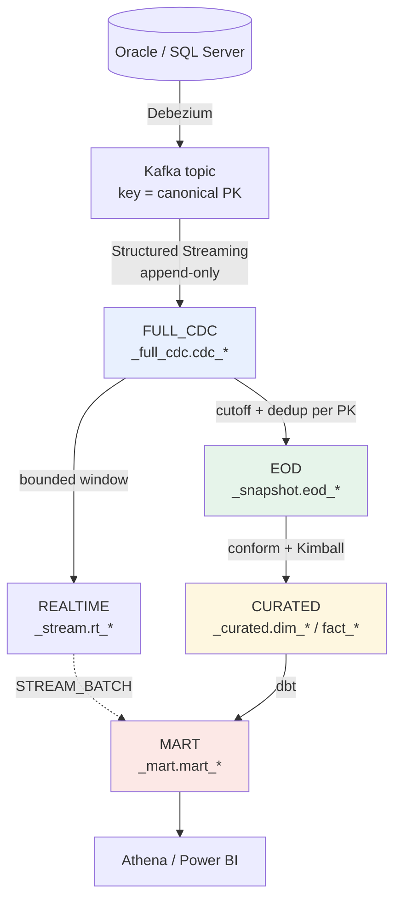

# Adding a CDC table, end to end

One YAML entry. No Spark job, no DAG edit, no hand-written Iceberg DDL. This document is the
whole path, plus how to verify each hop in S3, Glue and Athena.

Reference for every field: `docs/CDC_TABLE_CONFIG_REFERENCE.md`. Why it is shaped this way:
ADR-062, ADR-071, ADR-080.

---

## 1. The layers, and what each one is for



| layer | grain | mutability | who writes it |
|---|---|---|---|
| **FULL_CDC** | one row per Kafka record | append-only, never deduped | `full_cdc_stream_job.py` |
| **REALTIME** | latest state per PK inside a rolling window | rows age out | `realtime_engine.py` |
| **EOD** | one row per PK per closed business date | immutable once certified | `eod_engine.py` |
| **CURATED** | conformed entities + Kimball dims/facts | rebuilt per COB | `curated_build.py` |
| **MART** | business grain, per job YAML | MERGE ladder | dbt |

REALTIME and EOD are **siblings** derived from FULL_CDC, not a chain. An EOD rebuild of a
historical date must never depend on a REALTIME window that has since aged out.

**REALTIME is not STREAM_BATCH.** REALTIME is a *layer* — a materialised rolling window of
source state. STREAM_BATCH is a *flow mode* — a mart refresh that reads that layer every ten
minutes. One is storage, the other is a schedule.

---

## 2. Add the table

Edit `cdc/registry/sources.yaml`. Precedence is
`defaults < sources[].defaults < sources[].tables[]`.

```yaml
sources:
  - source_id: oracle
    engine: oracle
    connector: corebank-source
    database: coredb
    schema: corebank
    topic_prefix: cdc.oracle
    tables:
      - table: statement            # <- the only required pair...
        primary_key: [STATEMENT_ID] # <- ...is this one
        dq: {not_null: [STATEMENT_ID, ACCOUNT_ID]}
```

Everything else inherits. Override only what differs:

```yaml
      - table: statement
        primary_key: [STATEMENT_ID]
        classification: confidential          # PII -> masked BI copy
        dq: {not_null: [STATEMENT_ID], freshness_sla_minutes: 15}
        realtime: {enabled: false}            # static reference table
        eod: {schedule: "30 2 * * *"}         # its own cadence
        maintenance: {temperature: warm, compact_target_mb: 256}
```

**Target table names are DERIVED from the canonical id** (`oracle.coredb.corebank.statement`),
never spelled out, so the FULL_CDC / REALTIME / EOD names cannot drift apart. Override a name
only to adopt a table that already exists in the catalog.

### Field notes that matter

| field | why you would set it |
|---|---|
| `primary_key` | the canonical PK. Kafka keys on it, EOD dedups on it, and the same PK must land in the same partition (CLAUDE.md §5.1) |
| `dq.not_null` | the MINIMUM contract is the key itself. A registered-but-empty DQ contract is not a contract: an EOD close that cannot fail certifies whatever it produced |
| `realtime.enabled: false` | a four-row reference table does not need a 72-hour window |
| `eod.delete_policy` | `exclude_from_snapshot` (default) or `soft_delete`. Never leave a tombstone ambiguous (§5.7) |
| `maintenance.temperature` | drives compaction scope. `warm`/`hot` compact recent partitions more often |

---

## 3. Compile, review, deploy

```bash
make check                              # compiles the plan, refuses on drift
python3 -m cdc.compile --out /tmp/plan.json
```

The compiler prints every table with its `config_hash`. A changed hash on a table you did
not touch means a default moved — read that before deploying.

```bash
bash scripts/cdc-deploy-code.sh         # framework zip + entrypoints + COMPILED plan
```

`config_version` is a hash of the whole registry. Every job stamps it into
`eod_run_hist`, `eod_info` and `streaming_app_state`, so any row can be traced back to the
exact config that produced it.

### Provision the physical tables

```bash
bash scripts/emr-submit.sh provision s3://$LAKE/artifacts/code/provision_cdc_tables.py eod \
  --plan s3://$LAKE/artifacts/cdc/table-plan.json --warehouse s3://$LAKE/warehouse
```

Idempotent: creates what is missing, leaves what exists.

---

## 4. Register the connector so Kafka carries the table

A new table must be added to the Debezium include-list, or nothing is ever captured.

```bash
bash scripts/register-connectors.sh              # dry run, prints the diff
bash scripts/register-connectors.sh --execute
bash scripts/cdc-runtime.sh status               # both connectors RUNNING
bash scripts/cdc-runtime.sh topics               # the new topic exists
```

The compiled plan already contains the include-list entry
(`capture.include_list_entry`), so the connector config is generated, not typed.

---

## 5. Run each hop, and verify it

### 5.1 Kafka → FULL_CDC

```bash
python3 scripts/cdc-stream.py apps                       # which app owns the topic
python3 scripts/cdc-stream.py submit --app-id full-cdc-oracle   # PRINTS the command
```

Verify:

```sql
SELECT count(*) AS events,
       count(DISTINCT dv_event_id) AS distinct_transport_ids
FROM   kafka_dev_lab_dev_full_cdc.cdc_oracle_coredb_corebank_statement;
```

`events = distinct_transport_ids` is the exactly-once assertion. Re-run the app and re-check:
the count must not move.

S3:

```bash
aws s3 ls s3://$LAKE/warehouse/full_cdc/cdc_oracle_coredb_corebank_statement/ --recursive \
  | head            # data/ and metadata/ both present
aws s3 ls s3://$LAKE/checkpoints/full_cdc/full-cdc-oracle/   # the derived checkpoint
```

Glue:

```bash
aws glue get-table --database-name kafka_dev_lab_dev_full_cdc \
  --name cdc_oracle_coredb_corebank_statement --query 'Table.StorageDescriptor.Columns[].Name'
```

### 5.2 FULL_CDC → REALTIME

```bash
bash scripts/emr-submit.sh realtime s3://$LAKE/artifacts/code/realtime_engine.py eod \
  --plan s3://$LAKE/artifacts/cdc/table-plan.json --warehouse s3://$LAKE/warehouse \
  --table oracle.coredb.corebank.statement
```

Verify — one row per PK, and the window bound is FROZEN for the run:

```sql
SELECT count(*) rows, count(DISTINCT dv_pk_hash) keys
FROM   kafka_dev_lab_dev_stream.rt_oracle_coredb_corebank_statement;

SELECT table_id, window_start, window_end, status
FROM   kafka_dev_lab_dev_ops.realtime_run ORDER BY window_end DESC LIMIT 5;
```

### 5.3 FULL_CDC → EOD

```bash
bash scripts/emr-submit.sh eod s3://$LAKE/artifacts/code/eod_engine.py eod \
  --plan s3://$LAKE/artifacts/cdc/table-plan.json --warehouse s3://$LAKE/warehouse \
  --table oracle.coredb.corebank.statement --cob-date 2026-09-19
```

Verify:

```sql
SELECT table_id, cob_date, certification_status, row_count,
       prev_watermark_ts, watermark_ts
FROM   kafka_dev_lab_dev_ops.eod_info WHERE cob_date = DATE '2026-09-19';

SELECT attempt, status, dq_status, reconciliation_status, err_msg
FROM   kafka_dev_lab_dev_ops.eod_run_hist
WHERE  cob_date = DATE '2026-09-19' ORDER BY attempt;
```

`certification_status = CERTIFIED` is the only state downstream treats as final.

### 5.4 EOD → CURATED

If the new table feeds a dimension or fact, add it to `reporting/curated/entities.yaml`
(see §7). Then:

```bash
bash scripts/emr-submit.sh curated-build s3://$LAKE/artifacts/code/curated_build.py eod \
  --plan s3://$LAKE/artifacts/cdc/table-plan.json \
  --layers s3://$LAKE/artifacts/reporting/layers.json \
  --entities s3://$LAKE/artifacts/reporting/curated-entities.json \
  --warehouse s3://$LAKE/warehouse --cob-date 2026-09-19
```

The job prints `CURATED_ENTITY <name> rows=N` per entity, then `CURATED_DIMENSIONS` and
`CURATED_FACTS`. An entity at `rows=0` says so explicitly.

### 5.5 CURATED → MART

```bash
bash scripts/emr-submit.sh dbt-build s3://$LAKE/artifacts/code/emr_dbt_bootstrap.py eod \
  --wheelhouse-uri s3://$LAKE/artifacts/dbt/wheelhouse.zip \
  --project-uri s3://$LAKE/artifacts/dbt/dbt-project.zip \
  --mart-schema kafka_dev_lab_dev_mart --curated-schema kafka_dev_lab_dev_curated \
  --select "*" --command build \
  --vars-json '{"flow_mode":"EOD","cob_date":"2026-09-19","execution_id":"manual-001",
                "config_version":"<from the plan>","source_layers":{},
                "date_of_data":"2026-09-19"}'
```

Add `--full-refresh` whenever a model's **grain** changed: the merge key only decides which
rows to update, so rows written under the old grain stay exactly where they are.

---

## 6. The end-to-end verification query set

```sql
-- 1. transport identity is unique (exactly-once)
SELECT count(*) - count(DISTINCT dv_event_id) AS dupes
FROM kafka_dev_lab_dev_full_cdc.cdc_oracle_coredb_corebank_statement;   -- expect 0

-- 2. EOD is one row per PK per COB
SELECT count(*) - count(DISTINCT (dv_pk_hash, business_date)) AS dupes
FROM kafka_dev_lab_dev_snapshot.eod_oracle_coredb_corebank_statement;   -- expect 0

-- 3. the mart holds its declared grain
SELECT count(*) AS rows, count(DISTINCT (account_sk, business_date)) AS grain
FROM kafka_dev_lab_dev_mart.mart_account_balance_daily;                 -- equal

-- 4. no fact points at a dimension member that does not exist
SELECT count(*) FROM kafka_dev_lab_dev_curated.fact_transaction f
LEFT JOIN kafka_dev_lab_dev_curated.dim_account d USING (account_sk)
WHERE d.account_sk IS NULL;                                             -- expect 0

-- 5. unresolved dimensions and FX are VISIBLE, not hidden
SELECT sum(CASE WHEN account_sk = -1 THEN 1 ELSE 0 END) AS unknown_account,
       sum(CASE WHEN amount_base IS NULL THEN 1 ELSE 0 END) AS unresolved_fx
FROM kafka_dev_lab_dev_curated.fact_transaction;
```

S3 layout, for any layer:

```bash
aws s3 ls s3://$LAKE/warehouse/                  # curated/ full_cdc/ mart/ ops/ snapshot/ stream/
aws s3 ls s3://$LAKE/warehouse/<layer>/<table>/metadata/ | tail -3   # Iceberg roots
aws s3 ls s3://$LAKE/artifacts/cdc/table-plan.json                   # the deployed plan
```

---

## 7. Adding the table to the CURATED layer

Only needed if the table becomes a conformed entity (a dimension source or a fact source).

```yaml
# reporting/curated/entities.yaml
entities:
  banking_statement:
    table_id: oracle.coredb.corebank.statement
    layer: EOD
    dimension: dim_statement        # omit when it is a fact source
    natural_key: [statement_id]
    columns:
      STATEMENT_ID: {name: statement_id, type: bigint}
      ACCOUNT_ID:   {name: account_id,   type: bigint}
      ISSUED_ON:    {name: issued_on,    type: date_millis}
      CREATED_AT:   {name: created_at,   type: timestamp_micros}
      BALANCE:      {name: balance,      type: "decimal(18,2)"}
```

**The `type` is not cosmetic.** Debezium sends an Oracle `DATE` as epoch **millis** and a
`TIMESTAMP(6)` as epoch **micros**, as bare integers, in the same JSON object. Nothing in the
value distinguishes them. Decoding one with the other's factor does not fail — it reports
every customer as born in 1970.

Derived columns are declared, never coded:

```yaml
    derived:
      age_band:     {from: dob,         rule: age_band}
      channel_code: {from: device_type, rule: map,
                     values: {WEB: WEB, IOS: MOBILE, ANDROID: MOBILE}}
```

An unmapped value becomes NULL, never a default — the fact then resolves to `UNKNOWN_SK`,
which is visible in a filter list and countable in reconciliation.

---

## 8. What you did NOT have to do

* write a Spark job — the engines are generic and read the plan
* edit an Airflow DAG — DAGs are per **cadence**, not per table, and expand over the plan
* write Iceberg DDL — `provision_cdc_tables.py` generates it
* add a maintenance entry — the planner reads `maintenance` from the same registry
* touch the EOD, REALTIME or dbt code at all

A test asserts the DAG count does not grow with the table count.
