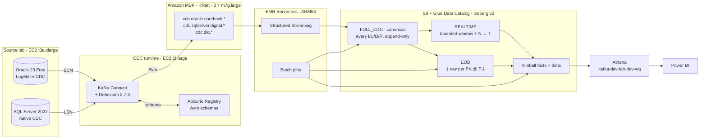

# AWS CDC Lakehouse — Architecture & Test Guide

> **Read this to understand what was built, how to test it yourself, and what to do when
> something does not behave as expected.**
>
> Account `111122223333` · Region `ap-southeast-1` · Profile `my-aws-profile` · Env `dev`
> Written 2026-08-16, during the first live CDC window.

---

## 0. Current status — read first

| Layer | State | Evidence |
|---|---|---|
| Foundation (S3, Glue, Athena, KMS, budget) | **LIVE, validated, drift 0** | Session 20, 28 PASS |
| MSK KRaft cluster | **LIVE, ACTIVE** | `kafka-dev-lab-dev`, 3 brokers |
| Kafka topics (16) | **CREATED** | verified via `kafka-topics --list` |
| Oracle 23 Free | **UP, healthy** | container `source-oracle` |
| SQL Server 2022 Dev | **UP, healthy** | container `source-sqlserver` |
| Apicurio Registry | **STARTING** | container `cdc-apicurio` |
| Kafka Connect + Debezium | **CRASH-LOOPING** | see §7 defect F9 |
| CDC events flowing | **NOT YET** | blocked on Connect |
| L1 / L2 / L3 Iceberg tables | **NOT CREATED** | Spark has not run |
| Kimball / marts / Athena queries | **BLOCKED** | need tables |

**Nothing downstream of Connect has run.** No CDC event has yet reached S3.

---

## 1. The architecture

### 1.1 End-to-end flow



### 1.2 AWS services and why each was chosen

| Service | Resource | Role | Why not the alternative |
|---|---|---|---|
| **MSK Provisioned** | `kafka-dev-lab-dev` 3 × `kafka.m7g.large`, KRaft, IAM auth | Durable event log | MSK Serverless has no KRaft control; self-managed EC2 Kafka is 10× cheaper but throws away IAM auth and managed brokers — the point of the project |
| **EC2 source lab** | `t3a.xlarge`, 50 GiB | Oracle + SQL Server in containers | RDS Oracle/SQL Server is **$1.1620/hr vs $0.1888/hr** — 6.2× (ADR-032) |
| **EC2 CDC runtime** | `t3.large`, 40 GiB | Connect + Apicurio co-located | MSK Connect cannot run Apicurio; separate hosts double the cost |
| **EMR Serverless** | ARM64, `emr-7.2.0`, auto-stop 15 min | Spark for L1/L2/L3 | EMR on EC2 bills a 24/7 cluster; Glue ETL costs more per DPU-hour |
| **S3** | `kafka-dev-lab-dev-lake-111122223333` | Iceberg warehouse | — |
| **Glue Data Catalog** | 7 databases | Iceberg catalog | Hive metastore needs a server; Glue is serverless and free at this size |
| **Athena** | `kafka-dev-lab-dev-wg`, 10 GiB cutoff | Query engine | **No idle cost** — bills bytes scanned only |
| **KMS** | 1 CMK (lake) | Encryption at rest | $1/key-month; state bucket uses free SSE-S3 (ADR-030) |
| **VPC endpoints** | S3 + DynamoDB (Gateway, free), Glue (Interface, $0.013/hr) | Private AWS access | 12 interface endpoints would be **$341/month** — 11× the budget |
| **NAT Gateway** | **NONE** | — | Public subnet + zero-inbound SG gives free IGW egress (ADR-022) |

### 1.3 The three lake layers

| Layer | Glue database | Grain | Rule |
|---|---|---|---|
| **FULL_CDC** (canonical) | `kafka_dev_lab_dev_full_cdc` | one row per CDC **event** | Written straight from Kafka. Every I/U/D/R preserved with source + Kafka metadata. Idempotent by `event_id` on rerun. **No business dedup, ever.** |
| **REALTIME** | bounded window over `full_cdc` | one row per CDC **event** | Sibling of EOD: same ranking, bound `T-N → T` instead of `<= T-1`. SUBSTITUTED until the layer is built. |
| ~~L1 STREAM~~ | `kafka_dev_lab_dev_stream` | — | **DEPRECATED 2026-08-21.** Kafka no longer lands here. Retained read-only for Session 33 evidence; never a reporting source (ADR-033). |
| **EOD** | `kafka_dev_lab_dev_snapshot` | one row per **PK** per snapshot date | Dedup by PK, keep last event by `event_order`, cutoff `source_commit_ts <= T-1 23:59:59`. Deletes excluded from active. |

Plus `curated`, `mart` (Kimball — the **only** layer Power BI reads), `ops` (reconciliation ledgers), `quarantine` (poison records).

**S3 prefixes** — note `checkpoints/` is deliberately separate from `warehouse/` (CLAUDE.md §5.9; sharing them corrupts Iceberg metadata):

```
s3://kafka-dev-lab-dev-lake-111122223333/
├── warehouse/{stream,full_cdc,snapshot,curated,mart,ops,quarantine}/
├── checkpoints/          ← Spark streaming checkpoints, NEVER under warehouse/
├── query-results/athena/ ← 7-day lifecycle
├── quarantine-payloads/  ← 30-day
├── dq-results/           ← 30-day
├── logs/{airflow,emr-serverless}/  ← 3-day
└── bootstrap/{source-lab,cdc-runtime}/  ← EC2 bootstrap assets
```

---

## 2. The core CDC correctness contract

This is the part that actually matters, and where most CDC projects are silently wrong.

### 2.1 Ordering — Oracle and SQL Server normalise in **opposite** directions

```python
# spark/jobs/l1_stream/ordering.py
ORACLE_SCN_WIDTH = 24          # SCN is NUMERIC: '9' > '10' lexically but 9 < 10 numerically
                               #   → must ZERO-PAD to make string compare == numeric compare
SQLSERVER_LSN_PARTS = (8,8,4)  # LSN is HEX, already fixed-width zero-padded
                               #   → must VALIDATE, padding would corrupt it
```

A single "just pad it" helper would silently corrupt one engine. The code **refuses** an
over-wide SCN rather than truncating, because truncation silently reorders history.

### 2.2 The ordering key, in precedence order

```
position_primary   →  Oracle commit SCN (padded)   | SQL Server commit LSN
position_secondary →  Oracle change SCN            | SQL Server event_serial_no
source_ts_ms       →  tie-break
kafka_partition    →  tie-break
kafka_offset       →  tie-break  ← NEVER used for global ordering
```

**`kafka_offset` only increases within one partition.** Comparing offsets across
partitions is the classic CDC bug: a higher SCN on a lower offset in another partition
must still win.

### 2.3 Deterministic event identity

```
event_id = sha256(f"{topic}:{partition}:{offset}")
```

Makes replay and backfill idempotent — reprocessing the same Kafka message produces the
same row, so L2 MERGE is a no-op.

---

## 3. How to test it — step by step

### 3.0 Prerequisites

```bash
cd /path/to/aws-cdc-lakehouse
export AWS_PROFILE=my-aws-profile AWS_REGION=ap-southeast-1
aws sts get-caller-identity          # must show 111122223333
bash scripts/cdc-window-start.sh     # must exit 0 before you spend time testing
```

> Every script that mutates anything is **dry-run by default** and needs `--execute` plus a
> typed phrase at a real terminal. That is deliberate: no automation can approve spend.

### 3.1 Enable CDC on the source databases

```bash
bash scripts/source-lab.sh enable-cdc --execute      # phrase: ENABLE CDC
bash scripts/source-lab.sh seed --execute            # phrase: SEED SOURCE LAB
bash scripts/source-lab.sh verify-cdc
```

**Expect:** Oracle in ARCHIVELOG with supplemental logging on; SQL Server CDC enabled per
table; seed rows in `corebank.{customer,account,transaction,branch}` and
`digital.{app_user,channel,digital_event,merchant}`.

**Verify yourself:**
```bash
# Oracle
aws ssm start-session --target i-087555cda23a4b318
docker exec source-oracle sqlplus -s system/<pw>@FREEPDB1 <<'SQL'
SELECT log_mode FROM v$database;                    -- ARCHIVELOG
SELECT supplemental_log_data_min FROM v$database;   -- YES
SELECT COUNT(*) FROM corebank.customer;             -- > 0
SQL
```

### 3.2 Register the Debezium connectors

```bash
bash scripts/register-connectors.sh --execute        # phrase: REGISTER CONNECTORS
bash scripts/register-connectors.sh status
```

**Expect:** two connectors `RUNNING`, zero failed tasks.

### 3.3 Prove events reach Kafka — the first real checkpoint

```bash
aws ssm start-session --target i-0de8ff7156475c7d2
export CLASSPATH=/opt/connect-plugins/libs/aws-msk-iam-auth.jar
set -a; . /opt/cdc-runtime/.env; set +a

# Count messages on the Oracle customer topic
/opt/kafka-cli/bin/kafka-console-consumer.sh \
  --bootstrap-server $BOOTSTRAP \
  --consumer.config /opt/cdc-runtime/client.properties \
  --topic cdc.oracle.corebank.customer \
  --from-beginning --max-messages 5
```

**Expect:** Avro-encoded Debezium envelopes with `op` ∈ `{r,c,u,d}` and a `source` block
carrying `scn`/`commit_scn` (Oracle) or `commit_lsn`/`change_lsn` (SQL Server).

**If you see nothing:** the connector is running but capturing nothing — check
`snapshot.mode`, table include lists, and that the CDC user can read the redo log.

### 3.4 Run Spark and build the layers

```bash
bash scripts/run-flow.sh l1-stream   --execute   # Kafka → L1
bash scripts/run-flow.sh l2-full-cdc --execute   # L1 → L2
bash scripts/run-flow.sh l3-snapshot --execute --cutoff 2026-08-16
bash scripts/run-flow.sh kimball     --execute
```

### 3.5 Query through Athena

```bash
bash scripts/athena-smoke.sh --execute
```

This substitutes the deployed Glue prefix automatically. Once Spark has created tables
these move from `BLOCKED_BY_DESIGN` to `PASS`.

Manual check:
```sql
SELECT COUNT(*) FROM kafka_dev_lab_dev_stream.oracle_corebank_customer;
SELECT COUNT(*) FROM kafka_dev_lab_dev_snapshot.banking_customer;
```

---

## 4. The 16 correctness scenarios — how to run each

Run against the source DB, wait ~1 min for propagation, then verify at each layer.

| # | Scenario | How to trigger | What must be true |
|---|---|---|---|
| 1 | INSERT | `INSERT INTO corebank.customer …` | 1 row L1 `op=c`; 1 row L2; present in L3 active |
| 2 | UPDATE | `UPDATE … SET name=…` | 2 rows L1; L3 shows **only the newer** by SCN |
| 3 | Multiple UPDATEs | 3 updates on one PK | 4 rows L1; **exactly 1** row in L3 |
| 4 | DELETE | `DELETE FROM …` | L1 has `op=d`; L3 active **excludes** the PK |
| 5 | Delete + recreate | delete then insert same PK | L3 shows the **recreated** row, not deleted |
| 6 | Duplicate event | replay same offset | `event_id` identical → L2 count **unchanged** |
| 7 | Kafka replay | reset consumer offset to earliest | L2 count unchanged (idempotent MERGE) |
| 8 | Late-arriving event | pause connector, mutate, resume | auto-correct flow picks it up; variance → 0 |
| 9 | Out-of-order | two partitions, higher SCN lower offset | **higher SCN wins** regardless of offset |
| 10 | Schema evolution | `ALTER TABLE … ADD COLUMN` | L1/L2 absorb it; DQ completeness check flags a dropped column |
| 11 | Debezium restart | `docker restart cdc-connect` | resumes from stored offset, **no gap, no duplicate** |
| 12 | Connect restart | restart worker | same as 11 |
| 13 | Spark restart | kill and resubmit job | resumes from checkpoint |
| 14 | Checkpoint recovery | delete executor, resubmit | no data loss, no double-count |
| 15 | EOD rerun | run EOD twice | row count **identical** after 2nd run |
| 16 | L3 rebuild | rebuild same cutoff twice | **identical checksum** |

Automated harness:
```bash
bash scripts/cdc-runtime.sh correctness all      # scenarios 1-6
bash scripts/failure-drill.sh --execute --drill 1   # scenarios 11-14
```

---

## 5. Reconciliation — source vs Kafka vs L1 vs L2 vs L3

```bash
bash scripts/run-flow.sh reconcile --execute
```

| Comparison | Rule |
|---|---|
| Source → Kafka | topic message count ≥ source change count (snapshot adds `op=r`) |
| Kafka → L1 | **exact match** per topic-partition-offset range; any gap is data loss |
| L1 → L2 | equal after dedup by `event_id`; L2 ≤ L1 only via duplicates removed |
| L2 → L3 | `COUNT(DISTINCT pk)` in L2 at cutoff **==** L3 row count |
| L3 → Kimball | dimension row count == distinct business keys; fact grain enforced |
| Kimball → Athena | same numbers through the serving views |

Ledgers land in `kafka_dev_lab_dev_ops.reconciliation_run`.

---

## 6. Cost control — read before every window

| | |
|---|---|
| **Baseline burn** | **$1.1244/hr** — MSK is 68% of it |
| With EMR job running | $1.4267/hr |
| 4-hour window | $4.50 – $5.71 |
| 6-hour window | $6.75 – $8.56 |
| Foundation only (idle) | **~$1.01/month** — just the KMS CMK |

```bash
bash scripts/tf.sh verify          # what is billable right now
bash scripts/show-cost-resources.sh --idle
```

> ⚠️ **MSK cannot be stopped — only destroyed.** `stop-ephemeral.sh` stops EC2 but **EBS
> keeps billing** (120 GiB ≈ $11.52/month). Only `destroy` ends the burn. Set a wall-clock
> alarm; budget alerts arrive hours late.

**Teardown:**
```bash
bash scripts/tf.sh destroy --execute        # phrase: DESTROY THE DEV LAB
bash scripts/verify-destroy.sh --destroyed
```
Retained by design: S3 lake (`force_destroy=false`), state backend, KMS CMK (7-day window).

---

## 7. Troubleshooting — defects already found, and how they were diagnosed

Nine real defects surfaced during the first live deployment. **Every one of them was
invisible to `terraform plan`, `terraform validate` and 421 passing unit tests.** That is
the lesson: infrastructure code that has never run is a hypothesis.

| ID | Symptom | Root cause | Fix |
|---|---|---|---|
| **F1** | $30 budget reads $0.00 forever | Cost-allocation tag `Project` was **Inactive** for billing — a budget can only filter on an *active* tag. Terraform string was correct; activation is an account-level Billing setting Terraform does not manage | `aws ce update-cost-allocation-tags-status` |
| **F2** | All 6 Athena smoke queries `SCHEMA_NOT_FOUND` | Queries hardcode unprefixed schemas (`stream`) but deployed DBs are `kafka_dev_lab_dev_stream`. Would have failed **even after** Spark created tables | `scripts/athena-smoke.sh` substitutes prefix from `terraform output` |
| **F3** | CDC plan "succeeded" but both EC2 instances missing | `aws_s3_object` set `etag` **and** `kms_key_id` — S3 exposes no MD5 ETag for KMS objects, provider rejects it. Bootstrap objects failed → instances depending on them vanished | `etag` → `source_hash` |
| **F4** | Cost preview read $0.8541/hr vs real $1.1244 | Every `aws_instance` priced at a flat t3.small rate; EBS, endpoints, broker count ignored | Attribute-aware pricing + flags unpriced types |
| **F5** | Readiness gate said toolbox "NOT RUNNING" | `toolbox.tf` never sets a `Component` tag | Gate falls back to `Name` tag |
| **F6** | `cdc-runtime` bootstrap `AccessDenied` on S3 | The `connect` role was never granted `bootstrap_read` — only `source_lab` was | Added `connect:bootstrap` attachment |
| **F7** | Connect could not resolve `${ssm:...}` passwords | Pinned Maven URL **404s** — `kafka-config-provider-aws` was never on Maven Central; Confluent Hub listing is deprecated and serves a truncated archive | Secrets resolved at registration time (documented tradeoff) |
| **F8** | `create-topics.sh: /usr/bin/kafka-topics: No such file` | Nothing ever installed the Kafka CLI; the only mention was a help message. `auto.create.topics.enable=false` meant nothing could recover | Script installs its own CLI + puts `aws-msk-iam-auth.jar` on `CLASSPATH` |
| **F9** | `cdc-connect` crash-looping, REST never answers | **UNDER INVESTIGATION** — see below |

### 7.1 Diagnosing F9 yourself (current open issue)

```bash
aws ssm start-session --target i-0de8ff7156475c7d2
docker logs cdc-connect 2>&1 | grep -iE 'ERROR|FATAL|Caused by' | head -30
```

> ⚠️ Do **not** pipe raw Connect logs into an AI assistant — the startup banner dumps a
> multi-thousand-line JVM classpath. Always `grep` first.

Most likely causes, in order:
1. **Worker config references a removed provider.** F7 commented out `config.providers=ssm`
   — confirm no stale `config.providers.ssm.*` line survives in
   `/opt/cdc-runtime/connect-worker.properties`.
2. **Internal topic replication factor.** RF must be ≤ broker count (3) and
   `min.insync.replicas=2`.
3. **MSK IAM auth from the worker** — same missing-jar class as F8, but for the worker JVM.
4. **Apicurio not ready** — Connect's Avro converter fails if the registry 500s.

### 7.2 General triage order

| Symptom | Check first |
|---|---|
| Connector `FAILED` | `curl .../connectors/<n>/status` — read `trace` |
| No messages on topic | connector `RUNNING` but snapshot done? check `snapshot.mode` |
| Spark job fails on Glue | IAM: `spark_stream` needs `lake_write` + `glue:*Table*` |
| Athena `TABLE_NOT_FOUND` | expected until Spark creates it — **not** a defect |
| Athena `SCHEMA_NOT_FOUND` | real defect — you are missing the DB prefix (F2) |
| Query scans too much | 10 GiB cutoff kills it *after* billing — add a partition predicate |
| L3 count ≠ L2 distinct PK | ordering bug — check SCN padding width has not changed |

---

## 8. What "meeting expectations" means

Accept the build when **all** of these hold:

- [ ] Both connectors `RUNNING`, 0 failed tasks
- [ ] Every `cdc.*` topic has messages; `cdc.dlq.*` are **empty**
- [ ] L1 count **==** Kafka message count (exact, per partition)
- [ ] L2 rerun leaves count **unchanged** (idempotent)
- [ ] L3 count **==** `COUNT(DISTINCT pk)` in L2 at cutoff
- [ ] Deleted PK **absent** from L3 active; delete+recreate **present**
- [ ] Higher SCN wins over lower offset in a different partition
- [ ] EOD rerun and L3 rebuild produce **identical checksums**
- [ ] All 6 Athena smoke queries `PASS`
- [ ] Kimball fact grain enforced — no double-counting on update
- [ ] `reconciliation_run` shows variance **0** after auto-correct
- [ ] Window destroyed; `verify-destroy.sh --destroyed` exits 0

**If any fails:** capture the failing layer's row counts, the `event_id` of a disagreeing
row, and its `event_order` tuple. Those three facts localise almost every CDC bug to a
single layer.

---

## 9. Key file map

```
terraform/envs/dev/          root module, tfvars, backend
terraform/modules/           14 modules (kafka_platform, data_lake, lake_iam, …)
spark/jobs/l1_stream/        envelope.py, ordering.py ← the correctness core
spark/eod/ spark/snapshot/   L2 window, L3 snapshot
spark/dimensions/ facts/     Kimball SCD2, additivity
connectors/{oracle,sqlserver}/  Debezium templates
docker/{source-lab,cdc-runtime}/  container + bootstrap assets
scripts/                     operator entry points, all dry-run by default
serving/athena/queries/      6 smoke queries
artifacts/validation/        per-session evidence
```

**Start reading at** `spark/jobs/l1_stream/ordering.py` — it is 116 lines and contains the
single most important idea in the project.
