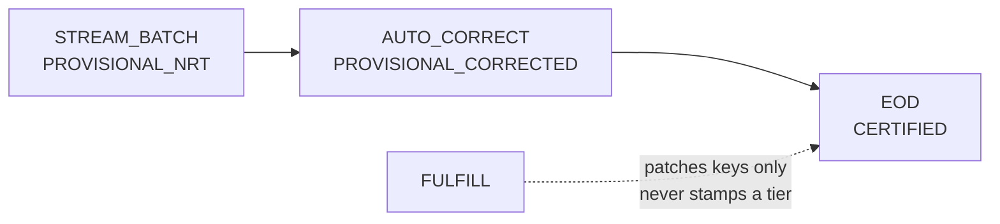

# AUTO_CORRECT, STREAM_BATCH, FULFILL, STREAMING_RT

Four ways to write the same mart. **One SQL file**, many modes: every enabled flow runs the
same model and they differ only in `incremental_filter()` (which rows) and the tier they
stamp. One SQL file per mode would make a provisional-vs-certified variance ambiguous between
"late data" and "divergent logic", and only one of those is a bug worth chasing.

Related: `docs/FOUR_FLOWS.md`, ADR-042 (the accuracy ladder), ADR-043.

---

## 1. The accuracy ladder



A row may move **up** the ladder and never down. The MERGE is guarded: rows that would
downgrade an existing one are dropped **before** the merge sees them, as a pre-filter.
dbt-spark exposes no `WHEN MATCHED AND` clause, and putting the guard in the `ON` clause
would be actively wrong — a losing row would fall to `NOT MATCHED` and be **inserted**,
duplicating the key.

Within a tier, `input_cutoff` breaks the tie, so an older EOD rebuild cannot overwrite a
newer one.

## 2. STREAM_BATCH — every 10 minutes

Reads the **REALTIME** layer. Bounded window with a `safety_overlap_minutes: 2` rewind on
every run: an event written microseconds before the recorded watermark can otherwise fall
through the gap between two runs and never be picked up. Safe to overlap **only** because the
merge key is the business key and the write is idempotent.

Stamps `PROVISIONAL_NRT`. It must never stamp CERTIFIED — letting STREAM_BATCH certify would
defeat the ladder from inside.

```bash
python3 scripts/reporting-live-run.py --flow-mode STREAM_BATCH \
  --business-date 2026-09-20 --execute
```

Watermark after a run: `committed to 2026-09-20T18:38:07Z`. A **failed** run never advances
it.

## 3. AUTO_CORRECT — every 30 minutes

Reads **FULL_CDC** as a change feed and repairs dates that moved. Config that matters:

```yaml
AUTO_CORRECT:
  source_layer_policy: EOD_PLUS_REALTIME
  lookback_days: 3
  late_arrival_days: 3
  correction_source: FULL_CDC
  affected_date_policy: CHANGED_DATES_ONLY
  affected_key_strategy: PRIMARY_KEY
  allow_certified_repair: false
```

It finds the **affected dates and keys** rather than rebuilding a window blindly. When it
cannot narrow the set it falls back to the full window and says so:

```
3 date(s), 0 key(s), path=FULL_WINDOW_FALLBACK;
1 date(s) ESCALATED (already certified; AUTO_CORRECT cannot overwrite CERTIFIED)
```

**ESCALATED is the important word.** A certified date is final. AUTO_CORRECT refuses it and
escalates rather than silently rewriting a published number. To repair a certified date on
purpose, an operator passes `--allow-certified-repair`, which is a decision with a name.

## 4. FULFILL — manual, ranged

A deliberate backfill over `--from-date … --to-date`. `schedule: None`, `max_active_runs: 1`,
`retry_count: 0`, a 4-hour timeout and a 200 GB scan guard.

```bash
python3 scripts/reporting-live-run.py --flow-mode FULFILL \
  --business-date 2026-09-20 --from-date 2026-09-18 --to-date 2026-09-20 --execute
```

FULFILL **never stamps a status**. It patches unresolved surrogate keys on rows that already
exist: resolving a key does not change how accurate the row's measures are, and stamping a
tier here would DOWNGRADE certified rows.

## 5. STREAMING_RT — continuous, gated off

A resident Structured Streaming app writing the mart directly from FULL_CDC. It is
`is_enabled: false` in the job YAML and behind an `ENABLE_STREAMING_RT` environment gate,
because it is the one hourly cost in the reporting layer (CLAUDE.md §4.5).

It is covered by `spark/tests/test_reporting_streaming_rt.py` — lifecycle, watermark, restart
— and has **not** been run against live AWS. See `KNOWN_LIMITATIONS.md`.

## 6. Reruns and rebuilds, safely

Everything is keyed and idempotent, so the safe order is always:

1. **Find what you are fixing.** `eod_run_hist` for a close, `job_execution` for a flow.
2. **Rebuild the layer that is wrong, not the one downstream of it.** A wrong mart caused by
   a wrong EOD snapshot is fixed by re-closing the EOD date, not by re-running dbt.
3. **Re-close a historical date** with `--skip-readiness` (the source moved past that cutoff
   long ago, so the gate has nothing left to protect). Never for the current day — the
   open-day guard refuses to certify it anyway.
4. **Re-run dbt with `--full-refresh` only when a model's GRAIN changed.** The merge key
   decides which rows to *update*; it cannot remove rows written under an older grain.
5. **Never delete a streaming checkpoint to force a rerun.** See
   `FULL_CDC_STREAMING_RUNBOOK.md` §4.

## 7. Which mode should I run?

| situation | mode |
|---|---|
| the day just closed | EOD |
| late data arrived for the last few days | AUTO_CORRECT |
| a date range needs rebuilding on purpose | FULFILL |
| intraday freshness | STREAM_BATCH |
| sub-minute freshness, budget approved | STREAMING_RT |
