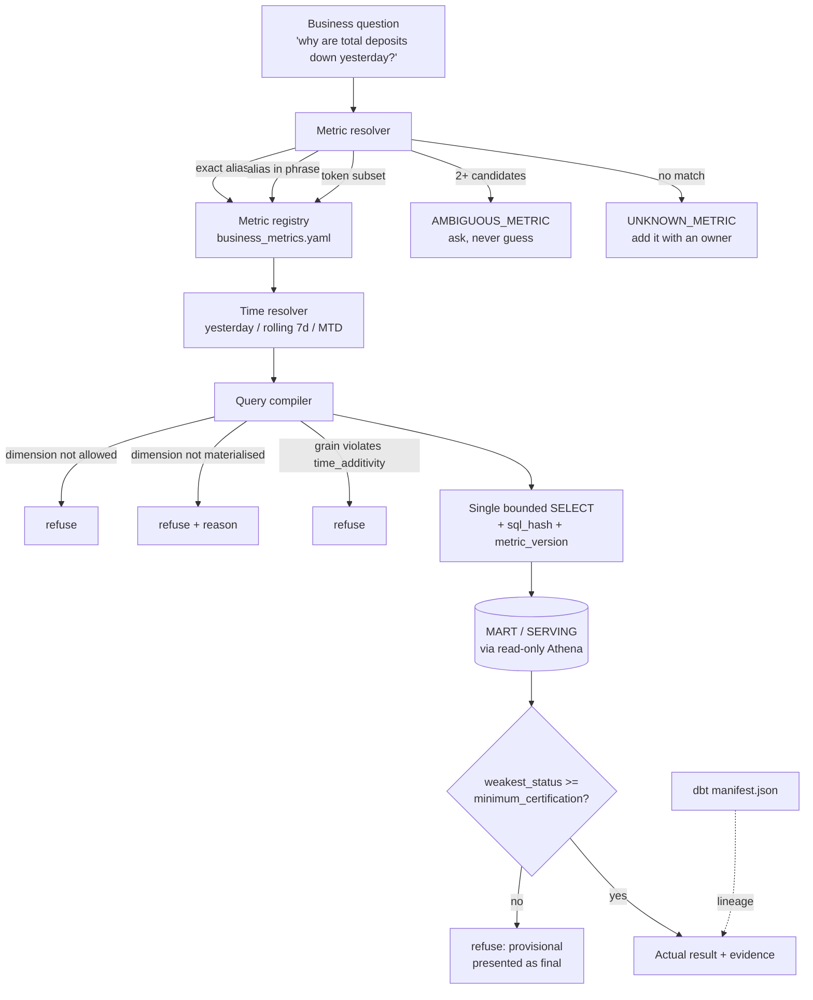

# Business Semantic / Metric Layer (BAI-P1)

The governed definition of every business KPI. Its job is to make *"total deposits"*,
*"deposit balance"* and *"deposit amount"* resolve to **one** definition, and to make an
undefined metric a **refusal** rather than an improvisation.

The LLM chooses a metric, a window and a dimension **by name**. It never writes the SQL and
never invents a definition.

---

## Flow



---

## Why a repo-owned YAML and not dbt's semantic layer

dbt-core 1.9.4 is installed, but `dbt-metricflow` is **not**, and the compiled manifest holds
**0 metrics and 0 semantic_models**. Adopting MetricFlow would pull a second query engine and
pin dbt-core into a lab running `dbt-spark` in `method: session` on EMR — a heavy dependency
bought for architectural fashion, which BAI-P1 §2 and CLAUDE.md §3.9 both warn against.

Lineage is **not** duplicated: `ai/analytics/lineage.py` walks dbt's own `manifest.json`
(§9). Rename or re-parent a model and lineage follows; a hand-maintained copy would drift
silently and still be believed.

---

## Defining a metric

Add an entry to `aiplatform/metrics/business_metrics.yaml`. The loader refuses the file
outright if any rule below is broken — a bad definition never reaches runtime.

| Field | Purpose |
|---|---|
| `metric_id` | stable id; duplicates refused |
| `aliases` | business phrasings; **an alias claimed by two metrics is refused at load** |
| `source_relation` / `dbt_node` | where it lives, and its node in the dbt manifest |
| `measure_column` **or** `measure_expression` | exactly one; both is refused |
| `aggregation` | `sum · avg · count · count_distinct · min · max` |
| `additive` | may it be decomposed **across segments**? |
| `time_additivity` | may it be rolled up **across dates**? |
| `allowed_dimensions` | anything else fails before SQL |
| `minimum_certification` | weakest tier acceptable as a business answer |
| `unit` / `currency` / `format` / `owner` / `freshness_sla_hours` | presentation and ownership |

### The two additivity fields are not the same thing

```yaml
additive: true                     # SUM across accounts on one date  -> correct
time_additivity: semi_additive_last  # SUM across 30 dates            -> ~30x too large
```

`closing_balance` is both. The dbt model already says so in prose — *"across time use LAST,
never SUM"* — and this makes it machine-enforced. A metric whose `time_additivity` is not
`additive` **cannot declare** `week`/`month` grains; the loader rejects it.

---

## Aliases and resolution

Three ordered stages, fully deterministic — no model call, no fuzzy score that drifts:

1. **exact alias** — `"total deposits"` → `total_closing_balance`
2. **alias inside the phrase** — `"how much are the total deposits"` → same metric
3. **token subset** — remaining candidates

More than one survivor raises `AMBIGUOUS_METRIC` with the candidates. **It never picks.**
Guessing between `total_closing_balance` and `avg_balance_per_account` because both contain
"balance" answers a question nobody asked.

---

## Dimension governance

Three outcomes, and the middle one is the useful one:

| Case | Result |
|---|---|
| allowed **and** materialised | compiled into `GROUP BY` |
| allowed but **table not materialised** | **refused, with the reason and the join it needs** |
| not in `allowed_dimensions` | refused |

Today `product_code`, `currency`, `branch_id` and `segment_code` are all in the second
category: declared, but `curated.dim_account` / `dim_customer` are not built (BAI-P0 gap 1).
Answering *without* the requested breakdown would answer a different question, so it refuses.

---

## Time semantics

One resolver decides what business time means, so two identical questions cannot produce
different windows. `as_of` is **required** and never defaults to the wall clock: a job at
02:00 for business date T-1 must not resolve "today" to T.

| Phrase | Window (as_of 2026-08-22) | Comparison |
|---|---|---|
| `yesterday` | 08-21 | 08-20 |
| `same day last week` | 08-22 | 08-15 |
| `last 7 days` / `rolling 7d` | 08-16 … 08-22 | 08-09 … 08-15 |
| `month to date` | 08-01 … 08-22 | — |
| `between A and B` | A … B | — |

Windows are **closed-closed**: the mart is partitioned on `business_date`, and a half-open
window silently drops the last partition.

---

## Certification

Ranks, weakest to strongest: `REALTIME` < `PROVISIONAL_NRT` < `PROVISIONAL_CORRECTED` <
`RECONCILED` < `CERTIFIED`.

Each metric declares a `minimum_certification`. All seven currently require `RECONCILED`, so
a provisional row cannot be returned as a business answer.

Every compiled query selects **`MIN(processing_status) AS weakest_status`** — the *weakest*
tier in the window, not the strongest or the most common. `MAX` would let one provisional
partition hide inside an otherwise certified total.

---

## Generated SQL

```sql
SELECT business_date AS business_date,
       SUM(closing_balance) AS metric_value,
       COUNT(*) AS row_count,
       MIN(processing_status) AS weakest_status
FROM   mart.mart_account_balance_daily
WHERE  business_date BETWEEN DATE '2026-08-21' AND DATE '2026-08-21'
GROUP BY business_date ORDER BY business_date LIMIT 1000
```

Every statement is a **single bounded SELECT**. Identifiers are validated against
`^[A-Za-z_][A-Za-z0-9_]*$` and **rejected rather than quoted** — a value needing escaping to
be safe should never have reached the compiler. Each query carries a `sql_hash` and the
`metric_version` hash of the definition that produced it, so a stored result can be checked
against the definition it came from.

---

## Lineage

```
total_closing_balance
  └── mart.mart_account_balance_daily      (model.aws_cdc_lakehouse.mart_account_balance_daily)
        └── stg_fact_account_daily_snapshot
              └── curated.fact_account_daily_snapshot   [dbt source]
```

Resolved from `dbt/target/manifest.json`. If the manifest is absent, lineage reports
**UNRESOLVED** rather than guessing.

---

## Verifying it

```bash
python3 -m pytest spark/tests/test_business_metrics.py -q     # 42 tests
python3 -c "
import sys; sys.path.insert(0,'ai')
from analytics.validate_metrics import validate_all
for c in validate_all():
    print(('MATCH' if c.match else 'FAIL '), c.metric_id, c.sql_value, c.expected_value)"
```
