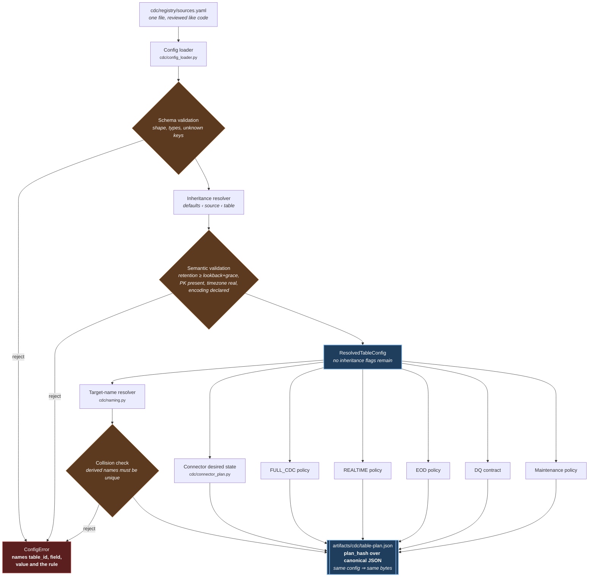

# Adding a CDC table — developer workflow

Phase 1 tooling (ADR-062). Reference: `docs/CDC_TABLE_CONFIG_REFERENCE.md`.

**Everything in steps 1–4 is local and read-only.** No AWS, no connector, no cost. The
expensive systems only see config that has already been proven correct.

---

## The compiler pipeline

Everything below happens **before anything mutates**. Each stage can only reject or enrich;
none of them reaches AWS.



Three properties this pipeline is built to have:

* **It fails before runtime.** Every rule that could produce a wrong number at 3am is checked
  here, where the cost of being wrong is a red terminal instead of a re-certified close.
* **The hash is over content, not formatting.** Reordering the YAML, reformatting it, or
  recompiling on a different day produces identical bytes; changing `lookback_days` does not.
* **Nothing is discovered live.** Serialising a plan makes no AWS call, so it runs in CI and
  on a laptop with no credentials — which is what makes it something people actually run.

## The loop

```
1. scaffold      python3 scripts/cdc-table-new.py --source … --schema … --table …
2. paste         into cdc/registry/sources.yaml, fill the PK and owner
3. compile       python3 -m cdc.compile --check
4. plan          python3 scripts/cdc-table-plan.py --table <canonical id>
--- everything above is read-only; everything below mutates ---
5. source DB     create the table, enable CDC, per-table supplemental logging
6. topics        bash scripts/cdc-runtime.sh create-topics --execute
7. connector     update the template from the plan output, then register --execute
8. schemas       bash scripts/cdc-runtime.sh export-schemas --execute <bucket>
9. backfill      see "Backfill" below — the part that is easy to forget
10. ingest       add the topic to --topics; assert the DQ rules
```

---

## 1. Scaffold

```bash
python3 scripts/cdc-table-new.py --source oracle --schema corebank --table loan
```

```yaml
      # ---- scaffolded for oracle.coredb.corebank.loan ----
      # Derived, do NOT hand-write: topic cdc.oracle.COREBANK.LOAN
      #                             full_cdc cdc_oracle_coredb_corebank_loan
      #                             realtime rt_oracle_coredb_corebank_loan
      #                             eod      eod_oracle_coredb_corebank_loan
      # primary_key NOT discovered -- fill it in. An omitted message.key.columns
      # entry does not error: Debezium keys by its own default and the same PK
      # scatters across partitions, breaking per-key ordering (CLAUDE.md 5.1).
      - table: loan
        primary_key: [<PRIMARY_KEY_COLUMN>]
        owner: my-aws-profile
        # classification: confidential      # uncomment if the table holds PII
        dq:
          not_null: [<PRIMARY_KEY_COLUMN>]
        # realtime: {enabled: false}        # uncomment for small, near-static reference data
```

It prints to **stdout and never edits the registry**. A scaffolder that writes the file
directly is one that can clobber a hand-tuned neighbour, and reviewing that diff is the
whole point. It refuses an unknown source and refuses a table already registered.

### `--discover` — the columns and PK, from the source's own DDL

```bash
python3 scripts/cdc-table-new.py --source oracle --schema corebank --table account --discover
```

```yaml
      # columns and primary key discovered READ-ONLY from
      # docker/source-lab/oracle/01-init.sql (8 columns).
      # TYPES ARE A STARTING POINT: the connector's own mapping
      # (decimal.handling.mode=precise, Debezium temporal types) is the
      # authority for what actually lands in the lake. REVIEW THEM.
      - table: account
        primary_key: [ACCOUNT_ID]
        ...
        # payload:
        #   mode: typed
        #   columns:
        #   - {name: ACCOUNT_ID, type: "bigint"}
        #   - {name: BALANCE, type: "decimal(18,2)"}
```

The authority is `docker/source-lab/<engine>/01-init.sql` — the DDL that **creates** the
tables the connectors capture. So discovery is read-only **by construction**: it opens a
file, never a connection. It works with the lab torn down, needs no AWS credential, costs
nothing, and cannot mutate the source under any argument.

Three details that are not incidental:

* **Oracle keys are folded to UPPERCASE.** The DDL declares `account_id`; Debezium emits
  `ACCOUNT_ID`. The PK is copied verbatim into `message.key.columns`, where the wrong case
  is not an error — Debezium resolves a different key and per-key ordering breaks silently.
* **A table absent from the DDL yields a prompt, not a guess.** A wrong primary key is worse
  than none: it is accepted without question.
* **The typed-payload block is commented out.** `json` is the current contract, and turning
  a table typed is a decision — not a default the scaffolder makes for you. `type` values
  are **quoted**: in a YAML flow mapping the comma inside `decimal(18,2)` would otherwise
  terminate the entry and parse as `decimal(18`.

What it will **not** do is query the live source. The previous implementation claimed to —
its docstring said it read the catalog over SSM — and did not: it built a SQL string, never
used it, called `aws ssm send-command` with no instance and no parameters, and returned
empty every time. `--discover` silently did nothing while reporting success. A live query is
a legitimate future addition; it is not this one, because it cannot be written honestly
without a live lab to test it against.

## 2. Paste and fill

Only the fields that actually differ. Everything else inherits — that is what keeps a new
table to six lines instead of a hundred-line copy of its neighbour, and a copy is where
drift starts.

## 3. Compile

```bash
python3 -m cdc.compile --check
```

```
  config_version   cdccfg-be1e8c713f33c6d9
  tables           8 (8 enabled)
    oracle.coredb.corebank.account     4a36bb08a880b192 internal
    …
  deterministic     yes (recompiled, hashes match)
```

Non-zero exit on any defect, with a message that names the table and says what to do:

```
CONFIG ERROR: oracle.coredb.corebank.loan: realtime.retention_hours=90 is below
window_hours + late_grace_hours = 96. The layer would expire rows it is still
responsible for serving
```

## 4. Plan — read this before anything mutates

```bash
python3 scripts/cdc-table-plan.py --table oracle.coredb.corebank.loan
```

```
=== oracle.coredb.corebank.loan   [a1b2c3…]
  owner my-aws-profile   class internal   domain core_banking
  CONNECTOR CAPTURE DIFF
    table.include.list   COREBANK.LOAN              *** MISSING — add it ***
    message.key.columns  COREBANK.LOAN:LOAN_ID      *** MISSING — add it ***
  TOPIC EXPECTED         cdc.oracle.COREBANK.LOAN
  FULL_CDC               cdc_oracle_coredb_corebank_loan
  REALTIME               rt_oracle_coredb_corebank_loan
  EOD                    eod_oracle_coredb_corebank_loan
  PARTITION / WRITE      event_date   v2 zstd target=128MB dist=hash
  SNAPSHOT POLICY        cutoff=source_commit_ts tz=UTC delete=exclude_from_snapshot
  STREAM WINDOW          72h + 24h grace
  RETENTION              realtime 168h   eod 365d
  DQ                     not_null=['LOAN_ID'] event_date_null_tol=0 freshness=60m
  MAINTENANCE            compact=128MB expire=7d orphan=3d
  SCHEMA EVOLUTION       additive_only
  COST IMPACT CLASS      MEDIUM (realtime window maintained)

Nothing was mutated. No AWS call was made.
```

**This step is the point of the whole phase.** Three onboarding failures in this repo's
history were silent — wrong topic casing, a missing `message.key.columns` entry, and a table
captured but never ingested. Each is now a line you read before anything runs. The capture
diff is computed from the connector **template on disk**, so it works with no platform up.

### Migration impact

```bash
python3 scripts/cdc-table-plan.py --against artifacts/cdc/table-plan.json
```

```
MIGRATION IMPACT vs table-plan.json
  added   ['oracle.coredb.corebank.loan']
  removed []   (a removed table stops being captured; the existing data is NOT deleted)
  changed []
```

### Cost impact classes

| class | when | why |
|---|---|---|
| `HIGH` | realtime on **and** freshness ≤ 15 min | frequent small commits — the small-file driver measured in Phase 0 |
| `MEDIUM` | realtime on | a maintained window |
| `LOW` | batch layers only | no streaming state |

A coarse band on purpose. A per-table dollar forecast would be invented precision.

---

## 5–8. The mutating steps

Each is gated and prints the phrase it needs. Take the values from the plan output rather
than retyping them — retyping is what the derivation exists to prevent.

Oracle needs **per-table** supplemental logging. Database-level `MIN=YES` is not enough:
without `ALL COLUMN LOGGING` an UPDATE arrives with unchanged columns NULL and every
before/after comparison downstream is silently wrong.

## 9. Backfill — the part that is easy to forget

**Adding a table to a running connector gives that table no snapshot.**

Both connectors run `snapshot.mode: initial`, which snapshots only on first start against an
empty offset. On restart with an extended include-list, Debezium resumes from the stored
offset and captures the new table **from that point forward only**. Neither connector
configures `signal.data.collection`, so incremental snapshot is unavailable too.

| option | mechanism | verdict |
|---|---|---|
| incremental snapshot | add `signal.data.collection`, send `execute-snapshot` | **preferred** — snapshots the new table while streaming continues |
| one-off JDBC backfill | read the table, write `op='r'` rows with a synthetic position | acceptable, but the synthetic `event_order` values must be marked as such |
| full re-snapshot | clear offsets, snapshot again | **rejected** — re-delivers every row of every table for one new table |

This is tracked as Phase 5 in `docs/CDC_TABLE_PLATFORM_TARGET.md` §11.

## 10. Verify

```sql
SELECT source_table, COUNT(*) FROM kafka_dev_lab_dev_full_cdc.cdc_events
WHERE source_table='LOAN' GROUP BY 1;

-- must be 0
SELECT COUNT(*) FROM kafka_dev_lab_dev_full_cdc.cdc_events WHERE event_date IS NULL;

-- must be 0: per-key ordering depends on it (CLAUDE.md 5.1)
WITH k AS (SELECT json_extract_scalar(payload_after,'$.LOAN_ID') pk, kafka_partition
           FROM kafka_dev_lab_dev_full_cdc.cdc_events WHERE source_table='LOAN')
SELECT SUM(CASE WHEN n>1 THEN 1 ELSE 0 END)
FROM (SELECT pk, COUNT(DISTINCT kafka_partition) n FROM k WHERE pk IS NOT NULL GROUP BY pk);
```

---

## 11. Provision — the step that creates the tables

```bash
python3 -m cdc.provision --table oracle.coredb.corebank.loan      # read the DDL
spark-submit spark/ops/provision_cdc_tables.py \
    --plan artifacts/cdc/table-plan.json --warehouse s3://<lake>/warehouse/   # dry run
spark-submit spark/ops/provision_cdc_tables.py --plan ... --warehouse ... --execute
```

**Provision BEFORE capture, always.** The ingest jobs do not create CDC tables: a target
that does not exist is a refusal naming this command. That is deliberate and it is the whole
control — otherwise a mistyped topic mints a production table with no owner, no retention
and no DQ rule, and every log line reports success (ADR-063).

Re-running is safe: every statement is `CREATE TABLE IF NOT EXISTS`, and the tool never
drops a column, never changes a type and never replaces a table.

## 12. Route — turning the per-table path on

The ingest jobs default to `--migration-mode legacy_only`, which writes the monolith and
nothing else, exactly as before this phase. The cutover is a deliberate act:

```bash
--migration-mode dual_write --table-plan s3://<lake>/artifacts/cdc/table-plan.json
--migration-mode per_table_only --table-plan ... --event-index
--unknown-table-policy quarantine|reject
```

Read the routing counters on any run:

```
CDC_ROUTER_TOTAL / CDC_ROUTER_UNROUTED / CDC_ROUTER_OUTCOME <kind> <n>
CDC_ROUTER_UNKNOWN_CLAIM <what the event claimed to be> <n>
```

`CDC_ROUTER_UNROUTED` above zero means a topic is producing events for a table nobody
registered. The records are quarantined, not lost, and replay after registering the table
is idempotent on `dv_event_id`.

## CI

```bash
python3 -m cdc.compile --check                                   # config is valid
python3 -m cdc.compile --verify artifacts/cdc/table-plan.json    # committed plan is current
python3 -m pytest spark/tests/test_cdc_registry.py -q            # 63 tests
python3 -m pytest spark/tests/test_cdc_router.py -q              # 51 tests, no Spark
python3 -m pytest spark/tests/test_cdc_per_table_spark.py -q     # 24 tests, real Iceberg
```

The `--verify` step is the one that catches a registry edited without recompiling — the
class of drift that had the Airflow DAG and the CLI driver running two different reporting
plans for a whole window.

## What this phase does NOT do

Renders nothing into the connector templates, `create-topics.sh` or the ingest `--topics`
yet — the plan **shows** the diff, a human applies it. Automatic rendering is Phase 4 in
`docs/CDC_TABLE_PLATFORM_TARGET.md` §11, deliberately after the compiler has been used
enough to trust its output.

It also does **not** cut over. Phase 2 built the provisioner, the router and the migration
modes; the default is still `legacy_only` and the monolith is still what production writes.
ADR-062's gate for cutover stands: per table, a full-outer-join diff on `event_id` between
the monolith and the per-table target returning zero rows, computed independently in Athena
rather than by the job that wrote the data.
