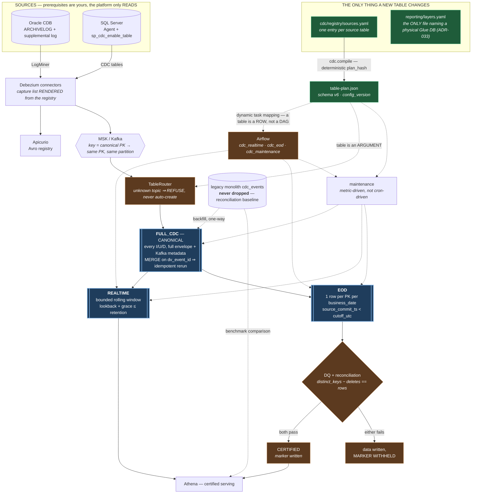

# Config-Driven CDC Table Platform — Architecture

**Status**: production-ready (Phase 8). **Contract**: ADR-062 … ADR-069.

One file decides what the platform captures and how. Everything below it is generic: adding a
table is a registry entry, and no layer of this diagram gains a line of code for it.

## The five invariants the diagram encodes

1. **FULL_CDC is canonical; REALTIME and EOD are siblings, never a chain.** EOD reads
   FULL_CDC directly, so a certified balance never depends on a bounded window that has aged
   rows out, nor on another job's schedule.
2. **The ingest never creates a table.** An unknown topic is refused, naming the registration
   step — an auto-created table is an unowned, unclassified, unretained data product.
3. **Certification is a gate, not a label.** Data is written when validation fails; the
   *marker* is withheld.
4. **The legacy monolith is never dropped.** It stays the reconciliation baseline for every
   window already captured (ADR-062).
5. **One file names physical databases.** Everything else names a logical layer.
6. **Tables are data to orchestration.** The DAG task list is dynamic-mapped over the compiled
   plan, so onboarding a table adds a task and not a file. A per-table DAG fails a test.

## What a new table costs

| | |
|---|---|
| new Python | **none** |
| new DAG | **none** — tasks are mapped over the plan (ADR-071) |
| new SQL | **none** |
| config | one registry entry (~6 lines) |
| runtime | 1 Kafka topic, 3 Iceberg tables, 1 nightly close |

Proven twice in Phase 8, on both engines: `oracle.coredb.corebank.loan` and
`sqlserver.digital.dbo.payment_method`.

## Where to start

`docs/CDC_TABLE_QUICKSTART.md`.
