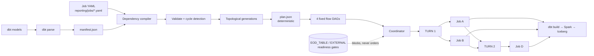

# Dependency discovery, turns, and the four fixed DAGs

## How dependencies are discovered



## dbt vs manual dependencies

**The dbt manifest is authoritative for dbt-to-dbt edges.** Write `{{ ref('dim_customer') }}`
in the model and run `make reporting-compile-dbt`; do **not** also list it in YAML.

Author a dependency in YAML only for what dbt cannot see:

| Type | Use for |
|---|---|
| `JOB` | an upstream reporting job — **ordering**, changes the turn |
| `EOD_TABLE` / `REALTIME_TABLE` / `FULL_CDC_TABLE` / `DATASET` | a layer closing — **gate**, does not change the turn |
| `EXTERNAL` | something outside this platform — gate |

### Ordering and readiness are different things

A `JOB` dependency is an **ordering** constraint: there is a job to run first, so it belongs
in the graph and decides which turn you land in.

A dataset dependency is a **gate**: there is no job to run before it, only a condition to
wait on. It cannot produce a turn, and forcing it into the graph would invent an ordering
that does not exist. Gates are evaluated at gate time by
`spark/reporting/dataset_gates.py` and **never** change `turn`.

Each gate returns one of four states, not a boolean:

| State | Meaning | Operator action |
|---|---|---|
| `READY` | condition met | none |
| `WAITING` | not met yet | wait |
| `FAILED` | could not be evaluated, or config invalid | **go and fix something** |
| `NOT_APPLICABLE` | declared for a different flow mode | none |

`WAITING` and `FAILED` demand opposite responses, so collapsing them into "not ready" makes
the run un-debuggable.

## How turns are calculated

`turn` is a **topological execution wave**, computed by `graph.compute_turns`, never
authored. Every dependency lands in a strictly earlier turn than its dependent.

```
A ──┐
    ├── C ── E          TURN 1: A, B, D
B ──┘                   TURN 2: C
D ──────────┘           TURN 3: E
```

Jobs in the same turn are independent and run **concurrently** via Airflow dynamic task
mapping (`reporting_common.py`, `.expand()` per wave).

## Why turn ≠ attempt_number

A retry is a **new attempt in the same turn**:

```
C fails  →  turn = 2, attempt_number = 2      ✅
         →  turn = 3                          ❌ wrong
```

Keeping `turn` fixed is what preserves the wave: a retry must not jump ahead of what it
depends on, nor be replanned into a wave whose dependents have already run. Asserted by
`test_phase15_recovery.py::test_zx_retry_increments_attempt_and_keeps_turn`.

## The four fixed DAGs

`datamart_eod` · `datamart_auto_correct` · `datamart_fulfill` · `datamart_stream_batch`

Adding a mart adds **zero** DAG files — the mart is *data* to the coordinator, not a new
DAG. `STREAMING_RT` is deliberately not among them: it is a long-running Structured
Streaming lifecycle, not a finite flow.

DAG parsing stays cheap because the heavy work — manifest parse, graph build, cycle check,
turn assignment — happens at **compile** time and lands in `plan.json`. The scheduler reads
a compiled artifact; it does not query Athena, Glue, or the dbt project.

## Adding a new datamart

See `docs/NEW_DATAMART.md`. Three files, no DAG:

```
dbt/models/marts/<job_id>.sql
dbt/models/marts/schema.yml
reporting/jobs/<job_id>.yaml
```

## Debugging WAITING_DEPENDENCY

There is no `BLOCKED_DEPENDENCY` state. `docs/REPORTING_TARGET_ARCHITECTURE.md` fixes the
vocabulary at ten states, and a dependent whose upstream **failed** carries the same
`WAITING_DEPENDENCY` as one whose upstream is merely **still running**. That is a
deliberate consequence of gating on the upstream's *watermark* rather than on its
execution status: a failed run never advances its watermark, so the dependent is held
without the coordinator needing to reason about the upstream's status at all. The
behaviour is correct — the child cannot run early, and an unrelated branch is unaffected —
but the two causes are not distinguishable from the state alone. To tell them apart, read
the upstream's last execution record; the commands below print the gate condition that is
unmet.


```bash
scripts/dependency-graph.py --flow EOD                    # turns + gates
scripts/dependency-graph.py --flow EOD --format mermaid   # paste into a doc
scripts/dependency-graph.py --flow EOD --format json
```

The gate list prints the condition and the lag, so a job waiting on a day that has not
closed is visible without querying DynamoDB. Then:

- upstream **job** not satisfied → `docs/runbooks/dependency-investigation.md`
- upstream **table** not closed → `docs/runbooks/eod-retry.md`

## Performance

Measured by `spark/tests/test_dependency_scale.py` (no AWS, no Spark):

| Jobs | Build + turns |
|---|---|
| 100 | 0.6 ms |
| 500 | 1.9 ms |
| 1000 | 3.6 ms |
| 1000, cyclic | 7.4 ms to detect |

Cycle detection previously used `nx.simple_cycles`, which enumerates **every** cycle and
did not return on a 1000-node graph — defeating ADR-037's compile-time guarantee exactly
when the graph is large enough to need it. It now uses `nx.find_cycle` (O(V+E), first cycle
found).
