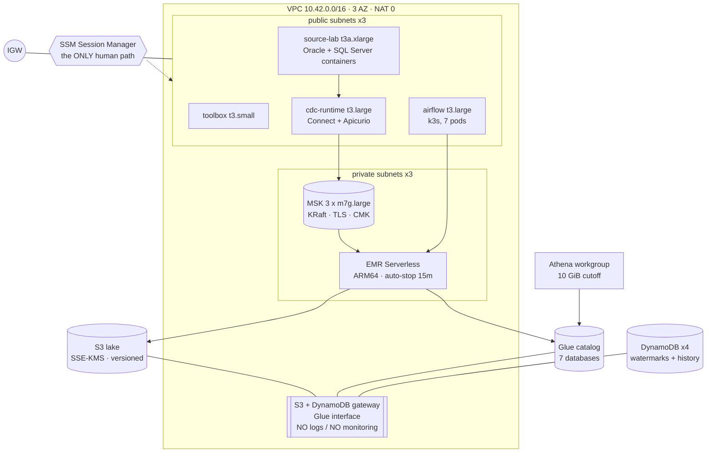
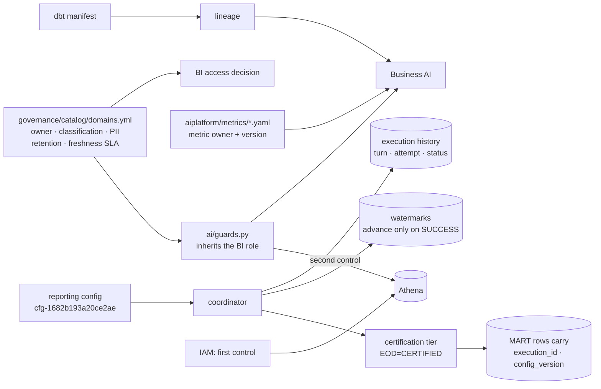
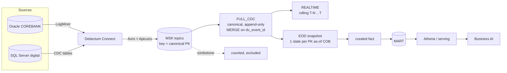
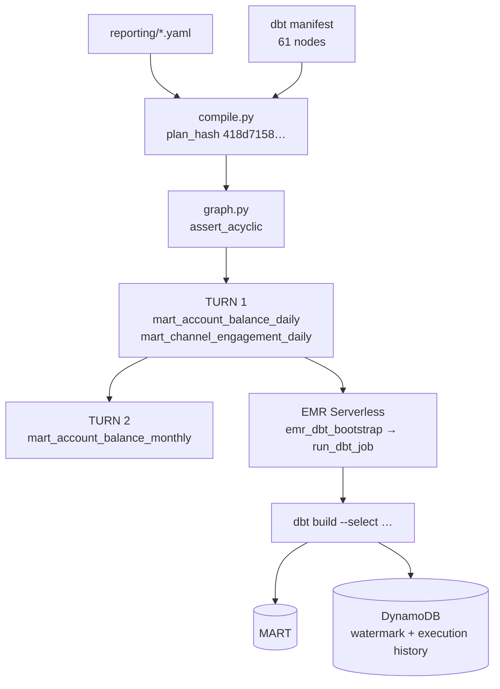
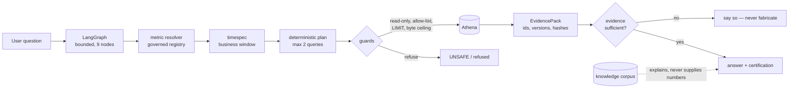
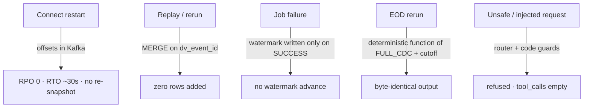

# End-to-End Demo — one key traced through every layer

Live run 2026-09-03. Account **990002**: inserted, deleted, then recreated on the same PK —
the sequence that exercises ordering, tombstones, dedup and resurrection in one chain.

## Correlation map

| Layer | Identity | Value |
|---|---|---|
| Source PK | `corebank.account.ACCOUNT_ID` | **990002** |
| Source SCN | insert / delete / recreate | `3101554` / `3101561` / `3101577` |
| Kafka | topic / partition / offsets | `cdc.oracle.COREBANK.ACCOUNT` / **1** / **121, 122, 124** |
| Tombstone | offset **123** | absent from FULL_CDC — counted, not ingested |
| FULL_CDC ops | `c` → `d` → `c` | `position_primary` 3101552 < 3101559 < 3101575 |
| `dv_event_id` | per delivered record | `de00c69bd0c3`, `1daf5eda6fe1`, `6084449f4dfa` |
| `dv_src_event_id` | per source change | `a548f71ea173`, `6ee24864b5f4`, `b8200851ff0e` |
| REALTIME | snapshot | `7340210906418940945`, 72 h window from `2026-08-31 10:13:06Z` |
| EOD | COB / tag / snapshot | `2026-09-03` / `EOD_2026-09-03` / `5452782707029562418` |
| Coordinator | run / execution | `p14b-eod-1788432893` / `…:EOD:mart_account_balance_daily:2026-09-03:1` |
| Turn / attempt | | **1 / 1** |
| Spark app | EMR job | `/applications/00g8g05ud5dj2u25/jobs/00g8g2f9pgg9vg27` |
| dbt | selector / result | `--select mart_account_balance_daily` / `PASS=3 WARN=0 ERROR=0` |
| Mart row | | `990002 | 2026-09-03 | 777.77 | CERTIFIED` |
| Config version | | `cfg-1682b193a20ce2ae` |
| Athena | query ids | `28658a65-…` (chain), `2ffc94db-…` (mart row) |
| Metric | id / version | `total_closing_balance` / `metric:0d1b5e7ea203f9de` |
| Agent | request id | `f7b3804a-6dec-416e-ac1f-2d6a5390ff38` |
| Feature group | version | `feature_group:bded816b072c310d` |
| Tokens / cost | | `0 / 0` · `$0.000000` (generation disabled) |

Account **990001** ran the same path but ended in a delete, and is correctly **absent** from
EOD, the mart and the AI answer.

## Physical AWS



Operators reach every host through SSM only — no key pair, no port 22, no inbound
`0.0.0.0/0`. The missing `logs` and `monitoring` endpoints are finding G3.

## Governance / control plane



Ownership, classification, PII and retention derive from **one** registry, and the AI SQL
guard inherits the BI role's access from that same file rather than keeping a second list
that would drift invisibly.

## Logical CDC / lakehouse



FULL_CDC is the **canonical** layer; REALTIME and EOD are siblings derived from it, not a
chain. `FULL_CDC_RAW` is deliberately unbound so the prohibition is nameable (ADR-033).

## Reporting and dependency turns



Two marts share TURN 1 — that is the same-turn parallelism. The monthly roll-up is TURN 2
because it depends on them.

## Business AI control plane



## Failure / recovery



## Reproducing the demo

```bash
bash scripts/cdc-window-start.sh                       # readiness gate, exit 0 required
bash scripts/source-lab.sh workload 1 --execute        # phrase: RUN WORKLOAD 1
# FULL_CDC → REALTIME → EOD on EMR (recipe: artifacts/validation/final-e2e/cdc/02-lakehouse-layers.txt)
python3 scripts/reporting-live-run.py --flow-mode EOD --business-date <COB> \
        --job-id mart_account_balance_daily --execute
python3 /tmp/bai_live.py "what is the total closing balance on <COB>"
```

The full evidence set is frozen under `artifacts/validation/final-e2e/`.
