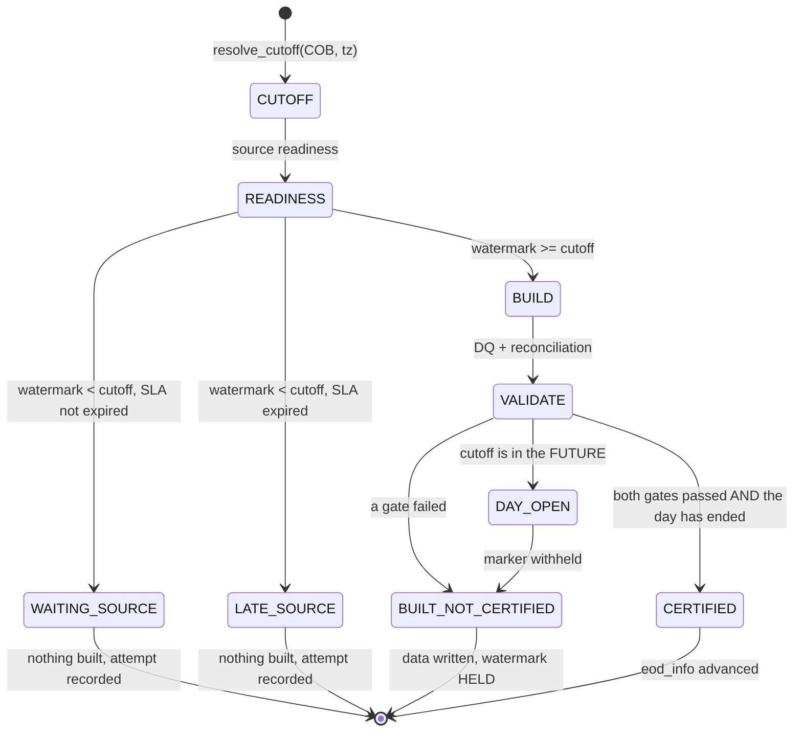

# The EOD control plane

Two tables answer two different questions, and the split is the point.

| table | question | shape |
|---|---|---|
| `ops.eod_info` | *what is the current certified state of this table for this date?* | ONE row per `(table_id, cob_date)`, MERGEd in place |
| `ops.eod_run_hist` | *what happened, every attempt, forever?* | append-only, one row per attempt, partitioned by COB |

Related: ADR-076, ADR-077. Runbook for the build itself: `EOD_SNAPSHOT_RUNBOOK.md`.

---

## 1. Why not one table

`eod_run` was an append log being asked a state question. "The current certified state" then
means "the latest row, by some ordering, that happens to be CERTIFIED" — a convention no
column enforces and every reader re-implements slightly differently. The Phase A audit found
exactly that.

`eod_info` answers it directly, and carries the watermark **pair** — what the close moved
FROM and what it moved TO. "What did this close actually advance?" is not answerable from a
cutoff alone.

## 2. The close, as a state machine



Three properties this encodes:

**The data is written either way.** A snapshot an operator can inspect beats one thrown
away. Only the completion marker is withheld, and downstream reads the marker.

**A failed run never advances a successful watermark.** `EOD_WATERMARK_HELD` is printed and
`eod_info` keeps its previous value. The attempt still lands in `eod_run_hist`, so "we waited
four times and then it went late" is visible afterwards.

**An unrecordable certification is not a certification.** Both gates passing is necessary and
not sufficient — the marker has to exist for anything to be able to read it. If the
`eod_info` write fails, the status degrades to `UNVERIFIED_NO_EVIDENCE`.

## 3. Readiness: a clock cannot certify

The rule: **FULL_CDC must hold at least one event committed at or after the cutoff.** That is
the only positive evidence that everything before the cutoff has arrived. A watermark merely
*close to* the cutoff proves nothing — the missing minute may hold the day's last thousand
transactions.

Two signals, either sufficient:

* the table's **own** watermark — strongest, but a quiet table has no event after the cutoff.
  `channel` holds four rows and may not change for weeks; requiring one would put every
  reference table into `LATE_SOURCE` on every close, every day.
* the **platform** watermark (`ops.streaming_app_state.source_watermark_ts`) — the ingest
  itself has consumed past the cutoff, so a table with nothing after it genuinely had nothing.

Connector health and ingest status are inputs too: a stalled ingest with a stale watermark
must not be waited on until the SLA expires and then certified by a human who assumes the day
was empty.

## 4. `--skip-readiness` waives the SOURCE gate, never the CLOCK

Its help has always said *"Never for closing the current day."* Nothing enforced it, and the
one run that used it published COB 2026-09-20 as **CERTIFIED** while that day's own cutoff,
2026-09-21T00:00Z, was still six hours in the future — a number published as final that a
later close could still change.

`close_table` now refuses to certify any COB whose cutoff has not passed, whatever the flag
says:

```
EOD_DAY_OPEN oracle.coredb.corebank.branch 2026-09-20: cutoff
2026-09-21T00:00:00+00:00 has not passed; built, NOT certified
```

`--skip-readiness` remains correct for a **historical rebuild**, where the source moved past
the cutoff long ago and the gate has nothing left to protect.

## 5. Diagnosing `WAITING_SOURCE`

```sql
SELECT table_id, cob_date, attempt, status, err_msg
FROM   kafka_dev_lab_dev_ops.eod_run_hist
WHERE  cob_date = DATE '<COB>'
ORDER  BY attempt DESC;
```

The message names the gap in minutes:

```
source watermark 2026-09-20T09:58:20+00:00 is 842 min behind the
cutoff 2026-09-21T00:00:00+00:00
```

Then, in order:

1. **Is the day over?** If the cutoff is in the future, waiting is correct. Nothing to fix.
2. **Is the ingest running?** `cdc-stream.py status`. A `STOPPED` app with a stale watermark
   is the common cause — run it.
3. **Is capture healthy?** `scripts/cdc-runtime.sh status` — both connectors should be
   `RUNNING`.
4. **Is the source genuinely quiet?** Then the *platform* watermark should still pass the
   cutoff. If it does not, the ingest is the problem, not the table.

`WAITING_SOURCE` becomes `LATE_SOURCE` once `cutoff + source_sla_minutes` has passed. The
distinction is deliberate: waiting is normal, late is an alert.

## 6. Reading the state

```sql
-- current state
SELECT table_id, cob_date, certification_status, row_count,
       prev_watermark_ts, watermark_ts
FROM   kafka_dev_lab_dev_ops.eod_info
WHERE  cob_date = DATE '<COB>';

-- every attempt, including the ones that failed
SELECT table_id, attempt, status, dq_status, reconciliation_status,
       duration_seconds, err_msg
FROM   kafka_dev_lab_dev_ops.eod_run_hist
WHERE  cob_date = DATE '<COB>' ORDER BY table_id, attempt;
```

`eod_info_legacy_v` exposes `pre_datelastmaint` / `datelastmaint` for consumers that speak
the older dialect. A VIEW, never columns on `eod_info`: those names are ambiguous about
whether they mean the date a close moved FROM or TO, and making them canonical would bake
that ambiguity into the platform's own control table. Applied through Athena
(`make cdc-eod-legacy-view`), because Iceberg view support is catalog-dependent.
