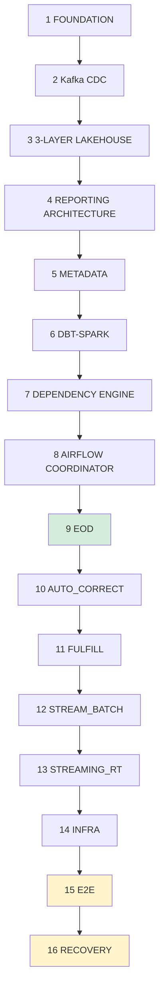

# Final execution order

The order a fresh build runs in, end to end. Each stage names what must be **true** before
the next one starts — a stage that "completed" without its exit condition is the most
expensive kind of green.

Guide-package prompts 00–19 cover stages 1–3 and 13–16. Stages 4–12 — the reporting
framework — have **no prompt** in that package; see
`aws-cdc-lakehouse-claude-guide-v2/prompts/PROMPT_STATUS.md` §3.

| # | Stage | Builds | Exit condition — what must be TRUE | Status |
|---|---|---|---|---|
| 1 | **FOUNDATION** | VPC, MSK, S3 + KMS, Glue, Athena, IAM, budgets | `terraform plan` clean; 0 NAT gateways; every resource tagged | **DONE** |
| 2 | **Kafka CDC** | Source lab, Connect, Apicurio, Debezium | Topic offsets match the seed **exactly**, and Apicurio holds one schema per topic | **DONE** |
| 3 | **3-LAYER LAKEHOUSE** | FULL_CDC (canonical) → REALTIME + EOD | Row counts reconcile to source; a re-run is a **no-op** | **DONE** |
| 4 | **REPORTING ARCHITECTURE** | Five modes, accuracy ladder, layer policy | A lower tier cannot overwrite a higher one — proven against live data | **DONE** |
| 5 | **METADATA** | DynamoDB runtime state: executions, watermarks, streaming | A watermark exists only behind a run that completed **and** validated | **DONE** |
| 6 | **DBT-SPARK** | Models, macros, wheelhouse, EMR bootstrap | `dbt build` runs **on EMR**, not substituted | **DONE** |
| 7 | **DEPENDENCY ENGINE** | Direct edges → transitive closure → turns | A cycle fails at **compile** time, not run time | **DONE** |
| 8 | **AIRFLOW COORDINATOR** | Four generic flow DAGs + lifecycle DAG | Adding a mart adds **zero** DAG files | **CODE DONE, NOT DEPLOYED** (OPEN-28) |
| 9 | **EOD** | Certified daily close | Gate refuses to open without ledger row **and** Iceberg tag | **DONE** |
| 10 | **AUTO_CORRECT** | Late-CDC repair | Refused against a CERTIFIED date, **before** submitting a job | **DONE** |
| 11 | **FULFILL** | Historical backfill | Stamps `RECONCILED`; per-date outcomes resumable | **DONE** |
| 12 | **STREAM_BATCH** | Finite micro-batch, frozen window | `watermark_ts` committed at the frozen upper bound | **DONE** |
| 13 | **STREAMING_RT** | Long-running stream lifecycle | Checkpoint read from **S3**; no path can delete it | **LIFECYCLE DONE, 0 EVENTS** |
| 14 | **INFRA** | Apply, cost guardrails, stop/destroy | `verify-destroy.sh` accounts for every billable resource | **DONE** |
| 15 | **E2E** | 8 scenarios on live infrastructure | No PASS without concrete data evidence | **DONE** — `artifacts/validation/session-34/PHASE14-RESULT.md` |
| 16 | **RECOVERY** | 20 injected failures | No invalid watermark advancement in any case | **DONE** — `artifacts/validation/session-34/PHASE15-RECOVERY-MATRIX.md` |

## Why this order and not another

**3 before 4.** The reporting framework reads layers. Building modes against a layer whose
dedup and ordering are unproven means every later discrepancy has two candidate causes.

**5 before 6.** dbt writes the mart, but the *watermark* is what makes the write
trustworthy. Runtime state first means a dbt failure is already recoverable when it happens.

**7 before 8.** The turn graph is what Airflow expands over. An orchestrator built before
the graph ends up owning dependency logic, which is exactly the coupling ADR-037 avoids.

**9 → 12 in tier order.** EOD establishes `CERTIFIED`. Every later mode writes a *lower*
tier, so each one is a test that the ladder refuses a downgrade. Building STREAM_BATCH
first would have nothing to be refused by.

**13 last among the modes.** It is the only workload that bills per hour rather than per
run, so it is the last thing to switch on and the first to switch off.

**15 before 16.** Recovery tests assert what happens when a working pipeline breaks. Run
against a pipeline that never worked, they assert nothing.

## What is still open

| Item | Blocks | Note |
|---|---|---|
| Airflow not deployed (OPEN-28) | stage 8 | Retry backoff, pools and scheduler concurrency unproven. The framework's own guards do not depend on the scheduler — `test_phase15_recovery.py` case 14. |
| REALTIME layer not materialised | stage 3 | Bound to `kafka_dev_lab_dev_stream`; STREAM_BATCH reads a bounded projection and records `source_layer_substituted`. |
| STREAMING_RT processed 0 events | stage 13 | `is_enabled=false`. Lifecycle proven; throughput not. |
