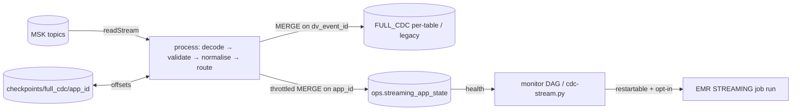

# FULL_CDC streaming ingest — operator guide

Kafka → FULL_CDC, as a Structured Streaming application. Decisions: ADR-073 (mode, trigger,
checkpoint identity) and ADR-074 (state, lifecycle, restart). The **one transformation path**
is `spark/jobs/full_cdc/stream_job.py::process`, shared by both modes.

> **Status: `STATIC_PASS` + `LOCAL_PASS`.** Every mechanism here is tested on local Spark and
> Iceberg. **No resident run has executed on EMR**, and the restart evidence in §7 is
> pending. Nothing in this document is a live-tested claim unless it cites
> `artifacts/validation/phase-b/`.

---

## 1. Lifecycle — before and after Phase B

| | before (as found 2026-09-17) | after Phase B |
|---|---|---|
| what ran | batch `job.py`, by hand (`emr-submit.sh`) | `stream_job.py`, either mode |
| mode | inferred from `--run-seconds` (default 240) | `ingestion.profile` → `mode`, in the plan |
| trigger | `--trigger-seconds` 30 | `ingestion.trigger_interval`, default 1 minute, 30 s floor |
| checkpoint | `--checkpoint` **required**, hand-typed; S3 holds `stream_w20260906`, `…b` | derived: `checkpoints/full_cdc/<app_id>` |
| app identity | none | from subscribed topics via `ingestion.apps`, unknown topic refused |
| fresh checkpoint starts at | `latest` (skips the backlog) | `earliest` (idempotent via `dv_event_id`) |
| state | table provisioned, **0 rows, no writer** | one row per app, MERGEd in place, throttled |
| liveness | row counts compared by eye | `cdc-stream.py health`, same rule as the monitor |
| start/stop/restart | none | `full_cdc_streaming_{start,monitor,stop}`, off by default |
| restart | none | EMR `STREAMING` run retry, with the monitor as backstop, bounded |
| checkpoint reset | STREAMING_RT only | `streaming-reset.sh --app-id`, same typed-phrase gate |



## 2. Modes

```yaml
# cdc/registry/sources.yaml
ingestion:
  profile: lab_low_cost          # production | lab_low_cost
  # mode: continuous_microbatch  # optional override; profile picks otherwise
  trigger_interval: "1 minute"
  heartbeat_interval: "5 minutes"
```

| profile | mode | behaviour | cost shape |
|---|---|---|---|
| `lab_low_cost` | `available_now` | drain what Kafka holds, commit, exit | per drain |
| `production` | `continuous_microbatch` | resident, commits every trigger | **per hour, always** |

Both modes run the same `process`. They differ only in `writer.trigger(...)` and in whether
the process stays up. An unknown key in `ingestion:` fails at compile, so a typo cannot
quietly fall back to a default.

`--test-only-run-seconds` exists for local tests. It has no default and is **refused under
`profile: production`**.

## 3. Checkpoints

```
s3://kafka-dev-lab-dev-lake-111122223333/checkpoints/full_cdc/full-cdc-oracle
s3://kafka-dev-lab-dev-lake-111122223333/checkpoints/full_cdc/full-cdc-sqlserver
```

* The path is derived from the **app id**, never from a run id or `config_version`.
  Onboarding a table does not move it.
* The job refuses a checkpoint under `warehouse/` (CLAUDE.md 5.9).
* The job **never deletes** a checkpoint. Only `streaming-reset.sh` does, and see §6 for it.
* **First start under these paths**: neither exists yet (verified 2026-09-17,
  `artifacts/validation/phase-b/01-checkpoints.txt`). The app starts from `earliest` and
  replays each topic into the MERGE. The replay is idempotent, and it costs more once.
* The date-keyed `stream_w20260906` and `stream_w20260906b` are orphaned by this change and
  deliberately left in place.

`python3 scripts/cdc-stream.py apps` prints every app, its topics and its checkpoint.

## 4. State contract — `ops.streaming_app_state`

One row per `app_id`, updated in place. Columns come from `cdc/ingestion.py::STREAMING_STATE_COLUMNS`:

| column | meaning |
|---|---|
| `app_id` / `deployment_id` | stable identity / which submission (EMR job run id) |
| `mode`, `profile`, `trigger_interval` | what it was running as |
| `checkpoint_location` | durable position |
| `status` | `STARTING → RUNNING → STOPPED \| FAILED → STARTING` (closed) |
| `last_batch_id`, `rows_last_batch`, `rows_total` | progress |
| `kafka_offsets` | `{topic:{partition:offset}}` JSON, coordinates only |
| `source_watermark_ts` | max `source_commit_ts` committed (**business** time) |
| `last_commit_ts`, `target_snapshot_id` | last successful commit |
| `restart_count` | read back and incremented on each start, so a crash loop shows |
| `config_version` | evidence only, **not** part of identity |
| `error` | truncated to 2,000 chars; full trace in the EMR driver log |
| `updated_at` | heartbeat |

**When a row is written**: at start (STARTING), after any batch that moved rows, on any
status change or error, when `heartbeat_interval` has elapsed, and at the end
(STOPPED/FAILED). An empty batch inside the interval writes nothing.

A failed state write is logged as `FULL_CDC_STREAM_STATE_WRITE_FAILED` and **does not fail
the batch**.

## 5. Health

```bash
python3 scripts/cdc-stream.py status                 # every app, one Athena SELECT
python3 scripts/cdc-stream.py health                 # exit 1 if any app is not healthy
python3 scripts/cdc-stream.py health --app-id full-cdc-oracle
```

| verdict | when | monitor restarts? |
|---|---|---|
| `HEALTHY` | RUNNING, heartbeat within 3 × interval | — |
| `STARTING` | STARTING | — |
| `STALE` | RUNNING, heartbeat older than 3 × interval | yes, if opted in |
| `FAILED` | FAILED | yes, if opted in |
| `STOPPED` | stopped cleanly | **never**, because someone stopped it |
| `ABSENT` | no row | no; a human decides (never ran, or state write broken) |

The monitor DAG and the CLI call the same `cdc.streaming_state.health`.

## 6. Operations

**Start (lab, finite drain):**
```bash
python3 scripts/cdc-stream.py submit --app-id full-cdc-oracle   # prints the command only
```
Review the printed command, then run it yourself. `emr-submit.sh` starts billable compute.

**Start (scheduled):** set `ENABLE_FULL_CDC_STREAMING=true` on the Airflow node and unpause
`full_cdc_streaming_start`. Auto-restart additionally needs `FULL_CDC_AUTO_RESTART=true`
(bounded by `FULL_CDC_MAX_RESTARTS`, default 1 per monitor run, and by
`FULL_CDC_MAX_FAILED_PER_HOUR`, default 3, on the EMR side).

**Stop:** unpause `full_cdc_streaming_stop`, or cancel the job run. **The checkpoint stays**,
and the next start resumes from it.

**Reset a checkpoint** (discards position, audited):
```bash
python3 scripts/cdc-stream.py health --app-id full-cdc-oracle      # must NOT be RUNNING
bash scripts/streaming-reset.sh --app-id full-cdc-oracle \
     --bucket kafka-dev-lab-dev-lake-111122223333                   # dry run
bash scripts/streaming-reset.sh --app-id full-cdc-oracle \
     --bucket kafka-dev-lab-dev-lake-111122223333 --execute         # typed phrase
```
The checkpoint is moved to `<path>_reset_<UTC>`, not deleted, and a RECOVERY line is
appended to `artifacts/validation/streaming-resets.log`.

## 7. Live acceptance — PENDING (run in a CDC window)

Each step is non-destructive except where marked. Record output under
`artifacts/validation/phase-b/`.

```bash
export AWS_PROFILE=my-aws-profile AWS_REGION=ap-southeast-1
aws sts get-caller-identity                                  # expect 111122223333
bash scripts/cdc-deploy-code.sh                              # stage zip + plan (schema 8)
bash scripts/cdc-watch.sh --once   > artifacts/validation/phase-b/10-before.txt

# (billable) run 1: drain from earliest into full-cdc-oracle
python3 scripts/cdc-stream.py submit --app-id full-cdc-oracle   # run the printed command
python3 scripts/cdc-stream.py status > artifacts/validation/phase-b/11-state-run1.txt
bash scripts/cdc-watch.sh --once   > artifacts/validation/phase-b/12-after-run1.txt

# (billable) run 2: same app, same checkpoint -- must RESUME, not replay
python3 scripts/cdc-stream.py submit --app-id full-cdc-oracle
python3 scripts/cdc-stream.py status > artifacts/validation/phase-b/13-state-run2.txt
```

**Pass criteria**

1. `restart_count` 1 → 2, with the same `checkpoint_location`.
2. After run 2, `last_batch_id` continues from run 1 instead of restarting at 0, and run 2's
   first batch reads only offsets past run 1's `kafka_offsets`.
3. For each FULL_CDC table: `count(*) == count(DISTINCT dv_event_id)`, meaning no transport
   duplicate after the restart.
4. `count(DISTINCT dv_src_event_id)` reported alongside, with any gap to `dv_event_id`
   listed as logical re-deliveries, not hidden.
5. Kafka end offsets vs FULL_CDC rows per table: the residual equals tombstones plus events
   produced after the drain began. Kafka offsets count tombstones, so they are not a row
   count.
6. `health` is `STOPPED` after an `available_now` drain, not `ABSENT`.

## 8. Cost

See `docs/COST.md` §"FULL_CDC resident streaming". A drain costs a few cents. Two resident
apps cost about **$0.76/hr** at the default sizing, which stays off in the lab.
