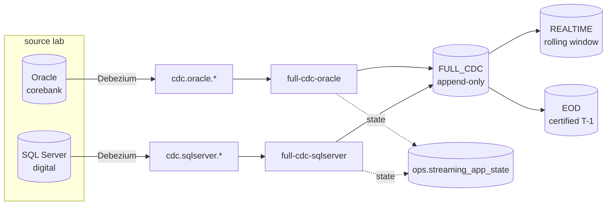

# FULL_CDC streaming runbook

Kafka → FULL_CDC. The append-only canonical layer: every I/U/D, with its full envelope and
Kafka metadata. REALTIME and EOD are **siblings derived from this**, not links in a chain
(`reporting/layers.yaml`, ADR-033).

Related: ADR-073 (checkpoint derivation), ADR-074 (execution modes), ADR-024 (UTC).

---

## 1. The two execution modes, and why the distinction is load-bearing



| | `continuous_microbatch` | `available_now` |
|---|---|---|
| profile | `production` | `lab_low_cost` (default) |
| lifetime | resident until stopped | drains what Kafka holds, commits, exits |
| EMR job-run mode | `STREAMING` | `BATCH` |
| cost | holds capacity | pays for the drain only |
| `--test-only-run-seconds` | **refused** | permitted |

The mode is a property of the **compiled plan**, not of the command line. Phase A found
production behaviour being *inferred* from a CLI flag, which meant the same command meant
different things depending on who typed it. `stream_job.py` now refuses
`--test-only-run-seconds` under the `production` profile:

```
REFUSING: --test-only-run-seconds under profile 'production'. A production
app is stopped by an operator, not by a stopwatch.
```

**There is no production dependency on a wall-clock budget.** The budget branch exists only
for the lab mode and is named `--test-only-` so it cannot be mistaken for an operational
control.

## 2. Checkpoints are derived, never typed

`checkpoints/full_cdc/<app_id>` — from the **app id**, never from a run id (ADR-073 §5). A
checkpoint keyed on a run replays the entire subscription on every restart, which looks like
a duplicate-data incident and is really a naming mistake.

`--checkpoint` is optional and exists for recovery drills only. The streaming checkpoint and
the Iceberg warehouse never share a prefix (CLAUDE.md §5.9).

## 3. Starting an app

```bash
python3 scripts/cdc-stream.py apps            # what exists, and its checkpoint
python3 scripts/cdc-stream.py status          # ops.streaming_app_state
python3 scripts/cdc-stream.py submit --app-id full-cdc-oracle
```

`submit` **prints** the command rather than running it: starting an EMR Serverless job is a
gate, and no gate may be self-approved (`APPROVAL_GATES.md`). Copy, read, then run.

The printed command is positional (`<name> <entrypoint-s3> <role> [args...]`). It used to
print `--entrypoint ... --args '...'`, a form `emr-submit.sh` has never accepted, and pointed
at `s3://$LAKE/config/`, which is empty. An operator command that cannot run is worse than
none, because it is copied before it is read.

## 4. Restart without deleting the checkpoint

**Deleting a checkpoint is never the first move.** It replays the whole subscription, and
with `--event-index` that is a large, slow, and entirely avoidable rewrite.

1. `cdc-stream.py status` — read `status`, `restart_count`, `error`, `kafka_offsets`.
2. If `status = FAILED`, read the driver log at
   `s3://<lake>/logs/emr/applications/<app>/jobs/<run>/SPARK_DRIVER/stdout.gz`.
3. Re-submit the **same app id**. The checkpoint is derived from it, so the app resumes from
   its committed offsets. `restart_count` increments; nothing is re-read.
4. Verify: row count unchanged for already-ingested topics, `dv_event_id` still distinct.

Proven live: a restart added **0 rows** and took `restart_count` to 2.

### A checkpoint that OUTLIVES its stack

`terraform destroy` does not empty the lake bucket, so `checkpoints/full_cdc/<app_id>/`
survives a rebuild. The next ingest then fails twice over, and both reasons matter:

1. **It cannot be read.** The files were written under the previous lake CMK; the rebuilt
   role policy names only the new one:
   `not authorized to perform: kms:Decrypt on resource: ...key/<old>` — observed
   2026-09-23, run `00g9059qp4cjt027`.
2. **It is WRONG even if it could be read.** `provision_cdc_tables.py` recreated FULL_CDC
   empty. The checkpoint says "already consumed through offset N", so resuming would skip
   every event before N — permanently, and silently, because the topic still has them and
   nothing downstream would report a gap.

Reason 2 is the one that matters. Reason 1 merely makes the failure loud, which is lucky:
had the old key still been readable, the ingest would have started cleanly and produced an
incomplete FULL_CDC that looked healthy.

So a rebuild is the documented case for `streaming-reset.sh`, which MOVES the checkpoint to
`<app_id>_reset_<timestamp>` rather than deleting it:

```bash
export LAKE_BUCKET=<lake>
bash scripts/streaming-reset.sh --app-id full-cdc-oracle              # dry run first
bash scripts/streaming-reset.sh --app-id full-cdc-oracle --execute
```

Delete a checkpoint only when the offsets themselves are unusable — a topic was recreated, or
retention expired past the committed offset. Then it is a deliberate backfill, and
`backfill.py` is the tool.

## 5. Exactly-once, and the two identities

* `dv_event_id` — TRANSPORT identity: topic / partition / offset. Unique per Kafka record.
* `dv_src_event_id` — LOGICAL identity: the source change itself.

They are different questions. A redelivery has the same `dv_src_event_id` and a new
`dv_event_id`; a rerun has neither. FULL_CDC keeps all of it (CLAUDE.md §5.3: no business
dedup), and idempotency is asserted on `dv_event_id`.

`kafka_offset` increases only **within one partition** and is never used as a global
ordering (§5.4). Event order is commit SCN / LSN first, then `source_ts_ms`, then
partition/offset as tie-breakers.

## 6. Partitioning and write

`event_date` identity partitioning, Parquet + Iceberg v2, target file 128 MB.
Never partitioned on a PK or any high-cardinality column (§6). The measured justification is
`docs/DATA_LAYOUT_BENCHMARK.md` — `days(source_commit_ts)` was benchmarked against identity
and against bucket(16/32/64) and did not win.

## 7. Diagnosing

| symptom | first thing to read |
|---|---|
| `ModuleNotFoundError: No module named '<x>'` | `SHARED_MODULES` in `cdc-deploy-code.sh` — the zip name is the IMPORT name |
| `kms:Decrypt` AccessDenied | the object predates a CMK rotation. Re-upload it; do not widen the policy reflexively |
| `ApplicationMaxCapacityExceededException [disk: 100 GB]` with nothing running | EMR dynamic allocation ignoring `spark.executor.instances`. `DYNAMIC_ALLOCATION=false` is now the default |
| rows in Kafka, none in FULL_CDC | the app has never been run. `ops.streaming_app_state` has no row for it — that is the tell |

The last one is not hypothetical: `full-cdc-sqlserver` had five live topics holding 3,344
events and no state row at all, because nothing had ever started it.
