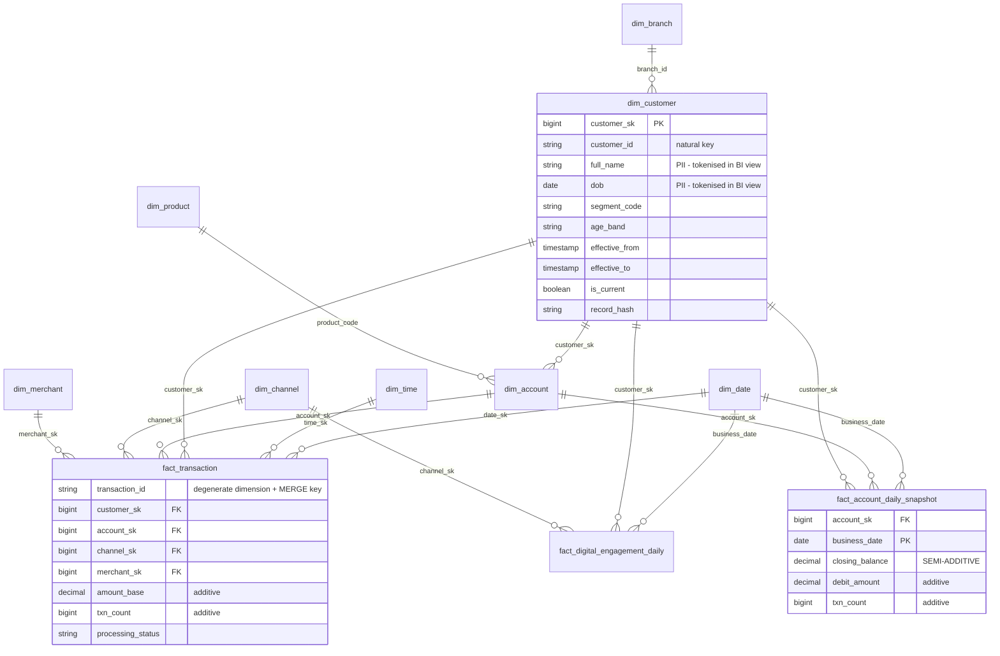

# Kimball dimensional model — banking demo

- Session: 10
- Date: 2026-08-14
- Status: **model semantics PROVEN locally; nothing deployed**
- Sources: [`reference/KIMBALL_SAMPLE_MODEL.md`], [`docs/FOUR_FLOWS.md`](FOUR_FLOWS.md),
  [`docs/L3_SNAPSHOT.md`](L3_SNAPSHOT.md)

---

## 1. Bus matrix

Business processes down, conformed dimensions across. A dimension shared by two processes
is **conformed** — the same table, the same surrogate keys — which is what makes the two
processes drillable together.

| Business process | Fact | Grain | date | time | customer | account | product | branch | channel | merchant |
|---|---|---|:--:|:--:|:--:|:--:|:--:|:--:|:--:|:--:|
| Transaction posting | `fact_transaction` | one transaction | ● | ● | ● | ● | ● | ● | ● | ● |
| Daily account position | `fact_account_daily_snapshot` | account × date | ● | | ● | ● | ● | ● | | |
| Digital engagement | `fact_digital_engagement_daily` | customer × date × channel × device | ● | | ● | | | | ● | |

`dim_customer`, `dim_account` and `dim_channel` are conformed across processes — so
"transaction value and digital sessions for the same customer segment" is one join, not a
reconciliation exercise.

## 2. ERD



## 3. Surrogate keys are deterministic, not sequential

`customer_sk = hash(customer_id, effective_from)` — a 60-bit positive integer.

`monotonically_increasing_id()` or a `row_number` sequence assigns a **different** key to
the same dimension version on every rebuild. Every fact already written then points at the
wrong member, or at nothing, and the mart silently re-attributes history.

This project rebuilds by design — L3 is a pure function of L2, and the four flows re-run
all day — so a non-reproducible key is not survivable. `test_same_version_always_gets_the_same_key`
builds the same dimension from rows in two different orders and asserts every key matches.

Hashing makes collisions *possible* rather than impossible, so `scd2.validate()` checks for
them and **fails**: a silent collision would merge two customers into one.

`dim_date` and `dim_time` are the exception — their keys are the readable natural values
(`20260814`, `1345`), stable by construction, and a human debugging a fact row can read the
date straight out of the key.

## 4. SCD2 — and the join that quietly ruins it

| Dimension | Type | Tracked attributes |
|---|---|---|
| `dim_customer` | **2** | `full_name`, `segment_code`, `status`, `branch_id`, `age_band` |
| `dim_account` | **2** | `customer_id`, `product_code`, `currency`, `status` |
| `dim_product`, `dim_branch`, `dim_channel`, `dim_merchant` | **2** | descriptive attributes |
| `dim_date`, `dim_time` | **0** | immutable — the calendar does not change |

Invariants, all enforced by `scd2.validate()`:

1. Exactly **one** `is_current` row per natural key.
2. **No overlapping validity** — version N's `effective_to` equals version N+1's
   `effective_from`. Intervals are **half-open** `[from, to)`.
3. `effective_from < effective_to`.
4. Surrogate keys unique.
5. The **unknown member (-1) exists**.

`effective_to` uses a `9999-12-31` **sentinel, never NULL**: `txn_ts < effective_to` is
NULL-propagating, so a NULL end date makes the current version match *nothing* and every
recent fact silently falls to the unknown member.

The record hash covers **tracked attributes only** — never `updated_at`. Hashing an audit
column emits a new version every time the source touches a row without changing anything a
user would recognise, and every fact join then has to choose between versions that are
semantically identical.

### The point-in-time join

```sql
-- WRONG
JOIN dim_customer d ON d.customer_id = f.customer_id AND d.is_current

-- RIGHT
JOIN dim_customer d ON d.customer_id = f.customer_id
                   AND f.txn_ts >= d.effective_from
                   AND f.txn_ts <  d.effective_to
```

This is the most common way a Kimball model goes wrong, and **it does not produce an
error**. A customer who was `RETAIL` in January and became `PRIVATE` in June has their
January transactions reported under `PRIVATE`. The row count is right, the amounts are
right, every total reconciles — only the segmentation is wrong, and only against a
historical report.

Using `is_current` against an SCD2 dimension is strictly worse than a Type 1 dimension: it
pays the full cost of keeping history and then discards it.

`test_is_current_would_have_given_the_wrong_answer` asserts the *wrong* answer explicitly,
next to the right one, so the difference is visible rather than asserted in the abstract.

The upper bound is **exclusive**: a fact landing exactly on a version boundary would
otherwise match two versions and **duplicate the fact row**, inflating every additive
measure on it. `assert_no_fanout()` catches that class directly, because a fact count that
changes during a dimension join is always a defect.

## 5. Unknown members and late-arriving dimensions

`UNKNOWN_SK = -1`, and the member is **physically inserted** into every dimension, spanning
all time (`1900-01-01` → `9999-12-31`).

- Inserted, not implied: a join back from the fact to the dimension would otherwise drop
  every unresolved row, and a missing fact reads as a *smaller number* rather than an error.
- Spanning all time: an unknown member with a narrow validity window is no unknown member
  at all for facts outside it.
- Natural key `'UNKNOWN'` rather than NULL, so it appears in a BI filter list instead of
  vanishing into a blank.

Late-arriving dimensions are then resolved by the **full-fill flow** (Session 09, S09-9):
it patches the surrogate key in place, never inserts, and never changes
`processing_status` — resolving a key makes a row more *complete*, not less *certain*.

## 6. Additivity — the measure registry

Declared in `spark/facts/additivity.py`. A measure absent from the registry raises rather
than defaulting: a measure nobody decided how to aggregate is a review failure.

| Measure | Class | Aggregating over time |
|---|---|---|
| `amount_base`, `txn_count`, `debit_amount`, `credit_amount`, `session_count`, `event_count`, `active_minutes` | **ADDITIVE** | `SUM` |
| `closing_balance` | **SEMI-ADDITIVE** | **`LAST` by date — never `SUM`** |
| `distinct_devices`, `conversion_flag` | **NON-ADDITIVE** | refused — re-derive at the grain you need |

### Why `closing_balance` is the dangerous one

Summing it across **accounts** for one day is the bank's total position — correct and
useful. Summing the **same column** across 30 days for one account gives roughly thirty
times that account's balance, which is not a quantity that exists.

Both are `SUM(closing_balance)`. Only the grouping differs — and Power BI produces the
second one by default the moment a user drags the measure onto a date axis.

```dax
-- WRONG: implicit SUM over the date axis
Total Balance = SUM(fact_account_daily_snapshot[closing_balance])

-- RIGHT: semi-additive — last value in the period
Closing Balance =
CALCULATE(
    SUM(fact_account_daily_snapshot[closing_balance]),
    LASTDATE(dim_date[full_date])
)

-- Additive measures need no special handling
Transaction Amount = SUM(fact_transaction[amount_base])

-- Non-additive: re-derive over the window, never sum the daily values
Active Devices = DISTINCTCOUNT(fact_digital_engagement_daily[device_type])

-- Certified-only, for T-1 and earlier
Certified Txn Amount =
CALCULATE(
    [Transaction Amount],
    fact_transaction[processing_status] = "CERTIFIED"
)
```

`aggregate_over_time()` **refuses** a non-additive measure rather than returning something
plausible — there is no correct scalar aggregate for a ratio or a distinct count, and
returning one would be inventing a number.

## 7. PII

| Column | Table | Treatment in the BI view |
|---|---|---|
| `full_name` | `dim_customer` | `sha2` token → `full_name_token` |
| `dob` | `dim_customer` | `sha2` token → `dob_token`; use `age_band` instead |

**Tokenised, not dropped and not nulled.** A stable token per value keeps the column
joinable and distinct-countable for analysis while never exposing the value. Dropping it
would break existing reports; NULLing it would make distinct counts silently wrong —
`test_masked_view_still_supports_distinct_counts` pins that.

The default BI role is granted on **`v_dim_customer_bi` only**. `dim_customer` itself stays
restricted to the governance role: **a view is not a security boundary if the caller can
also read the table behind it.** `SECURITY_MODEL.md` classifies raw PII in L1/L2 as
Restricted and L3/curated as Confidential with controlled PII; the mart layer is where that
control is actually applied.

## 8. Partition, sort and file-size strategy

| Table | Partition | Sort | Target file |
|---|---|---|---|
| All dimensions | **none** | natural key, `effective_from` | 128 MB |
| `fact_transaction` | `business_date` | — (S09) | 128 MB |
| `fact_account_daily_snapshot` | `business_date` | `account_sk` | 128 MB |
| `fact_digital_engagement_daily` | `business_date` | `customer_sk`, `channel_sk` | 128 MB |
| `mart_transaction_monitoring_10m` | `business_date` | — | **64 MB** |

**Dimensions are not partitioned.** Partitioning a 10k-row dimension creates thousands of
tiny files and makes every join slower, not faster. `CLAUDE.md` §6 also forbids partitioning
on a PK/high-cardinality column, which rules out the natural key anyway.

**Facts are partitioned by `business_date` only.** It is the column every flow, every mart
and every BI filter uses. A second partition column (channel, product) multiplies the file
count by its cardinality to serve a filter most queries never apply. Sort order does that
job better: sorting on the filtered columns lets Iceberg skip whole files via min/max
statistics at **no file-count cost**.

**128 MB target, not the 512 MB default.** These tables are written by 5-minute
micro-batches; a 512 MB target means each batch either waits or writes a small file anyway,
and compaction then rewrites 512 MB to absorb a handful of new rows. The monitoring mart is
rewritten all day, so it goes smaller still at 64 MB.

## 9. Source-to-target mapping

| Target | Column | Source | Transformation |
|---|---|---|---|
| `dim_customer` | `customer_sk` | — | `hash(customer_id, effective_from)` |
| | `customer_id` | Oracle `CUSTOMER.customer_id` | natural key, via L3 |
| | `segment_code` | Oracle `CUSTOMER.segment_code` | tracked → versions |
| | `age_band` | Oracle `CUSTOMER.dob` | banded; the non-identifying derivation BI uses |
| | `effective_from` | L3 `source_commit_ts` | business time, never ingest time |
| `dim_account` | `account_sk` | — | `hash(account_id, effective_from)` |
| | `customer_sk` | Oracle `ACCOUNT.customer_id` | point-in-time lookup |
| `fact_transaction` | `transaction_id` | Oracle `TRANSACTION.transaction_id` | degenerate dimension + MERGE key |
| | `amount_base` | `TRANSACTION.amount` × `dim_currency.rate_to_base` | NULL while the rate is unresolved |
| | `*_sk` | natural keys | point-in-time join, `-1` when unresolved |
| `fact_account_daily_snapshot` | `closing_balance` | **L3** `ACCOUNT.balance` as-of T-1 | certified layer only — see below |
| | `debit_amount` / `credit_amount` | that day's transactions | `SUM` by `txn_type` |
| `fact_digital_engagement_daily` | `session_count` | SQL Server `DIGITAL_EVENT.session_id` | `COUNT(DISTINCT)` |
| | `active_minutes` | `DIGITAL_EVENT.event_ts` | distinct event **minutes**, not `max − min` |

### Why the balance fact reads L3 only

`docs/FOUR_FLOWS.md` §6 splits metrics into monotone accumulations (approximate intraday is
honest — a partial total is a lower bound) and state as-of a moment (approximate is simply
wrong). A closing balance is the second kind: a late transaction makes a running `SUM` too
*low*, which a reader can correctly read as "so far", but it makes a **balance wrong**.
There is no reading of "the account held $500" that is true-so-far when it held $700.

So `fact_account_daily_snapshot` is built from L3 SNAPSHOT T-1 after the day closes, and
has **no NRT variant** — deliberately.

Rows exist for **every** account on every date, including dormant ones. A periodic snapshot
that emits rows only for accounts that moved silently becomes "balance by account that
transacted", and the accounts that quietly went to zero disappear from the report meant to
surface them.

## 10. Marts

| Mart | Grain | Notes |
|---|---|---|
| `mart_customer_360_daily` | customer × date | joins three facts of different grains |
| `mart_channel_performance_daily` | channel × date | |
| `mart_transaction_monitoring_10m` | 10-min bucket × channel | intraday; provisional by construction |
| `mart_account_balance_daily` | account × date | **not** rolled up over time |

Each fact is **pre-aggregated to the mart grain before joining**. Joined raw, a customer
with 3 transactions and 2 accounts yields 6 rows and every measure is inflated, while each
individual row still looks correct.

### Certification metadata travels with the numbers

Every mart carries `processing_status`, `run_id`, `certified_at` and `built_at` — and the
status is the **weakest** of the facts that fed it, not the strongest.

A mart built from one `CERTIFIED` fact and one `PROVISIONAL_NRT` fact **is provisional**: it
contains a number that can still move. Taking the max would let a single certified input
launder a provisional aggregate into a certified one, and it would then be reported as final
on that basis. The ladder itself comes from `flows.STATUS_RANK` — the same single definition
the Session 09 anti-downgrade rule uses — so the two cannot drift.

## 11. Test results

```
spark/tests/test_scd2.py          27 passed   SCD2, deterministic SKs, point-in-time
spark/tests/test_kimball_spark.py 19 passed   facts, additivity, marts
Full suite (Sessions 06–10)      207 passed   (was 161 after Session 09)
```

Six guards were **mutation-checked** — reverted, and the test confirmed to fail:

| # | Guard reverted | Caught by |
|---|---|---|
| K1 | point-in-time join → `is_current` | `test_fact_resolves_the_version_current_at_event_time` |
| K2 | validity upper bound → inclusive | `test_boundary_event_matches_exactly_one_version` |
| K3 | `record_hash` includes `updated_at` | `test_unchanged_attributes_do_not_create_a_version` |
| K4 | mart takes max status, not weakest | `test_mart_takes_the_WEAKEST_status_of_its_inputs` |
| K5 | semi-additive aggregated with `SUM` | `test_semi_additive_over_time_takes_last_not_sum` |
| K6 | dormant accounts dropped (inner join) | `test_dormant_account_still_gets_a_row` |

| Acceptance criterion | Status |
|---|---|
| No duplicate fact at declared grain | **PASS** — `validate_grain` on both new facts |
| SCD2: no overlapping validity, one current row per key | **PASS** — both asserted directly |
| Unknown dimension strategy works | **PASS** — incl. referential integrity via `-1` |
| Marts contain processing/certification metadata | **PASS** — incl. the weakest-status rule |
| PII not exposed in default BI role/view | **PASS** — tokenised, view-only grant |
| **Benchmark partition/file layout and MERGE behaviour** | **`NOT_TESTED`** — see below |

### Why the benchmark is NOT_TESTED

The architect brief asks to "benchmark partition/file layout and incremental MERGE
behavior". A benchmark measures a deployed system: file sizes, compaction cost and MERGE
latency depend on real data volumes, S3 and the Glue catalog. Sessions 02–10 are unapplied
(0 MSK, 0 EC2, 0 EMR Serverless applications, verified at closeout), and the local tests run
against a Hadoop catalog with a handful of rows.

The **strategy** and its reasoning are in §8 and are implemented in the DDL. Numbers would
have to be invented, so they are not reported.

## 12. Cost

Marts stay in **S3 Iceberg**; no warehouse is added (session cost constraint). Athena
remains the query engine — `CLAUDE.md` §8 makes it core/default, with Redshift Serverless
and Trino behind feature flags.

The new tables add storage only, and they are small: two daily facts and four marts at demo
volumes. The compute cost is the flows that write them, already accounted for in
`docs/FOUR_FLOWS.md` §7 — the dominant driver remains NRT's frequency.
