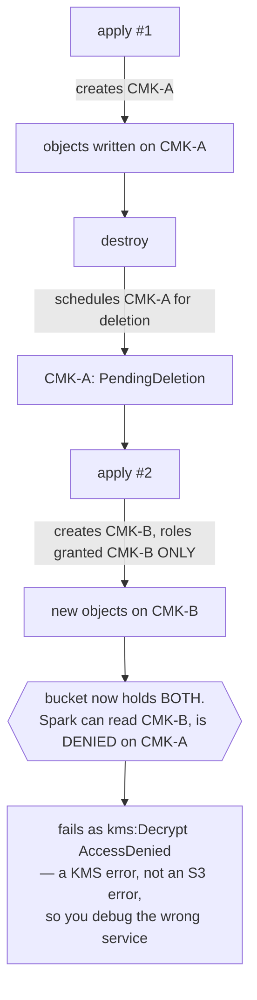

# Lake CMK lifecycle — why objects end up on five different keys, and what to do about it

The lake bucket survives `terraform destroy`; the KMS key that encrypts it does not. That
one asymmetry produces every CMK problem this project has hit, and it is the reason
`scripts/reencrypt-lake-cmk.sh` exists.

## 1. How the divergence happens



The bucket's *default* encryption follows the newest key, but **objects already written keep
the key they were written with**. Roles are granted only the current key. After two cycles
Spark cannot read its own Iceberg tables, and the error names KMS rather than S3.

Current state of this bucket, measured 2026-09-04 (`reencrypt-lake-cmk.sh audit`):

```
 1875 objects  2fd510a7  [Enabled]    <- current key, IN terraform state
  258 objects  44bf584e  [Enabled]    <- from an earlier apply, NOT in state
  254 objects  8d20ebe1  [Enabled]    <-        "
  212 objects  383f6d53  [Enabled]    <-        "
   40 objects  e66f4dfa  [Enabled]    <-        "
  161 objects  d1f568fd  [UNKNOWN]    <- key already DELETED; all under
                                         logs/ and query-results/, both regenerable
```

## 2. The correction that matters most: re-encrypt is a PRE-APPLY step, not pre-destroy

**Terraform manages exactly one lake CMK — the current one.** `terraform state list` shows
a single `module.data_lake.aws_kms_key.lake`, today `2fd510a7`. The four older keys are not
in state and `destroy` does not touch them.

That inverts the intuition:

| | What destroy does | Consequence |
|---|---|---|
| `2fd510a7` (current, **67% of the bucket**) | **scheduled for deletion** | those 1,875 objects become unreadable when the window elapses |
| `44bf584e`, `8d20ebe1`, `383f6d53`, `e66f4dfa` | untouched, stay `Enabled` | those objects stay readable |

So **re-encrypting onto the current key immediately before a destroy is exactly backwards** —
it concentrates the whole lake onto the one key that is about to be scheduled for deletion.

### The right sequence

**Before destroy — do nothing.** Destroy, then immediately cancel the deletion:

```bash
bash scripts/tf.sh destroy --execute            # phrase: DESTROY THE DEV LAB
aws kms cancel-key-deletion --key-id 2fd510a7-2119-4b03-af29-d377d2bc31fd
aws kms enable-key          --key-id 2fd510a7-2119-4b03-af29-d377d2bc31fd
```

Zero data movement, zero KMS request cost, seconds instead of minutes. This project has
done exactly this before: `e66f4dfa` was rescued the same way and is still `Enabled`.

**Before the NEXT apply — then re-encrypt.** Converge the stragglers onto whatever key the
new apply created, so the newly-created roles (granted only that key) can read the whole
bucket:

```bash
bash scripts/reencrypt-lake-cmk.sh audit                 # read-only, ~30s
bash scripts/reencrypt-lake-cmk.sh reencrypt             # dry run, shows the plan
bash scripts/reencrypt-lake-cmk.sh reencrypt --execute   # phrase: REENCRYPT LAKE
```

`logs/` and `query-results/` are skipped deliberately: regenerable, the bulk of the objects,
and paying KMS + request cost to rewrite them buys nothing. That is why the 161 objects on
the already-deleted key are harmless — they are all in those two prefixes.

## 3. The hang, and the fix

Reported 2026-09-03: `reencrypt --execute` ran for 30 minutes and classified almost nothing.

**It was not slow. It was wedged, and the cause was DNS.**

The classification phase was `xargs -P 16` over the AWS CLI — **one process per object**.
2,800 objects meant 2,800 interpreter starts and, decisively, **2,800 separate DNS
resolutions**, because nothing is shared between processes. The WSL2 DNS forwarder
(`10.255.255.254:53`) stopped answering under that storm, and the AWS CLI applies **no
timeout to DNS**. All 16 workers blocked in `wait_woken` on a port-53 socket, permanently,
so `xargs` could never refill a slot.

The failure mode is the nastiest kind: the process is alive, uses no CPU, prints nothing,
and is indistinguishable from slow progress.

Diagnosis that identified it, reproducible:

```bash
ps --ppid <pid> -o pid,etime,cmd     # xargs child still alive at 30:01
pgrep -f 'aws s3api' | wc -l         # 16 workers
# same 16 PIDs across an 8s sample  => wedged, not churning
cat /proc/<worker>/wchan             # wait_woken
ss -tnp | grep <worker>              # ESTAB ... 10.255.255.254:53   <- DNS, not S3
```

**Fix:** `scripts/lake_cmk_worker.py` — one Python process, one `boto3` client, a thread
pool. It resolves DNS once and pools connections, so the storm cannot happen. Every call
carries `connect_timeout=10, read_timeout=30` and 3 adaptive retries, and the whole scan
carries a wall-clock `--deadline`; anything unclassified at the deadline is **reported**,
never silently omitted.

Measured on the same machine and bucket:

| | per object | 2,800 objects |
|---|---|---|
| `aws` CLI, one process each | 0.671 s | wedged, never finished |
| this worker, 16 threads, 1 process | ~0.010 s | **27 s** |

The speed is the smaller win. The real one is that the failure mode is gone: a stall now
ends in a reported timeout instead of an indefinite hang.

`copy` passes `CopySource` as a **dict**, not a string. That closes an encoding trap this
project hit twice with the CLI form, where the caller owned the escaping:
`quote(safe='')` turned `/` into `%2F` and all 660 objects failed; `quote(safe='/')` turned
`=` into `%3D` and only the 94 Hive-partitioned keys (`business_date=…`) failed — which
looked table-specific rather than like an escaping bug. A dict has no string for anyone to
escape wrongly.

## 4. Operator quick reference

| Situation | Command |
|---|---|
| What keys is the bucket on? | `reencrypt-lake-cmk.sh audit` (read-only, ~30s) |
| About to destroy | **nothing** — destroy, then `kms cancel-key-deletion` on the current key |
| About to apply onto an existing lake | `reencrypt-lake-cmk.sh reencrypt --execute` first |
| Spark says `kms:Decrypt AccessDenied` | the roles hold only the newest key; run the audit, then re-encrypt |
| A scan looks stuck | it cannot hang any more; if it reports `DEADLINE … unclassified`, the link is degraded — re-run, it is idempotent |
