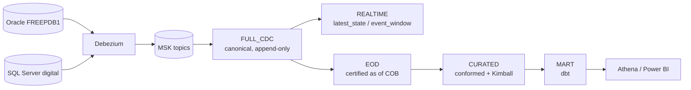

# Platform resource inventory and full run-through

Everything deployed, what it costs, how to reach it, and the exact order to bring the
platform from `terraform apply` to a queryable mart.

**Nothing in this file is typed from memory.** Every identifier below comes from
`terraform output`, and the commands re-derive them rather than repeating them — an EMR
application id, a bucket name and a broker list all change on every destroy/apply cycle, and
a hand-copied one fails later as something that looks like a permissions problem (ADR-070).

```bash
terraform -chdir=terraform/envs/dev output -json | python3 -m json.tool | less
```

---

## 1. What exists

Verified 2026-09-29, account **111122223333**, region **ap-southeast-1**, profile
`my-aws-profile`.

### Compute and network

| Resource | Identifier source | Notes |
|---|---|---|
| MSK cluster | `kafka_platform.msk_cluster_name` | 3 brokers, Kafka **3.9.x KRaft**, IAM + TLS, private subnets across 3 AZs |
| VPC | `kafka_platform.private_subnet_ids` / `public_subnet_ids` | 3 private + 3 public; **no NAT gateway** |
| EMR Serverless | `emr_serverless.application_id` | ARM64, auto-stop 15 min idle, max 16 vCPU / 64 GB / **100 GB disk** |
| `source-lab` EC2 | `source_lab.instance_id` | t3a.xlarge — Oracle Free + SQL Server Developer in containers |
| `cdc-runtime` EC2 | `cdc_runtime.instance_id` | t3.large — Kafka Connect + Debezium + Apicurio |
| `airflow` EC2 | — | t3.large — k3s + Airflow 3 (KubernetesExecutor) |
| `toolbox` EC2 | — | t3.small — SSM jump host for private endpoints |

### Storage and catalog

| Resource | Identifier source |
|---|---|
| Lake bucket | `lake_bucket` |
| Warehouse prefix | `lake_warehouse_uri` |
| Checkpoints prefix | `lake_checkpoints_uri` — a **top-level sibling** of `warehouse/`, never under it |
| Lake CMK | `lake_kms_key_arn` |
| Glue databases (8) | `glue_databases` — full_cdc, stream, snapshot, curated, mart, ops, quarantine, serving |
| Athena workgroup | `athena_workgroup` — bytes-scanned cutoff enforced |

> **Checkpoints live outside the warehouse on purpose.** Iceberg's
> `remove_orphan_files` walks a table location and deletes what it does not recognise; a
> checkpoint stored under `warehouse/` is exactly that.

### Credentials — SSM Parameter Store, never Secrets Manager

```
/kafka-dev-lab/dev/source-lab/oracle-password
/kafka-dev-lab/dev/source-lab/oracle-cdc-password
/kafka-dev-lab/dev/source-lab/sqlserver-sa-password
/kafka-dev-lab/dev/source-lab/sqlserver-cdc-password
/kafka-dev-lab/dev/cdc-runtime/apicurio-admin-password
/kafka-dev-lab/dev/airflow/admin-password
/kafka-dev-lab/dev/airflow/metadata-db-password
/kafka-dev-lab-dev/grafana/admin-password
```

Read one:

```bash
aws ssm get-parameter --name /kafka-dev-lab/dev/source-lab/oracle-password \
  --with-decryption --query Parameter.Value --output text
```

### Access — SSM only, no public ingress and no SSH key

| Target | Command |
|---|---|
| Airflow UI | `bash scripts/airflow-node.sh ui` then `http://localhost:8080` |
| Airflow credentials | `bash scripts/airflow-node.sh credentials` |
| Apicurio registry | `cdc_runtime.apicurio_port_forward` |
| Kafka Connect REST | `cdc_runtime.connect_rest_port_forward` |
| Source databases | `source_lab.ssm_shell_command` |

---

## 2. The layers



**REALTIME and EOD are siblings of FULL_CDC, not a chain.** EOD never reads REALTIME — a
test asserts the file cannot — so turning REALTIME off for a table has zero effect on what
that table certifies.

---

## 3. Full run-through, in order

Each step is safe to re-run. Steps that mutate AWS are **dry-run by default** and need
`--execute`; two need a confirmation phrase typed by a human and cannot be automated.

```bash
export AWS_PROFILE=my-aws-profile AWS_REGION=ap-southeast-1
cd aws-cdc-lakehouse
```

### 0. Infrastructure

```bash
bash scripts/tf.sh plan
bash scripts/tf.sh apply            # prints identity first (CLAUDE.md §2)
```

Wait for MSK to leave `CREATING` (20–40 min) and for the four nodes to finish user-data:

```bash
aws kafka list-clusters-v2 --query 'ClusterInfoList[].[ClusterName,State]' --output text
aws ec2 describe-instance-status --query 'InstanceStatuses[].[InstanceId,InstanceStatus.Status]' --output text
```

### 0a. After a destroy/apply — RESCUE THE OLD CMK FIRST

**Do this before anything else touches the lake. There is a deadline.**

`terraform destroy/apply` mints a NEW lake CMK. The surviving S3 objects are still encrypted
under the OLD one, and Terraform schedules that key for deletion on the way out. A key in
`PendingDeletion` **cannot decrypt at all** — permissions are irrelevant — so every job that
reads the lake fails with what looks like an IAM problem:

```
kms:Decrypt on key/<old> → AccessDenied … because no identity-based policy allows it
```

It is not an IAM problem. Check the key's state before believing the message:

```bash
terraform -chdir=terraform/envs/dev output -raw lake_kms_key_arn     # the NEW key
aws kms describe-key --key-id <old-key-id>   --query 'KeyMetadata.[KeyState,DeletionDate]' --output text
```

`PendingDeletion` with a date means **the data is unrecoverable after that date**. Not
"needs a rebuild" — unrecoverable, because the only copy of the key is gone.

```bash
aws kms cancel-key-deletion --key-id <old-key-id>     # reversible; re-schedule later if you want
aws kms enable-key          --key-id <old-key-id>
bash scripts/reencrypt-lake-cmk.sh reencrypt          # typed phrase; rewrites onto the new key
```

Only after the re-encrypt can §0b register anything.

> **Orphan CMKs accumulate, one per destroy/apply cycle.** On 2026-09-29 this account held
> **12** keys all described as "kafka-dev-lab-dev data lake encryption" — 11 enabled, one
> pending deletion, ~$1/month each. Before scheduling any of them for deletion, confirm no
> S3 object is still encrypted under it; the re-encrypt is what makes that safe.

### 0b. After a destroy/apply — RE-REGISTER, do not re-provision

`terraform destroy` removes the Glue **databases**, and the table definitions go with them.
The S3 data does not: every Parquet file and every Iceberg `metadata.json` survives. The
result is a lake holding all its data and none of its pointers — Athena says `Table not
found`, which reads like a data problem and is not.

```bash
LAKE=$(terraform -chdir=terraform/envs/dev output -raw lake_bucket)
aws s3 cp spark/ops/register_tables.py "s3://$LAKE/artifacts/code/register_tables.py"
bash scripts/emr-submit.sh register-tables \
  "s3://$LAKE/artifacts/code/register_tables.py" eod --bucket "$LAKE" --dry-run
bash scripts/emr-submit.sh register-tables \
  "s3://$LAKE/artifacts/code/register_tables.py" eod --bucket "$LAKE"
```

**Registering costs one catalog write per table and rewrites no data.** Running
`provision_cdc_tables.py --execute` instead creates fresh empty tables and strands every
surviving object as an orphan. Skip this step entirely on a first-ever build.

### 0c. After a destroy/apply — RESET THE STREAMING CHECKPOINTS

The third "the bucket outlived the stack" trap, and the quietest of the three.

`terraform destroy` removes **MSK** but not the lake bucket, so
`checkpoints/full_cdc/<app-id>` survives holding offsets from a cluster that no longer
exists. The rebuilt MSK has fresh topics whose offsets start at 0. Spark Structured
Streaming **always prefers the checkpoint over `startingOffsets`**, so the ingest resumes
against offsets from the dead cluster, consumes nothing, and exits:

```
FULL_CDC_STREAM_SUMMARY {"batches": 0, "rows": 0, "poison": 0, "tombstones": 0}
```

**The job reports SUCCESS.** Green exit code, no data, no error, no warning. Observed on
2026-09-29: a full Oracle ingest ran to completion and moved zero rows, and the only way to
see it was to compare FULL_CDC counts before and after.

```bash
bash scripts/streaming-reset.sh --app-id full-cdc-oracle       # dry run first
bash scripts/streaming-reset.sh --app-id full-cdc-oracle --execute
bash scripts/streaming-reset.sh --app-id full-cdc-sqlserver --execute
```

Typed confirmation, because discarding a checkpoint discards a position. That gate is right:
doing this when MSK has NOT been rebuilt re-reads the whole topic and duplicates delivery
events (distinct `dv_event_id`, so they append rather than merge).

**How to tell you need it:** the ingest succeeds and the FULL_CDC count does not move. Check
before assuming the connectors are at fault:

```sql
SELECT count(*) FROM kafka_dev_lab_dev_full_cdc.cdc_oracle_coredb_corebank_account;
```

> **The three post-rebuild steps, in order: §0a rescue the CMK, §0b register the tables,
> §0c reset the checkpoints.** None of them announce themselves — the first looks like an
> IAM problem, the second like missing data, the third like nothing at all.

### 1–8. The CDC chain

| # | Command | What it does |
|---|---|---|
| 1 | `bash scripts/source-lab.sh enable-cdc --execute` | Oracle ARCHIVELOG + supplemental logging; SQL Server `sp_cdc_enable_*` |
| 2 | `bash scripts/source-lab.sh verify-cdc` | read-only assertions; **fix failures here, not later** |
| 3 | `bash scripts/cdc-runtime.sh create-topics --execute` | one topic per captured table, keyed by canonical PK |
| 4 | `bash scripts/register-connectors.sh register --execute` | Debezium Oracle + SQL Server connectors |
| 5 | `bash scripts/export-schemas.sh --execute` | Apicurio → `schemas.json` in S3; **per-topic Key + Envelope artifacts** |
| 6 | `bash scripts/cdc-deploy-code.sh` | compiles the plan, uploads framework + entrypoints |
| 7 | `bash scripts/emr-submit.sh provision … provision_cdc_tables.py eod --plan … --execute --evolve` | creates/evolves every target **and** the control tables |
| 8 | `python3 scripts/cdc-stream.py submit --app-id full-cdc-oracle` | prints the ingest command; run it with `emr-submit.sh` |

Repeat 8 for `full-cdc-sqlserver`.

### 9. The reporting layers

```bash
source scripts/reporting-env.sh          # derives 18 vars from terraform output
python3 scripts/reporting-live-run.py --flow-mode EOD --business-date <COB> --execute
```

Then REALTIME, the EOD close, the rebase and dbt — see §4.

### Two steps a human must type

```bash
bash scripts/source-lab.sh workload 1 --execute   # generates CDC activity
bash scripts/reencrypt-lake-cmk.sh reencrypt      # after a CMK rotation
```

Both refuse to run non-interactively. That is deliberate: one writes to source databases,
the other rewrites every object in the lake.

---

## 4. Operating the REALTIME layer

```bash
LAKE=$(terraform -chdir=terraform/envs/dev output -raw lake_bucket)
PLAN="s3://$LAKE/artifacts/cdc/table-plan.json"; WH="s3://$LAKE/warehouse"

# materialise every enabled table
bash scripts/emr-submit.sh rt-run "s3://$LAKE/artifacts/code/realtime_engine.py" eod \
  --plan "$PLAN" --warehouse "$WH" --table ALL

# close a business date, then drop what the close now holds
bash scripts/emr-submit.sh eod-close "s3://$LAKE/artifacts/code/eod_engine.py" eod \
  --plan "$PLAN" --warehouse "$WH" --table ALL
bash scripts/emr-submit.sh rt-rebase "s3://$LAKE/artifacts/code/realtime_engine.py" eod \
  --plan "$PLAN" --warehouse "$WH" --table ALL --rebase-cob AUTO
```

**Submit one job at a time.** The application caps at 100 GB disk — five workers — and two
concurrent submissions fail with `ApplicationMaxCapacityExceededException`. Each job also
waits 10–25 minutes for capacity from cold.

Inspect without running anything:

```bash
python3 scripts/cdc-table-plan.py --table <id>                      # config, shape, cost class
python3 scripts/cdc-table-plan.py --table <id> --set realtime.enabled=false   # disable preview
python3 scripts/realtime-benchmark.py                                # cost model, offline
python3 scripts/realtime-benchmark.py --measured                     # + the run ledger
python3 scripts/cdc-e2e-verify.py                                    # 39 read-only checks
```

---

## 5. What each thing costs

From `cost_drivers` and `emr_serverless.cost_guardrails`:

| Driver | Rate | Lever |
|---|---|---|
| MSK, 3 brokers + 60 GiB EBS | **$0.765/h** | the dominant cost — `enable_kafka_platform=false` |
| source-lab t3a.xlarge | $0.1888/h | `source-lab.sh destroy --execute` |
| cdc-runtime t3.large | $0.1056/h | stop when not capturing |
| airflow t3.large | ~$0.10/h | `airflow-node.sh stop --execute` — **EBS still bills** |
| EMR Serverless | ≤ $1.21/h while running | auto-stops after 15 min idle |
| VPC endpoints | 1 billed | S3 gateway is free |
| Budget of record | **$100/month** | ADR-030 |

**Stopping is cheaper, not free.** Only `destroy` removes EBS. The single biggest saving is
turning the Kafka platform off.

---

## 6. Health checks

```bash
bash scripts/source-lab.sh status          # containers + CDC
bash scripts/source-lab.sh verify-cdc      # assertions
bash scripts/cdc-runtime.sh status         # containers + connectors
bash scripts/register-connectors.sh status # Debezium task states
python3 scripts/cdc-stream.py status       # ingest state from OPS
python3 scripts/cdc-stream.py health --app-id full-cdc-oracle   # exit 1 when unhealthy
bash scripts/airflow-node.sh status
python3 scripts/cdc-e2e-verify.py          # every layer, read-only
```

A node that answers SSM but whose script is "No such file or directory" is still running
user-data. Check progress with:

```bash
aws ssm send-command --instance-ids <id> --document-name AWS-RunShellScript \
  --parameters 'commands=["tail -20 /var/log/cloud-init-output.log"]'
```

---

## 7. Teardown

```bash
bash scripts/airflow-node.sh stop --execute     # cheapest reversible lever
bash scripts/source-lab.sh destroy --execute    # removes the databases
bash scripts/tf.sh destroy                      # everything
```

The lake bucket is protected by `allow_destroy_with_data = false`, so a destroy leaves the
data and takes the catalog — which is what §0b exists to undo.
