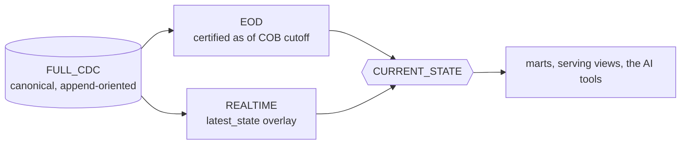

# CURRENT_STATE — the one governed way to read "now"

ADR-085. One contract, defined once, because the alternative is every mart writing its own
overlay and the overlays diverging on the tombstone rule.

---

## 1. The composition

```
CURRENT_STATE(entity)  =  latest CERTIFIED EOD baseline
                       +  REALTIME latest_state overlay for changes after its cutoff
```



Three rules, and **all three must be applied together**:

1. **A key present in the overlay wins.** It is newer than the baseline by construction —
   the overlay holds only post-cutoff changes.
2. **An overlay row with `op = 'd'` REMOVES the key.** It is a tombstone, not a row.
3. **A key absent from the overlay takes the baseline row unchanged.**

Rule 2 is the one that gets forgotten, and forgetting it is not visible: the mart shows a
deleted account as open, with every other column correct.

## 2. Why the overlay is an overlay and not a truth

A `latest_state` table holds only what has changed since its baseline's cutoff. It is not a
complete picture of the entity population and was never meant to be — asking it "how many
accounts are there" gives the number that *changed*, which is a plausible, wrong answer.

That is also why the rebase exists: when the EOD close for D certifies, the changes between
D-1 and D are now in the baseline, and the overlay drops them. Without that, composing the
two counts the same change twice.

`ops.realtime_info.baseline_cob_date` says which close a given overlay is on. **Composing an
overlay with a baseline other than that one is wrong**, and it is the first thing to check
when a CURRENT_STATE number looks off.

## 3. The reference SQL

```sql
WITH baseline AS (
  SELECT * FROM kafka_dev_lab_dev_snapshot.eod_oracle_coredb_corebank_account
  WHERE  business_date = DATE '<the COB in realtime_info.baseline_cob_date>'
),
overlay AS (
  SELECT * FROM kafka_dev_lab_dev_stream.rt_oracle_coredb_corebank_account
)
SELECT COALESCE(o.dv_pk_hash, b.dv_pk_hash) AS dv_pk_hash,
       COALESCE(o.payload_after, b.payload_after) AS payload_after
FROM   baseline b
FULL OUTER JOIN overlay o ON b.dv_pk_hash = o.dv_pk_hash
WHERE  COALESCE(o.op, '') <> 'd'      -- rule 2. Do not omit this line.
```

The `WHERE` clause is the contract. A reader that drops it gets a result that looks right
and is not.

## 4. EVENT_WINDOW is NOT current state

`shape: event_window` keeps the events. A row updated three times appears three times, and
there is no guarantee the last one by arrival is the last one by source order.

A consumer that wants current state from an event window must rank per key with the same
ordering EOD and REALTIME use (`cdc/realtime.py::order_key_expr`) and take the winner. It is
not exposed as current state automatically, and the platform does not do it for you, because
"the latest event about a transaction" and "the current state of a transaction" are the same
thing only while nothing is ever corrected.

## 5. Which tables have an overlay

```bash
python3 scripts/realtime-benchmark.py        # shape per table, no AWS call
```

Today: `account`, `customer`, `loan`, `app_user` are `latest_state` and have one.
`transaction`, `digital_event`, `payment_method` are `event_window` and do not.
`branch`, `channel`, `merchant` have REALTIME off entirely — their current state is the EOD
baseline, full stop, which is correct for a reference table that changes four times a day.
