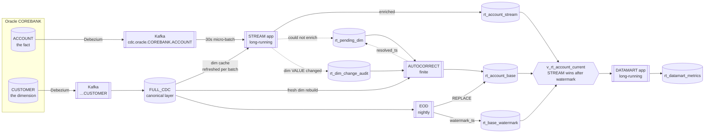
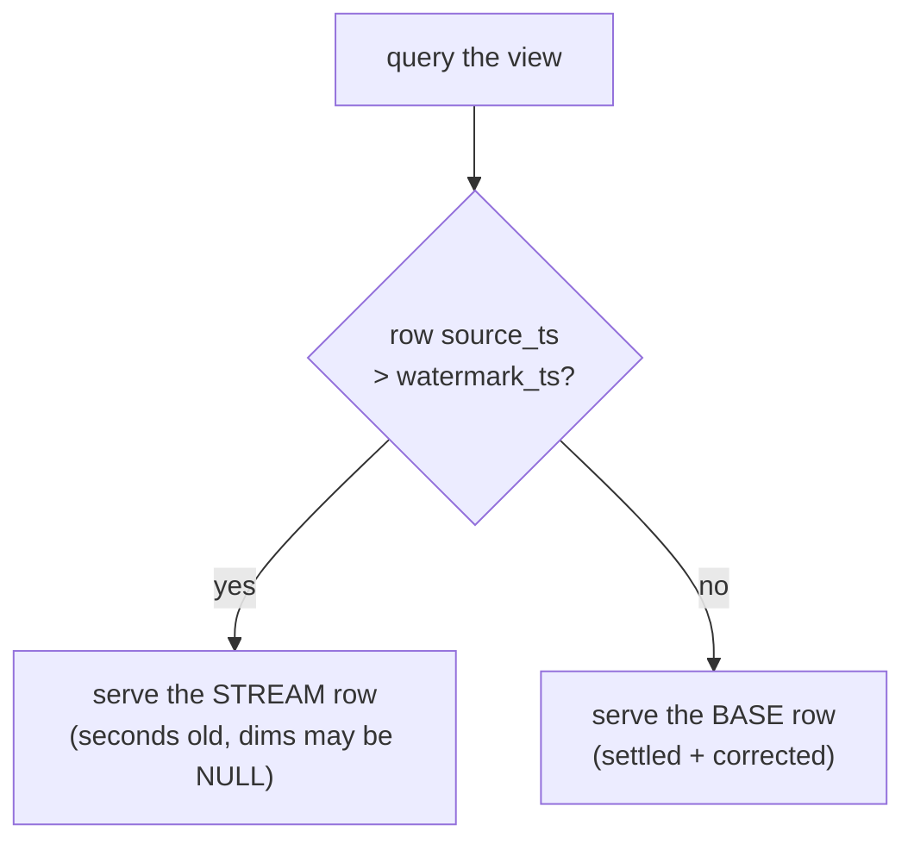
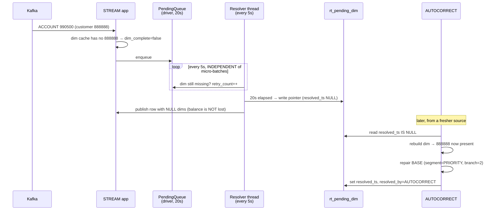

# STREAMING_RT — the realtime serving layer

Four applications, two tables, one view. Modelled on a production system
(`plstream v9 / flow3_pl_ceo_v2`), simplified for cost, and **run live end to end on
2026-09-03**. Every number below came out of the platform; nothing here is illustrative.

---

## 1. The idea, in one sentence

> **The stream does not fix its own mistakes.**

It publishes what it managed to enrich, and *records what it could not* into pointer tables.
A slower correction pass reads those pointers, rebuilds the dimensions from a fresher
source, and repairs the settled table.

That division is the whole design. The tempting alternative — have the stream retry until
the dimension appears — is what makes streaming pipelines fall over: the retry holds the
micro-batch open, backpressure builds, and one missing dimension becomes an outage.
Publishing an incomplete row *and flagging it* keeps the fast path's latency bounded by
construction, and guarantees the row is repaired later rather than being silently wrong
forever.

## 2. The four applications

| App | Lifetime | Cadence | Writes | Job in this repo |
|---|---|---|---|---|
| **STREAM** | **long-running** | 30s micro-batch | `rt_account_stream` + both pointer tables | `rt_stream_app.py` |
| **AUTOCORRECT** | finite, exits | periodic (ref: 3h) | `rt_account_base`, resolves pointers | `rt_autocorrect.py` |
| **EOD** | finite, exits | nightly | rebuilds `rt_account_base`, moves the watermark | `rt_eod_base.py` |
| **DATAMART** | **long-running** | 45s poll | `rt_datamart_metrics` | `rt_datamart_app.py` |

Two are processes, not jobs. They own their own loop and exit only when told to. In this
repo both take `--run-seconds` so a demonstration costs minutes rather than a working day —
that is the *only* concession; the shape is unchanged.

```
EOD          slow, complete, exact            →  rebuild BASE from scratch
STREAM       fast (30s), may lack dims        →  write STREAM + FLAG what is missing
AUTOCORRECT  medium, re-reads a fresh source  →  repair what STREAM flagged, write BASE
DATAMART     polls the merged view            →  aggregates, every cycle
```

## 3. Physical shape



## 4. The merge, and why the watermark exists



`watermark_ts` is **the point BASE is authoritative up to**, written only by EOD.

- Drop the watermark and always prefer STREAM → after EOD settles a day exactly, yesterday's
  fast-path guesses resurrect and overwrite it.
- Always prefer BASE → the layer stops being realtime.

It is a `LEFT ANTI JOIN`, not a row-level "prefer the newer timestamp": once STREAM has
spoken for an account after the watermark, that account's BASE row is dropped **entirely**.

## 5. The lifecycle of a row the stream could not finish



**Pointer BEFORE row is load-bearing.** If the pointer write succeeds and the row write
fails, the correction pass repairs an account that was never published — harmless. Reverse
the order and a failure publishes a dim-incomplete row with *nothing* flagging it, so it
stays wrong until the next full rebuild and no query can tell.

## 6. Live evidence, 2026-09-03

Run as: EOD → source insert (late dim) → STREAM 240s → FULL_CDC catch-up → AUTOCORRECT →
DATAMART 180s.

**EOD built the settled table**
```
RT_EOD_BASE_ROWS 321 · RT_EOD_BASE_INCOMPLETE 0 · RT_EOD_WATERMARK 2026-09-03 10:16:40
```

**STREAM, 4 micro-batches over 240s** — batch 0 is the replay; 1–3 are live balance
movements pushed into Oracle *while the app was up*:
```
RT_STREAM_STARTED trigger=30s resolver=5s budget=240s
RT_BATCH id=0 facts=323 full=322 timed_out=0 queue=1     ← one account cannot resolve its dim
RT_RESOLVER      recovered=0 timed_out=1 queue=0          ← resolver thread flagged it at 20s
RT_BATCH id=1 facts=3 full=3
RT_BATCH id=2 facts=3 full=3
RT_BATCH id=3 facts=3 full=3
RT_STREAM_SUMMARY {"batches":4,"facts":332,"full":331,"flagged":1,"resolver_cycles":43}
```

**The pointer table caught exactly the one account**
```
account_id 990500 · customer_id 888888 · missing_dims customer · retry_count 5 · resolved NULL
```
`retry_count 5` is the resolver re-checking every 5s across the 20s window before giving up.

**…and the balance was published anyway, flagged**
```
rt_account_stream: 990500 | 12345.67 | segment_code NULL | dim_complete false
```

**AUTOCORRECT closed the loop**
```
RT_AUTOCORRECT_WORKLIST 1 · REPAIRED 1 · STILL_INCOMPLETE 0 · RT_BASE_COUNT 322
rt_account_base: 990500 | 12345.67 | PRIORITY | branch 2 | dim_complete true | built_by AUTOCORRECT
rt_pending_dim:  990500 | resolved_ts 2026-09-03 16:11:15 | resolved_by AUTOCORRECT
BASE health: 322 rows, 0 incomplete
```

**DATAMART, 9 cycles in 180s**
```
RT_DATAMART_CYCLE {"cycle":1,"view_rows":322,"metrics_written":8,"seconds":17.8}
RT_DATAMART_CYCLE {"cycle":9,"view_rows":322,"metrics_written":8,"seconds":3.1}
```
17.8s → 3.1s is the source cache: each source is materialised **once per cycle**, so the
sections read a temp view instead of re-scanning a merge-on-read Iceberg table N times.

**It reconciles exactly.** Total across the view is `2,031,894,187.94`, against the
session's established ground truth of `2,031,880,937.77`:
```
2,031,894,187.94 − 2,031,880,937.77 = 13,250.17
                                    = 12,345.67  (the new account 990500)
                                    +    904.50  (3 accounts × 100.50 × 3 live waves)
```

**The view says which layer served each row**
```
STREAM   4 rows      3,213,236.17     ← newer than the watermark
BASE   318 rows  2,028,680,951.77
```

## 7. RT-1 — the gap the first live run exposed, and how it was closed

**As first shipped, AUTOCORRECT repaired BASE but the view kept serving the stale STREAM row
until the next EOD.** The 2026-09-03 run shows it: account 990500 was fully repaired in BASE
(`segment_code=PRIORITY`), and the view still reported `served_by=STREAM,
dim_complete=false`, because the STREAM row was newer than the watermark and STREAM wins
after the watermark.

That is faithful to the reference implementation, which has the identical gap and names it:
its correction pass never writes `dim_autocorrect_watermark` despite the table bearing its
name. Only EOD does.

Two things were *not* the fix. Advancing the watermark on a per-account repair is wrong —
the watermark is a statement about the **whole table**. Having AUTOCORRECT rewrite the
STREAM row is worse — two writers would own one table.

**The fix (2026-09-04, `rt_common.merge_base_and_stream`): a BASE row also wins when it was
BUILT AFTER the stream row was WRITTEN.** That is a strictly newer statement about the same
account, from a slower and better-informed source. A later stream row takes the account back
again, which is what keeps the layer realtime rather than freezing it at the last
correction. Both timestamps are optional and the comparison degrades to the plain
STREAM-wins rule if either is missing — a BASE row with no provenance must not silently
outrank live data.

It was proven against real data on 2026-09-06, by reading the datamart either side of a
repair — see §12. The reference still has the gap; this layer no longer does.

## 8. Simplifications versus the reference — and what was kept

| | Reference (production) | Here | Why |
|---|---|---|---|
| Dim joins | 6 (`account_info`, `tygia`, `dntn`, `fdi`, `pkkh`, `g4`) | **1** (`CUSTOMER`) | cost; the *mechanism* is per-join, not per-count |
| Report sections | 12 across 6 parallel workers | **3** | same |
| Stream window | 08:00 → 20:00 daily | **240s** | a demo must cost minutes |
| Autocorrect sources | 5 | **3** | EOD's nightly rebuild covers the other 2 |
| Trigger / resolver | 30s / 5s | **30s / 5s** | **unchanged** — these set the semantics |
| Pending wait | 20s | **20s** | **unchanged** |
| Pointer-before-row | yes | **yes** | **unchanged** — correctness, not scale |
| Event-time dedup | yes | **yes** | **unchanged** — see §9 |
| Source cache | yes | **yes** | **unchanged** — snapshot consistency |

The count of things was reduced. **No rule that decides correctness was.**

## 9. The three rules that are easy to get backwards

**Dedup by EVENT time, not arrival.** The source is a history table, so a retroactive
correction for an older effective date can arrive *after* the current one. Ordering by Kafka
offset would keep the retroactive row and publish a **stale balance** — silently, with a
perfectly healthy-looking pipeline.

**Completeness probes the JOIN, not every column.** `dim_complete` is decided by one probe
column (`segment_code`), not "are all dim columns non-null". A dimension row may legitimately
carry NULL in an optional attribute; flagging that would fill the pointer table with work
that can never be resolved.

**A partial failure RAISES.** With `foreachBatch`, swallowing an exception tells Spark the
batch succeeded, so it commits the offsets and the rows are gone — not in the target, not in
a queue, nowhere. The reference records ~100K offsets lost exactly this way. Raising leaves
the offsets uncommitted and Spark retries with the data still in Kafka.

## 10. Running it

```bash
# tables (idempotent)
rt_ddl.py         --warehouse s3://<lake>/warehouse --ddl s3://<lake>/artifacts/realtime/ddl.sql
# settled table + watermark
rt_eod_base.py    --warehouse … --business-date 2026-09-03
# the long-running fast path (role MUST be spark-stream: it reads Kafka via MSK IAM)
rt_stream_app.py  --bootstrap <brokers> --topic cdc.oracle.COREBANK.ACCOUNT \
                  --schemas-uri s3://<lake>/artifacts/code/schemas.json \
                  --checkpoint s3://<lake>/checkpoints/realtime/rt_stream \
                  --trigger-seconds 30 --resolver-seconds 5 --run-seconds 240
# the repair pass
rt_autocorrect.py --warehouse …
# the long-running datamart
rt_datamart_app.py --warehouse … --poll-seconds 45 --run-seconds 180
```

Submission recipe (jars, roles) is in
`artifacts/validation/final-e2e/realtime/README.md`. Two things that will otherwise cost an
hour: the stream app needs the **`spark-stream`** role (`spark-eod` has no MSK IAM
permission — it fails as `SaslAuthenticationException: Access denied`), and the checkpoint
must **not** live under `warehouse/` (`remove_orphan_files` walks table locations and would
delete streaming state — the app refuses at startup rather than letting that happen).

## 11. Tests

`spark/tests/test_realtime_rt.py` — **34 tests, 34 passing** (2026-10-06), no Spark, no
Kafka, no AWS. Each pins a rule that is expensive to get wrong: event-time dedup beating
arrival order, the watermark direction in both directions, a repaired BASE row winning over
a stale stream row (`TestRepairedBaseWins`, the RT-1 guard), the probe-column completeness
rule, queue backpressure, the resolver ageing an entry to timeout, and "a brand-new customer
is not a dim change". The last two classes pin the consumer side of the per-table cutover:
these apps resolve FULL_CDC through `cdc_source.full_cdc_for`, never by naming a physical
table (ADR-072).

## 12. Re-proven live — window of 2026-09-06

A second, independent live run on a rebuilt platform (new MSK cluster, new lake CMK, fresh
seed). Nothing was carried over from the 2026-09-03 evidence; every number below came from
this window.

| App | Result |
|---|---|
| `rt_ddl.py` | 6 tables created idempotently, `RT_DDL_COMPLETE` |
| `rt_eod_base.py` | `RT_EOD_BASE_ROWS 320`, `INCOMPLETE 0`, watermark `2026-09-06 04:33:15` |
| `rt_stream_app.py` | `batches=1 facts=320 full=320 resolver_cycles=44`, stopped on `run_seconds_budget_reached` |
| `rt_autocorrect.py` | `WORKLIST 1 → REPAIRED 1 → STILL_INCOMPLETE 0` |
| `rt_datamart_app.py` | 12 cycles / 180 s, **19.9 s → 3.5 s** as the source cache warms |

### The late-dimension loop, end to end

The gap was created the way it happens in production, not by hand: `COREBANK.ACCOUNT` was
ingested into FULL_CDC while `COREBANK.CUSTOMER` was not, which is exactly the per-topic
ordering race the design exists to absorb. (An orphan row could not have been inserted
anyway — `fk_account_customer` forbids it. The dimension is late, not absent.)

```
stream      facts=1 full=0 pending=1 flagged=1 resolved_late=0
            rt_account_stream : 990900  balance=12345.67  segment_code=NULL  dim_complete=false
            rt_pending_dim    : 990900  missing_dims=customer  retry_count=4  resolved_by=NULL
CUSTOMER ingested  ->  FULL_CDC_COUNT 5730
autocorrect WORKLIST 1  REPAIRED 1  STILL_INCOMPLETE 0
            rt_account_base   : 990900  segment_code=PRIORITY  branch_id=1  dim_complete=true
            rt_pending_dim    : 990900  resolved_by=AUTOCORRECT  resolved_ts=2026-09-06 07:07:42
```

The balance was **published, never dropped** — a report that silently omits an account is
wrong in a way nobody can see; a published row flagged incomplete is visible.

### RT-1, proven rather than asserted

RT-1 (a BASE row repaired *after* the stream row was written, without the watermark moving)
was fixed in code on 2026-09-04 with unit tests. This window is the first time it has been
demonstrated against real data, by reading the datamart either side of the repair:

| phase | segment | balance | accounts |
|---|---|---|---|
| before repair | PRIORITY | 503,970,320.00 | 80 |
| after repair | PRIORITY | **503,982,665.67** | **81** |

The difference is **12,345.67** — account 990900's balance exactly, and exactly one more
account. Under the pre-RT-1 rule the merge view would still have served the stale STREAM row
and reported the account as `(unresolved)` until the next EOD.
