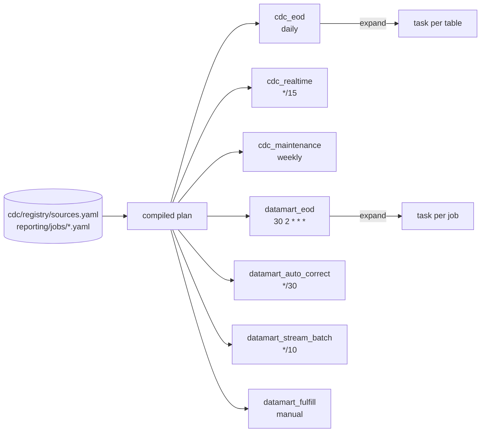

# Reporting orchestration

One DAG per **cadence**, never per table. ADR-071.

---

## 1. Why cadence, not table

Ten tables and five flow modes is fifty DAGs if you generate one per table — fifty things to
pause, fifty schedules to reason about, and a scheduler whose parse time grows with the
business. The registry already knows which tables exist, so the DAG asks it:



Adding a table adds a mapped **task**, not a DAG. A test asserts the DAG count does not grow
with the table count.

## 2. The DAGs

| DAG | schedule | what it maps over |
|---|---|---|
| `cdc_eod` | per-table `eod.schedule`, grouped | tables with `eod.enabled` |
| `cdc_realtime` | per-table realtime cadence, grouped | tables with `realtime.enabled` |
| `cdc_realtime_rebase` | `30 3 * * *` | tables with `rebase.on_eod_certified` |
| `cdc_maintenance` | weekly | tables with maintenance actions |
| `datamart_eod` | `30 2 * * *` | reporting jobs with an EOD flow |
| `datamart_auto_correct` | `*/30 * * * *` | jobs with an AUTO_CORRECT flow |
| `datamart_stream_batch` | `*/10 * * * *` | jobs with a STREAM_BATCH flow |
| `datamart_fulfill` | `None` — manual only | jobs with a FULFILL flow |

`cdc_realtime_rebase` runs an hour after the shipped EOD cadences and maps only over
`latest_state` tables (ADR-085). It is a **cadence, not a sensor**: the rebase refuses on a
close that is not CERTIFIED, so an early run is a recorded skip rather than a wrong delete.

`datamart_fulfill` has **no schedule on purpose**: a backfill that starts on a timer is a
backfill nobody decided to run.

Tables whose schedules differ are grouped by schedule string (`cdc/scheduling.py`
`schedule_groups`), so a table with `eod: {schedule: "30 2 * * *"}` joins that group rather
than spawning a DAG.

## 3. Shared settings, and why each one

Every reporting DAG comes from one factory (`airflow/dags/reporting_common.py`):

* `catchup=False` — **a reporting backfill is FULFILL, not catchup.** Unpausing a DAG that
  has been off for a week must not fire a week of runs at a cluster.
* `max_active_runs=1` — two overlapping corrections would MERGE into the same mart rows.
* paused on deploy — nothing starts spending the moment it is deployed.
* pools — `reporting_jobs`, `spark_jobs`, `streaming_apps`, `maintenance`, so one cadence
  cannot starve another.

## 4. Turns and waves

`datamart_eod` runs in **turns**: `resolve_plan` → `turn_1.select_wave` →
`turn_1.gate_and_run` → `turn_2...` → `finalize`. A turn is a dependency level. A mart that
depends on another mart runs in a later turn, and the gate between them is
`EodTableReadyGate`, not a sleep.

## 5. The readiness gate

Before a mart is built, every dataset it declares must be CERTIFIED **for the same COB**:

```sql
SELECT table_id, cob_date, certification_status
FROM   kafka_dev_lab_dev_ops.eod_info
WHERE  cob_date = DATE '<COB>';
```

The gate returns `READY` / `WAITING` / `FAILED` / `NOT_APPLICABLE` and **names which dataset
is missing**. Counting matches would tell an operator that three of four arrived without
saying which one did not.

`required_datasets` in the job YAML is how a job declares an external EOD dependency:

```yaml
required_datasets:
  - {layer: EOD, table_id: oracle.coredb.corebank.account,  certification: CERTIFIED}
  - {layer: EOD, table_id: oracle.coredb.corebank.customer, certification: CERTIFIED}
```

Diagnosing `WAITING_DEPENDENCY`: the task log names the dataset. Check its `eod_info` row —
if `certification_status` is not `CERTIFIED`, the upstream close is the thing to fix, and
`EOD_CONTROL_PLANE.md` §5 covers why a close waits.

## 6. Environment

The Airflow node's wiring is rendered by Terraform into
`s3://<lake>/bootstrap/airflow/values.yaml` and read by the node — the instance role is
deliberately denied `iam:GetRole` and `emr-serverless:ListApplications`, so a bootstrap that
looked these up would leave placeholders and every mapped task would fail at submit time.

`REPORTING_SPARK_CONF` is **byte-for-byte** `scripts/reporting-live-run.py::_spark_conf`.
It used to differ — binding Glue to `spark_catalog` where the script registers `glue_catalog`
— and both worked, which was the problem: two spellings of "where the data is", one never
exercised.

To change it: edit `airflow/helm/values.yaml`, then

```bash
terraform apply -target='module.airflow_k3s[0].aws_s3_object.helm_values[0]'
aws ssm send-command --instance-ids <airflow-node> --document-name AWS-RunShellScript \
  --parameters 'commands=["sudo bash /opt/airflow-stage2.sh"]'
```

`stage2.sh` re-reads values from S3 and runs `helm upgrade --install`. It is idempotent.

## 6b. Running a flow by hand

```bash
source scripts/reporting-env.sh
python3 scripts/reporting-live-run.py --flow-mode EOD --business-date <COB>            # dry run
python3 scripts/reporting-live-run.py --flow-mode EOD --business-date <COB> --execute
```

`reporting-env.sh` DERIVES every value from `terraform output`. Nothing is written down,
because every one of them -- the EMR application id, the lake CMK, the bucket -- changes when
the stack is rebuilt, and a hand-maintained copy fails afterwards as something that looks
like a permissions problem.

Two things it deliberately does NOT do:

* **It does not export `REPORTING_SPARK_CONF`.** `reporting-live-run.py` builds the full
  session conf with `os.environ.setdefault`, so anything exported wins and silently REPLACES
  all of it. Setting it to a partial map is how a run loses `spark.submit.pyFiles` and dies
  with `ModuleNotFoundError: No module named 'run_dbt_job'`.
* **It does not default to `reporting_job_role_arn`.** That is the designed role, and every
  flow proven live on this stack ran under `spark-eod`; they carry different lake policies.
  Defaulting to the unproven one would make a first run fail on permissions unrelated to the
  flow being tested. Override it explicitly to exercise the designed role.

## 7. Operating

```bash
bash scripts/airflow-node.sh status
bash scripts/airflow-node.sh ui            # SSM port-forward, the ONLY UI path
bash scripts/airflow-node.sh credentials
bash scripts/airflow-node.sh stop --execute   # the cost lever
```

Pause/unpause, on the node:

```bash
kubectl -n airflow exec deploy/airflow-scheduler -c scheduler -- \
  airflow dags pause datamart_stream_batch
```

`datamart_stream_batch` runs every ten minutes and submits a real EMR job each time. Pause it
when the demo window closes; `stop` the node when the day ends. **Stopping is cheaper, not
free** — the EBS volume bills whether the node runs or not. Only `destroy` removes it.

---

## 8. A STREAM_BATCH mode declares what it reads (R2-H, ADR-086)

A mode that reads the REALTIME layer must name its CDC source tables, and the compiler
checks them against the CDC registry:

```yaml
STREAM_BATCH:
  source_layer_policy: REALTIME
  source_tables:
    - sqlserver.digital.dbo.digital_event
    - sqlserver.digital.dbo.channel
  source_policy:
    preferred: REALTIME
    fallback: FULL_CDC        # required when any source table has REALTIME off
```

Declared, not inferred: the compiler cannot see through dbt's `ref()` chain to the CDC entry
underneath, and a dependency nobody declares is one nobody checks.

Without this, a mart reading a table whose REALTIME materialisation is off keeps resolving,
keeps querying a table that exists, and serves a number that stopped moving — while looking
healthy. `reporting/compile.py` now refuses, and the message names the fix. Preview the
effect of turning a table off before editing anything:

```bash
python3 scripts/cdc-table-plan.py --table <id> --set realtime.enabled=false
```
