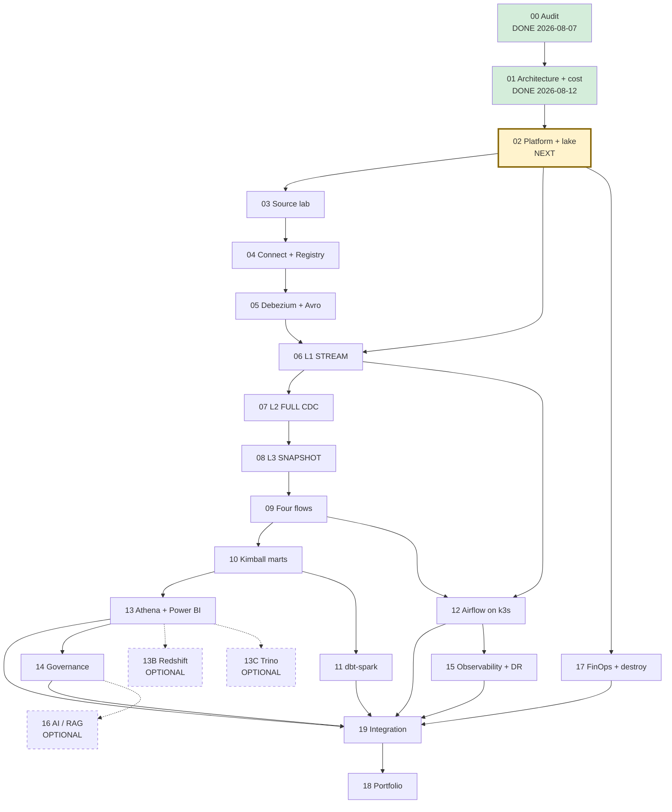

# SESSION DEPENDENCY GRAPH AND LOW-COST SEQUENCE — Sessions 00–19

- Session: 01 (addendum)
- Baseline: `MASTER_PLAN.md:20-43` of the guide package
- Corrected against: `docs/GAP_ANALYSIS.md`, `docs/TARGET_ARCHITECTURE.md`, `docs/COST.md`
- Status: `static-validated` — arithmetic and dependency reasoning only

`docs/TARGET_ARCHITECTURE.md` §4 gives the **Terraform module** graph. This document
gives the **session** graph, which is a different thing: it answers "what order do I
work in, and what does each step cost me".

---

## 1. Dependency graph



**Critical path (16 sessions):**

```text
00 → 01 → 02 → 03 → 04 → 05 → 06 → 07 → 08 → 09 → 10 → 13 → 19 → 18
```

Sessions 11, 12, 14, 15 and 17 hang off it and can be reordered within their
constraints. 13B, 13C and 16 are optional and outside the core release
(`MASTER_PLAN.md:53`).

## 2. Corrections to `MASTER_PLAN.md`'s dependency table

Five rows change as a consequence of Session 00's findings and Session 01's decisions.
Each correction has a concrete failure mode if ignored.

| Session | `MASTER_PLAN.md` says | Corrected | Why |
|---|---|---|---|
| **02** | depends on 01; builds "S3/KMS/Glue/Athena/IAM" | depends on 01; builds **the Kafka platform as well** | ADR-001 absorbs repo A. Session 02 is now the sole gateway to every later session — the platform is a deliverable, not a precondition. `docs/GAP_ANALYSIS.md` had to invent a "Gate 0" to express this; absorption removes the need. |
| **03** | depends on 01 | depends on **02** | The source lab needs the VPC, subnets and security groups that Session 02 creates. Under the old reading, Session 03 has nowhere to put an instance. |
| **04** | depends on 00, 03 | depends on **02, 03** | Connect needs a *running* MSK cluster and its security group, both from Session 02. Dependency on 00 is vestigial — 00 produced documents, not infrastructure. |
| **13** | depends on 10 | depends on **02** (creation) and **10** (content) | The Athena workgroup and its bytes-scanned cutoff are Terraform, built in Session 02. Session 13 *uses* Athena. Splitting creation from use is what lets Session 13 need no metered window at all (§4). |
| **17** | depends on "all enabled infra" | **budget guardrails move to 02**; 17 keeps teardown verification | Session 02 is the first session that can spend money, and a FinOps session arriving 15 sessions after the first spend is a post-mortem, not a control. *(Corrected 2026-08-12: the original supporting claim — "`budget_email` is `""` so the budget notifies nobody" — was wrong; two account-wide budgets already notify `owner@example.com`, see `docs/APPROVAL_GATES.md` §0. The conclusion stands on the sequencing argument alone, since a project-scoped tag-filtered budget is still worth having in 02.)* |

## 3. Which sessions need Kafka running — the cost-shaping insight

The single write path (`ARCHITECTURE.md:7`, `Kafka → L1 → L2 → L3 → mart`) has a
consequence nobody has exploited yet: **once L1 and L2 data exist in S3/Iceberg,
downstream sessions do not need Kafka, Connect or the source databases at all.**

| Session | MSK | Source lab | Connect | EMR Serverless | k3s | Athena |
|---|:-:|:-:|:-:|:-:|:-:|:-:|
| 02 | — | — | — | — | — | — |
| 03 | — | ✅ | — | — | — | — |
| 04 | ✅ | ✅ | ✅ | — | — | — |
| 05 | ✅ | ✅ | ✅ | — | — | — |
| 06 | ✅ | ✅ | ✅ | ✅ | — | — |
| 07 | ✅ | ✅ | ✅ | ✅ | — | — |
| **08** | — | — | — | ✅ | — | ✅ |
| 09 | ✅ | ✅ | ✅ | ✅ | — | ✅ |
| **10** | — | — | — | ✅ | — | ✅ |
| **11** | — | — | — | ✅ | — | ✅ |
| 12 | ✅ | ✅ | ✅ | ✅ | ✅ | — |
| **13** | — | — | — | — | — | ✅ |
| **14** | — | — | — | ✅ | — | ✅ |
| 15 | ✅ | ✅ | ✅ | ✅ | ✅ | ✅ |
| 17 | ✅ | ✅ | ✅ | ✅ | ✅ | ✅ |
| **18** | — | — | — | — | — | ✅ |
| 19 | ✅ | ✅ | ✅ | ✅ | ✅ | ✅ |

**Six sessions — 08, 10, 11, 13, 14, 18 — need no Kafka.** At $0.7749/hr for MSK
versus $0.3153/hr for EMR Serverless plus the Glue endpoint, batching those six into a
single lake-only window costs **$2.53 instead of $11.34** — and it is what keeps the
two-month core release at $30.53 rather than pushing it into a third month.

Session 13 needs **no metered window whatsoever**: Athena and S3 are both serverless,
so it costs bytes scanned (~$0.05) and nothing else.

## 4. Per-session cost

Rates from `docs/PRICE_REFERENCE.md`. A "window" is 6 hours unless noted.

| Session | Stack up | Marginal $/hr | Window cost | Notes |
|---|---|---:|---:|---|
| 00 | none | 0.0000 | **$0.00** | done; read-only |
| 01 | none | 0.0000 | **$0.00** | done; read-only |
| 02 | none — **probe retired** | 0.0000 | **$0.00** | OPEN-03 closed from CloudTrail; no apply |
| 03 | source lab | 0.2112 | **$1.27** | |
| 04 | + MSK + Connect | 1.0818 | **$6.49** | |
| 05 | same as 04 | 1.0818 | **$6.49** | |
| 06 | + EMR Serverless + Glue endpoint | 1.3971 | **$8.38** | |
| 07 | same as 06 | 1.3971 | **$8.38** | |
| 08 | **lake only** | 0.3153 | **$1.89** | L2 already in S3 |
| 09 | full CDC path | 1.3971 | **$8.38** | NRT needs live Kafka |
| 10 | **lake only** | 0.3153 | **$1.89** | |
| 11 | **lake only** | 0.3153 | **$1.89** | |
| 12 | + k3s | 1.5027 | **$9.02** | |
| 13 | **serverless only** | 0.0000 | **~$0.05** | Athena scan cost only |
| 14 | **lake only** | 0.3153 | **$1.89** | |
| 15 | full stack | 1.5027 | **$9.02** | failure drills need the real thing |
| 17 | full stack | 1.5027 | **$9.02** | must create in order to verify destroy |
| 18 | none | 0.0000 | **$0.00** | |
| 19 | full stack | 1.5027 | **$9.02** | end-to-end acceptance |
| | | | **≈ $85.03** | **one window each — nearly 3× the $30 budget** |
| 13B | + Redshift 8 RPU, 3 h | 3.6000 + stack | **$20.25** | optional |
| 13C | + Trino, 3 h | 0.4224 + stack | **$10.74** | optional |

One window per session does not fit. Sessions must be **batched**.

## 5. Low-cost implementation sequence

Batching sessions that need the same stack into shared windows. Nothing is reordered
across a dependency edge.

> **Re-derived 2026-08-13 against the real $30 budget (ADR-030).** The previous plan —
> 7 windows, $43.92, "fits one month's $80 budget" — was sized against a budget that never
> existed. Reproduce this table with `python3 scripts/derive-cost-envelope.py --budget 30`.

| Month | Window | Sessions | Stack | Hours | Cost |
|---|---|---|---|---:|---:|
| **1** | **W1** | 03 + 04 + 05 | source lab → Connect → Debezium | 4 | **$4.00** |
| **1** | **W2** | 06 + 07 | L1 then L2 | 5 | **$6.00** |
| **1** | **W3** | 09 | four flows — the only one needing live NRT | 4 | **$5.74** |
| | | | *month 1 windows* | | **$15.74** |
| | | | *+ floor* | | **$2.28** |
| | | | ***month 1 total*** | | **$18.02** — headroom **$11.98** |
| **2** | **W4** | 08 + 10 + 11 + 13 + 14 + 18 | **lake only, no Kafka** | 8 | **$2.53** |
| **2** | **W5** | 12 + 15 + 17 + 19 | Airflow → drills → teardown → end-to-end | 6 | **$7.70** |
| | | | *month 2 windows* | | **$10.23** |
| | | | *+ floor* | | **$2.28** |
| | | | ***month 2 total*** | | **$12.51** — headroom **$17.49** |
| | | | **core release** | **27 h** | **≈ $30.53 over two months** |

**The core release spans two months, and that is deliberate.** It would *technically* fit
one month at $28.25, leaving $1.75 — but a single W2 re-run costs $6.00, so a
one-month plan breaks on its first retry. Month 1 isolates the failure-prone
Kafka-dependent chain and gives it **$11.98 — two full W2 re-runs**.

The general rule, recorded in ADR-030: **when a budget tightens, spend the schedule before
you spend the architecture.** A second month costs $2.28 of carrying floor. Forcing one
month by dropping MSK to two brokers would save $4.91 and cost replication factor 3.

Changes from the previous sequence:

- **W0 is deleted.** It existed to probe `kafka.t3.small` for $0.06. OPEN-03 closed
  negative from CloudTrail without it — the MSK API had already rejected that instance
  type in this account on 2026-07-26. There is no cheaper broker to find.
- **W5 and W6 merged.** Session 17 must *create* infrastructure to prove it can be
  destroyed, which is the same stack sessions 12, 15 and 19 need. Running them as two
  windows paid twice for one stack. Saves **$3.08**.
- **Kafka windows shortened 6 h → 4–5 h.** Cost is almost purely hourly, so this is a
  direct saving; it requires the sessions to be scripted rather than explored. W2 keeps
  5 hours because it does the most novel work.
- **Session 18 folded into W4.** It is a portfolio write-up needing no infrastructure, so
  it costs nothing to sit inside the cheap lake-only window.

Ordering notes that still hold:

- **W1 batches 03 → 05 deliberately.** They form a chain where each step's output is the
  next step's input, and the failure modes (risks R2, R3, R15) are configuration errors
  discovered in minutes. Batching means one MSK spin-up instead of three.
- **W4 is the cheap window and it is large.** Six sessions for $2.53, because none needs
  Kafka. If budget gets tight, this is where to spend time rather than money.
- **Optional sessions come after the core release is accepted.** 13B alone is $20.25 —
  **68 % of a month's budget**, up from a quarter under the old assumption. It now needs a
  month of its own, and `MASTER_PLAN.md:53` forbids claiming either optional module
  without live testing.

## 6. Always-on versus ephemeral cost drivers

### Always-on — the floor, **~$2.28/month** (ADR-030)

Survives every `terraform destroy` because it lives in a different module or lifecycle.

| Driver | Rate | Monthly | Why it survives |
|---|---:|---:|---|
| KMS CMKs × 2 (platform, lake) | $1.0000/key-Mo | **$2.00** | 7–30 day deletion window; deliberately retained |
| ~~Secrets Manager × 4~~ → **SSM SecureString × 4** | **free, standard tier** | **$0.00** | ADR-031; was $1.60 |
| CloudWatch alarms × 6 | $0.1000/alarm-Mo | $0.60 | inherited from repo A `monitoring.tf` |
| S3 lake, 10 GiB | $0.0250/GB-Mo | $0.25 | the system of record — retention is the point |
| CloudWatch Logs, 5 GiB | $0.0300/GB-Mo | $0.15 | 7-day retention |
| State backend bucket | $0.0250/GB-Mo | ~$0.01 | must outlive every stack (ADR-021) |

### Ephemeral — per metered window

| Driver | Rate | Stop path | Destroy verify |
|---|---:|---|---|
| **MSK brokers × 3** | **$0.7650/hr** | **none — destroy only** | `list-clusters-v2` = 0 |
| MSK broker storage, 60 GiB | $0.0493/hr | with cluster | with cluster |
| Source lab `t3.xlarge` | $0.2112/hr | stop | `describe-instances` empty |
| CDC runtime `t3.large` | $0.1056/hr | stop | `describe-instances` empty |
| k3s `t3.large` | $0.1056/hr | stop | `describe-instances` empty |
| EMR Serverless (ARM 4/16) | $0.3023/hr | auto-stop 15 min | `list-applications` empty |
| Glue interface endpoint | $0.0130/hr | **none — destroy only** | `describe-vpc-endpoints` empty |
| Redshift Serverless, 8 RPU | $3.6000/hr | **none — destroy only** | workgroup **and** namespace empty |
| Trino, 3 instances | $0.4224/hr | scale to 0 | no pods, no volumes |

### The trap: "ephemeral" resources that bill after `stop`

| Left behind by `stop` | Rate | 150 GiB / typical | Monthly |
|---|---:|---|---:|
| **EBS gp3 on stopped instances** | $0.0960/GB-Mo | 150 GiB | **$14.40** |
| Interface endpoints outliving their workload | $0.0130/hr | 1 endpoint | $9.49 |
| Redshift managed storage after workgroup deletion | $0.0261/GB-Mo | 5 GiB | $0.13 |

Stopping rather than destroying raises the floor from $2.28 to roughly **$16/month** —
a quarter of the budget for a lab doing nothing, and it cuts the affordable window count
from 7.9 to 6.4. This is why ADR-027 makes destroy the default and why
`make stop-ephemeral` is scoped to *within* a window only.

## 7. Read-only integration contract — conditional form

`prompts/00_PROMPT.md` asks for a read-only contract for consuming existing VPC,
subnet, security group, MSK bootstrap broker, cluster ARN, KMS and monitoring outputs.
Under ADR-001 these became **module outputs inside one state**
(`docs/TARGET_ARCHITECTURE.md` §5), because there is no running platform to consume —
verified empty on 2026-08-12.

The read-only form is retained here as the **fallback** if the absorption decision is
ever reversed, and as the shape Session 02 must expose either way:

```hcl
# Only valid once a platform exists AND has an S3 backend (ADR-021).
# Not usable today: repo A has local state and 5 of 16 keys.
data "terraform_remote_state" "kafka_platform" {
  backend = "s3"
  config = {
    bucket = "<state-bucket>"
    key    = "kafka-dev-lab/dev/terraform.tfstate"
    region = "ap-southeast-1"
  }
}
```

| Contract key | Consumed as | Read-only safe? |
|---|---|---|
| `vpc_id`, `vpc_cidr` | SG creation, subnet math | yes |
| `private_subnet_ids`, `public_subnet_ids` | workload placement | yes |
| `availability_zones`, `private_route_table_ids` | endpoint placement and association | yes |
| `msk_cluster_arn`, `msk_cluster_name` | IAM policy scoping, CW dimensions | yes |
| `msk_bootstrap_brokers_sasl_iam` | Connect and Spark client config | yes — connection metadata, not a secret |
| `msk_security_group_id`, `toolbox_security_group_id` | SG-to-SG ingress rules | yes |
| `platform_kms_key_arn` | reference only — the lake gets its own CMK | yes |
| `toolbox_instance_id`, `toolbox_role_arn` | SSM access, trust policies | yes |
| `grafana_password_parameter_name` | SSM parameter **name** only | yes — never the value |

Two rules hold in either topology:

1. **Never output a secret value.** Repo A's pattern — generate at apply, write to SSM
   SecureString, output only the parameter *name* — is correct and is carried forward
   (`CLAUDE.md` §3.6).
2. **A consumer must fail loudly when the platform is absent**, not silently plan a
   second one. Tag-based `aws_*` data sources fail this test, which is why
   `docs/GAP_ANALYSIS.md` §4.1 option (C) was rejected.
