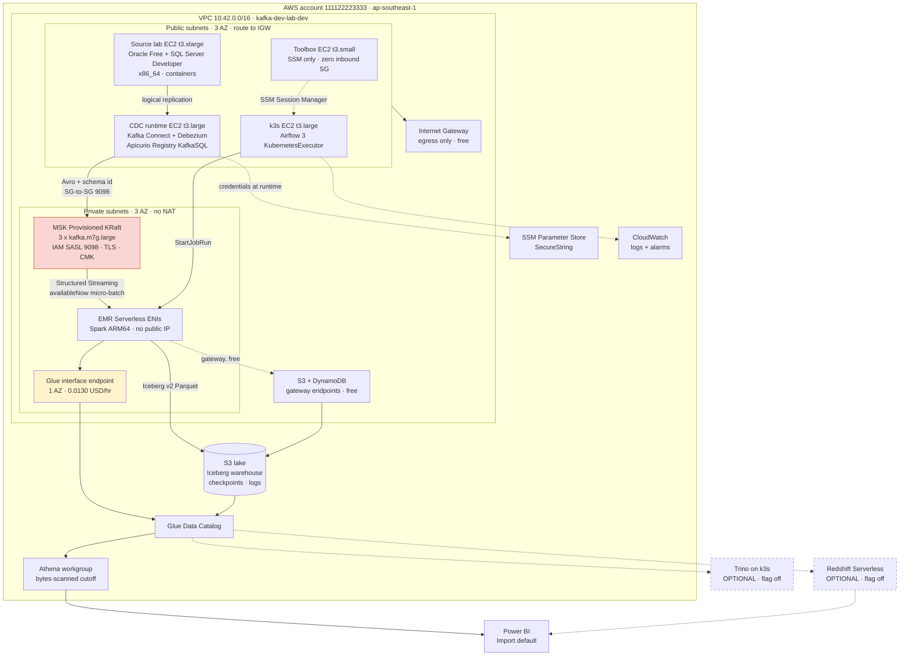
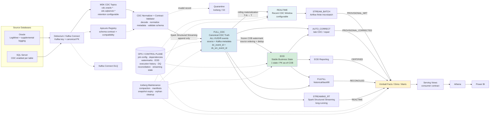
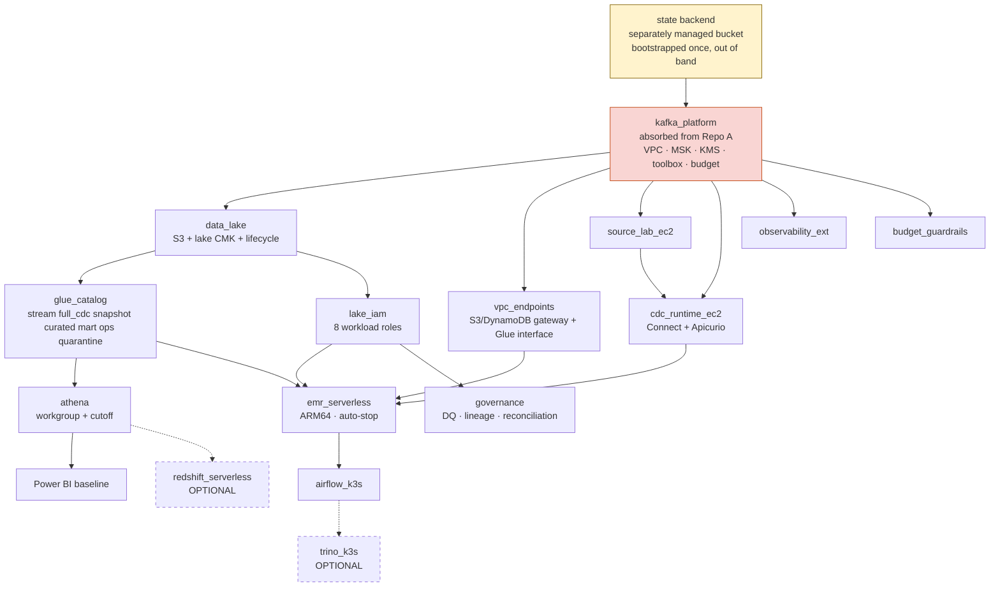

# TARGET ARCHITECTURE

- Session: 01
- Status: **NORMATIVE for implementation**. Supersedes the guide package's `ARCHITECTURE.md` wherever they differ.
- Inputs: `docs/EXISTING_PLATFORM_AUDIT.md`, `docs/GAP_ANALYSIS.md`, `docs/SOURCE_REPOSITORY_DECISION.md`, `docs/COST.md`, `docs/DATA_CONTRACTS.md`
- Decisions: `docs/adr/`

---

## 1. What changed from the guide's architecture, and why

The guide package's `ARCHITECTURE.md` is a sound logical design, but it was written
against a premise Session 00 disproved. Three corrections are structural:

| Guide assumption | Reality | Consequence |
|---|---|---|
| A Kafka platform exists and only the lakehouse needs building | Nothing is deployed; account verified empty on 2026-08-12 | The platform is **in scope**, absorbed as a module (ADR-001) |
| Reuse happens via existing outputs / remote state | Repo A has local state and exports 5 of 16 needed keys | Absorption makes them module outputs; no remote state needed (ADR-001, ADR-021) |
| Private compute simply runs in private subnets | Private route tables have **zero routes**; no NAT by policy | Egress is designed per workload, not uniformly (ADR-022) |

And one correction is economic: `docs/COST.md` §1 shows the platform at 7× budget if
run continuously, so **ephemerality is an architectural constraint** (ADR-027), not
an operational preference. That is why every component below has a destroy path and
why the lifecycle matrix in §7 is part of the architecture rather than a runbook.

---

## 2. Deployment topology

The guide's `README.md:27` diagram is logical and shows no network, so it cannot
express the Gap 8 problem. This one does.



Three things this diagram encodes that the logical one cannot:

1. **Compute that needs internet lives in public subnets with zero-inbound security
   groups and reaches out through the IGW for free.** This is repo A's audited
   toolbox pattern (`network.tf:29`) extended to three more workloads. `CLAUDE.md`
   §3.3 forbids inbound `0.0.0.0/0`; it does not forbid a public IP behind a
   zero-inbound SG.
2. **EMR Serverless is the only workload that cannot use that path**, because its
   ENIs never get public IPs. It gets the S3 gateway endpoint (free) and exactly one
   interface endpoint (Glue). See `docs/COST.md` §2.1.
3. **MSK stays private and is reached by security-group reference on 9098**, never by
   CIDR. No endpoint is involved; it is in-VPC traffic.

## 3. Data flow and the processing flows

CORRECTED 2026-08-21. The previous version of this diagram drew a three-step CHAIN
(`L1 STREAM -> L2 FULL_CDC -> L3 SNAPSHOT`) and hung the near-real-time and auto-correct
flows off **L1**. Both details were wrong, and the second was not merely a drawing error:
ADR-033 forbids reporting from the raw landing, and `source_resolver.resolve()` refuses
`FULL_CDC_RAW` outright. The diagram therefore described a pipeline the framework would
have rejected at runtime. `reporting/layers.yaml` had already recorded the underlying
ambiguity -- "`full_cdc` means L2 in this repository and L1 in the architecture prompt" --
without resolving it.

It is resolved here, in favour of the architecture the reporting framework already
implements in `spark/reporting/models.py`:

**FULL_CDC is the canonical layer and is written DIRECTLY from Kafka.** REALTIME and EOD
are SIBLINGS derived from it -- a fan-out, not a chain. Nothing reports from the raw
landing.



### Why the fan-out, and not a chain

A chain implies EOD can only be rebuilt by first rebuilding an intermediate. It cannot,
and must not: EOD is a *deterministic function of FULL_CDC and a cutoff*. Rebuilding it
means re-reading FULL_CDC with the same cutoff and the same `event_order` ranking, which
is what makes a FULFILL of any historical date reproducible years later. An intermediate
layer between them would have to be reconstructed to the state it held on that date, and
nothing does that.

REALTIME is the same function with a different bound (`T-N -> T` instead of `<= T-1`),
which is precisely why it is a sibling rather than a descendant.

### Logical layer -> physical database

Logical names are the contract; the physical Glue databases are deployed and are NOT
renamed (`reporting/layers.yaml` is the only place the mapping appears).

| Logical | Physical database | Role |
|---|---|---|
| `FULL_CDC` (L1) | `kafka_dev_lab_dev_full_cdc` | **canonical**, append-only, written straight from the normalizer |
| `REALTIME` (L2) | `kafka_dev_lab_dev_stream` | the **STREAM** layer: rolling window `T-N → T`, materialised FROM `FULL_CDC` |
| `EOD` (L3) | `kafka_dev_lab_dev_snapshot` | the **SNAPSHOT** layer: dedup as-of COB `T-1`, deletes applied |
| `CURATED` | `kafka_dev_lab_dev_curated` | conformed business facts |
| `MART` | `kafka_dev_lab_dev_mart` | Kimball serving grain |
| `OPS` | `kafka_dev_lab_dev_ops` | control plane: config, watermarks, executions, DQ |
| `FULL_CDC_RAW` | *(no binding)* | There is no raw landing database — Kafka is decoded and validated straight into `FULL_CDC`. The enum member survives only so `resolve()` can refuse the layer by name (ADR-033). |

`kafka_dev_lab_dev_stream` is **REALTIME**, not a landing zone. The database name predates
this layer model and is not renamed because it is deployed and holds data; `layers.yaml` is
the only place the mapping appears. Layer docs: `docs/L1_FULL_CDC.md`,
`docs/L2_REALTIME_STREAM.md`, `docs/L3_SNAPSHOT.md`.

### Which layer each mode reads

This table is normative and mirrors `SourceLayerPolicy` in `spark/reporting/models.py`.

| Mode | Reads | Writes tier | Runtime |
|---|---|---|---|
| EOD Reporting | `EOD` | `CERTIFIED` | dbt-Spark batch |
| FULFILL | `EOD` **and** `FULL_CDC` | `RECONCILED` | dbt-Spark batch |
| AUTO_CORRECT | `FULL_CDC` **or** `EOD` | `PROVISIONAL_CORRECTED` | dbt-Spark batch |
| STREAM_BATCH | `REALTIME` | `PROVISIONAL_NRT` | Airflow finite micro-batch |
| STREAMING_RT | `FULL_CDC` append (ADR-041) | `REALTIME` | long-running Structured Streaming |

Three of these deserve their reason stated, because the obvious simplification of each is
wrong:

**AUTO_CORRECT reads `FULL_CDC`, not `REALTIME`,** when it needs an event older than the
rolling window's retention — which is exactly the event a correction exists to catch. A
correction restricted to the recent window can only fix what was never really broken.

**FULFILL reads `EOD` *and* `FULL_CDC`.** `EOD` answers a backfill for a date that closed
normally. A date that never closed has no `EOD` state to read, so the backfill has to
re-derive it from `FULL_CDC` with that date's cutoff — which is possible only because
`EOD` is a deterministic function of `FULL_CDC` and a cutoff, never a mutated copy.

**STREAMING_RT stamps `REALTIME`, not `PROVISIONAL_NRT`.** They are different tiers on the
ladder: `PROVISIONAL_NRT` is a *completed finite batch over a closed window*, whereas a
continuous stream has no closed window and no completeness claim at all. Collapsing them
would let a stream's partial view of a business date outrank, or be outranked by, a batch
that genuinely finished — and the ladder could no longer tell which.

### The CDC Normalizer is a layer boundary, not a utility

Nothing writes to `FULL_CDC` directly from a topic. Every record passes the **CDC
Normalizer + Contract Validator**, which decodes the Avro payload against the registry,
normalises source and Kafka metadata into the canonical envelope, and validates the record
against its schema contract. A record that fails goes to **quarantine** (Iceberg/S3) with
its error class, stack hash and source coordinates (CLAUDE.md §5.10) — it is never dropped
and never written half-formed.

This is distinct from the **Kafka Connect DLQ**, which catches records that fail *before*
they reach a topic. Two different failure domains, two different sinks: the DLQ is
Debezium's, the quarantine is the lakehouse's.

### Two identities on every FULL_CDC row

| Column | Derived from | Answers |
|---|---|---|
| `dv_src_event_id` | source change coordinates (SCN / LSN + PK) | "is this the same *source change*?" |
| `dv_event_id` | Kafka coordinates + record timestamp | "is this the same *delivered record*?" |

Keeping both is not redundancy. Session 34 proved what one alone costs: with identity
derived from `(topic, partition, offset)` only, a rebuilt MSK cluster restarted every
partition at offset 0, so a genuinely new snapshot of different data reproduced the same
ids. The `MERGE ... WHEN NOT MATCHED` discarded all 5,728 fresh events as duplicates, the
table stayed at its previous count, no curated partition appeared for the new business
date, and nothing errored anywhere.

`dv_event_id` makes a **re-read of the same record** idempotent. `dv_src_event_id` makes a
**re-delivery of the same source change** — through a new cluster, a re-snapshot, or a
connector reset — recognisable as the same business event. A pipeline that can be replayed
needs both answers, and they are not the same question.

### The OPS control plane

`OPS` is not a log. It holds job config, the dependency graph, watermarks, EOD state,
execution history, DQ results, reconciliation runs and streaming application state, and it
governs `FULL_CDC`, `REALTIME`, `EOD` and `MART` alike. The dotted edges are control, not
data: no business row flows along them, and every flow above refuses to run when the
control plane cannot be read (`gates.py` raises rather than treating an unevaluable gate as
open).

### Iceberg maintenance

Every Iceberg table needs compaction, manifest rewrites, snapshot expiry and orphan-file
cleanup (CLAUDE.md §6). Retention must exceed the longest window any job might still commit
into, or cleanup races a live writer.

Status precedence for the same business grain (`ARCHITECTURE.md:121`, unchanged):

```text
CERTIFIED > RECONCILED > PROVISIONAL_CORRECTED > PROVISIONAL_NRT
```

A provisional row must never overwrite a certified one. Column-level contracts for
every layer are in `docs/DATA_CONTRACTS.md`, which is normative — this diagram is
orientation only.


## AI / ML Platform Extension

The AI/ML platform is an optional downstream extension of the existing
CDC Lakehouse and Reporting Platform.

The AI platform MUST NOT alter the semantics of:

- FULL_CDC
- REALTIME
- EOD
- CURATED
- MART
- OPS

The AI platform consists of four logically separate planes:

1. RAG / Knowledge Plane
2. Feature / ML Plane
3. AI Agent Plane
4. AI Governance / LLMOps Plane

The normative AI architecture is defined in:

docs/AI_TARGET_ARCHITECTURE.md

Core invariant:

FULL_CDC remains the canonical durable CDC truth.

AI applications consume existing lakehouse/reporting contracts and do not
become an alternative system of record.

RAG must not be used as a replacement for structured analytical queries.

Structured business questions use governed Athena access over MART/SERVING.

Feature Store is an ML feature-serving concern and is not the RAG vector store.

Agent V1 is read-only.


## 4. Module dependency graph

`MASTER_PLAN.md:20-43` sequenced sessions on the assumption that the platform was a
precondition rather than a deliverable. Absorption (ADR-001) folds it into the graph
and removes the separate "Gate 0" that `docs/GAP_ANALYSIS.md` had to invent.



Two ordering facts worth stating because they are easy to get wrong:

- **The state backend bucket is bootstrapped out of band and is never managed by the
  stack that stores state in it.** Repo A's `backend.hcl.example:1` already says this
  ("Do not let the disposable lab delete its own state backend") and it is correct.
  ADR-021 preserves it.
- **`source_lab_ec2` precedes `cdc_runtime_ec2`** because Debezium's initial snapshot
  fails against a database that has not yet enabled supplemental logging / CDC. The
  guide's `MASTER_PLAN.md` has 04 depending on 00 and 03, which is consistent; it is
  restated here because the failure is silent (the connector starts and produces
  nothing).

## 5. Integration contract — resolved

`docs/GAP_ANALYSIS.md` §4 scored 5 of 16 keys available. Under absorption every key
becomes a **module output within one state**, so `terraform_remote_state`,
tag-lookup data sources, and cross-repo apply ordering all disappear. This table is
the checklist Session 02 implements.

| Contract key | Type | Producing resource in `modules/kafka_platform` | Consumers |
|---|---|---|---|
| `aws_account_id` | string | `data.aws_caller_identity.current` | identity guard |
| `aws_region` | string | `var.aws_region` | identity guard |
| `vpc_id` | string | `aws_vpc.this` | every new security group |
| `vpc_cidr` | string | `aws_vpc.this.cidr_block` | endpoint SG rules, subnet math |
| `private_subnet_ids` | list(string) | `aws_subnet.private[*]` | EMR Serverless network config |
| `public_subnet_ids` | list(string) | `aws_subnet.public[*]` | source lab, CDC runtime, k3s, toolbox |
| `availability_zones` | list(string) | `data.aws_availability_zones` | endpoint AZ placement |
| `private_route_table_ids` | list(string) | `aws_route_table.private[*]` | S3/DynamoDB **gateway** endpoint association |
| `public_route_table_id` | string | `aws_route_table.public` | IGW egress verification |
| `msk_cluster_arn` | string | `aws_msk_cluster.this.arn` | IAM policy scoping |
| `msk_cluster_name` | string | `aws_msk_cluster.this.cluster_name` | CloudWatch dimensions, topic ARNs |
| `msk_bootstrap_brokers_sasl_iam` | string | `aws_msk_cluster.this.bootstrap_brokers_sasl_iam` | Connect worker, Spark `kafka.bootstrap.servers` |
| `msk_security_group_id` | string | `aws_security_group.msk` | SG-to-SG ingress on 9098 |
| `toolbox_security_group_id` | string | `aws_security_group.toolbox` | SSM jump path, Prometheus scrape source |
| `toolbox_instance_id` | string | `aws_instance.toolbox.id` | SSM shell / port forward |
| `toolbox_role_arn` | string | `aws_iam_role.toolbox.arn` | trust policy references |
| `platform_kms_key_arn` | string | `aws_kms_key.this.arn` | MSK encryption; **not** reused for the lake |

### 5.1 Two keys and a deliberate divergence

- **`platform_kms_key_arn` is exported but the lake gets its own CMK.** Gap 2 listed
  `kms_key_arn` as "decide: reuse for the lake, or issue a separate lake CMK". The
  decision is **separate**: key policies differ (the lake key is used by EMR
  Serverless, Athena and Glue; the platform key by MSK), rotation and deletion
  lifecycles differ, and a single key makes least-privilege key policies impossible
  to write. Cost is $1/month per key (`docs/PRICE_REFERENCE.md` §6) — a defensible
  price for separable blast radius. ADR-023 records it.
- **`bootstrap_brokers_sasl_iam` is renamed to `msk_bootstrap_brokers_sasl_iam`.**
  Repo A's name (`outputs.tf:14`) lacks the `msk_` prefix that every other key has.
  Renaming at absorption time costs nothing; renaming later breaks consumers.

## 6. Component register

Every component with a runtime, an owner, a flag, a cost class and a destroy path —
the acceptance criterion at `sessions/01_cost_and_target_architecture.md:31`.

| Component | Runtime | Owner | `enable_*` flag | Cost class | Stop | Destroy verify |
|---|---|---|---|---|---|---|
| State backend bucket | S3 + native lockfile | platform | none (bootstrap) | always-on, ~$0.01/mo | n/a | never destroyed with the stack |
| VPC / subnets / IGW | AWS network | platform | none (core) | free | n/a | `describe-vpcs` empty |
| MSK Provisioned KRaft | 3 × `kafka.m7g.large` | platform | `enable_kafka_platform` | **metered-window, $0.8143/hr** | none — destroy only | `list-clusters-v2` = 0 |
| Toolbox EC2 | `t3.small` public/zero-inbound | platform | `enable_toolbox` | metered-window | stop (EBS still bills) | `describe-instances` empty |
| S3 data lake | S3 + lake CMK | lake | none (core) | always-on, ~$0.25/mo | n/a | intentionally retained |
| Lake CMK | KMS | lake | none (core) | always-on, **$1.00/mo** | n/a | 7–30 day pending window |
| Glue databases | Glue Data Catalog | lake | none (core) | ~free | n/a | `get-databases` |
| Athena workgroup | Athena serverless | serving | `enable_athena` = **true** | per-query, $5/TB | n/a | `list-work-groups` |
| VPC endpoints | 1 Glue interface + 2 gateway | platform | `enable_emr_serverless` | metered-window, $0.0130/hr | none — destroy only | `describe-vpc-endpoints` empty |
| Source lab EC2 | `t3.xlarge` x86_64 | source-lab | `enable_source_lab` | metered-window, $0.2112/hr | stop | `describe-instances` empty |
| CDC runtime EC2 | `t3.large` Connect + Apicurio | cdc | `enable_cdc_runtime` | metered-window, $0.1056/hr | stop | `describe-instances` empty |
| EMR Serverless | ARM64, auto-stop 15 min | spark | `enable_emr_serverless` | per-job, $0.302/hr at 4 vCPU/16 GB | auto-stop | `list-applications` empty |
| k3s + Airflow 3 | `t3.large`, `KubernetesExecutor` | airflow | `enable_airflow` | metered-window, $0.1056/hr | stop | `describe-instances` empty |
| Governance / DQ / lineage | Spark + Glue + `ops` tables | governance | `enable_governance` | per-job | n/a | table-level |
| Observability | Prometheus/Grafana on toolbox + CW | sre | `enable_observability_ext` | ~$0.75/mo alarms | n/a | `describe-alarms` |
| Budget guardrails | AWS Budgets | finops | none (core) | free | n/a | intentionally retained |
| Redshift Serverless | 8 RPU private workgroup | serving | `enable_redshift_serverless` = **false** | **$3.60/hr** | destroy only | `list-workgroups` empty |
| Trino | k3s coordinator + 2 workers | serving | `enable_trino` = **false** | $0.4224/hr | scale to 0 | `kubectl get pods` empty |

**Components with no stop path — only destroy:** MSK, VPC endpoints, Redshift
Serverless. For MSK this matters most: there is no "stop a cluster" operation, so the
only cost control is deletion, and deletion loses topic data. This is exactly why
`docs/DATA_CONTRACTS.md` §6.2 keeps watermarks in `ops.layer_watermark` — the
pipeline must be able to resume from S3 state after the cluster is recreated.

## 7. Resource lifecycle matrix

The last column is the one that prevents surprise invoices.

| Resource | Created by | Stop command | Destroy command | Still bills after **stop** |
|---|---|---|---|---|
| MSK cluster | `enable_kafka_platform` | — | `terraform destroy -target=module.kafka_platform` | n/a (no stop) |
| MSK broker storage | with cluster | — | with cluster | n/a |
| EC2 instances | per-workload flag | `aws ec2 stop-instances` | `terraform destroy -target=...` | **EBS: $0.096/GB-Mo** |
| EBS volumes | with instance | — | with instance | **yes — the #1 forgotten cost** |
| VPC interface endpoint | `enable_emr_serverless` | — | with flag | n/a (no stop) |
| EMR Serverless app | `enable_emr_serverless` | auto-stop after 15 min idle | `terraform destroy -target=...` | nothing |
| Redshift Serverless | `enable_redshift_serverless` | — | `terraform destroy -target=...` | managed storage $0.0261/GB-Mo |
| S3 lake objects | Spark jobs | — | lifecycle rules + explicit empty | **yes — intentionally retained** |
| KMS CMKs | core | — | `schedule-key-deletion` (7–30 d) | **yes — $1.00/key-Mo through the window** |
| SSM SecureString parameters | per-workload | — | `delete-parameter` (immediate) | **no — standard tier is free** (ADR-031) |
| CloudWatch log groups | per-workload | — | `delete-log-group` | **yes — $0.03/GB-Mo** |
| CloudWatch alarms | `enable_observability_ext` | — | with module | **yes — $0.10/alarm-Mo** |

`make stop-ephemeral` is deliberately **not** the cost control for this project.
Stopping leaves EBS, CMKs, secrets, log groups and alarms billing — $19/month on the
baseline configuration, a quarter of the budget for a lab that is doing nothing.
`docs/COST.md` §3.2 quantifies it; ADR-027 makes destroy the default action.

## 8. Feature flag matrix

| Flag | Default | Enables | Cost class | Mutual exclusion |
|---|---|---|---|---|
| `enable_kafka_platform` | `true` | VPC, MSK, platform CMK, budget | metered-window | — |
| `enable_toolbox` | `true` | toolbox EC2, Prometheus/Grafana | metered-window | — |
| `enable_athena` | **`true`** | Athena workgroup + cutoff | per-query | — |
| `enable_source_lab` | `false` | Oracle + SQL Server containers | metered-window | — |
| `enable_cdc_runtime` | `false` | Connect + Apicurio | metered-window | requires `enable_source_lab` |
| `enable_emr_serverless` | `false` | Spark app + Glue endpoint | per-job | — |
| `enable_airflow` | `false` | k3s + Airflow 3 | metered-window | requires `enable_emr_serverless` |
| `enable_eks` | `false` | EKS instead of k3s | always-on control plane | excludes `enable_airflow` k3s mode |
| `enable_governance` | `false` | DQ, lineage, catalog metadata | per-job | — |
| `enable_observability_ext` | `true` | lakehouse alarms and dashboards | ~$0.75/mo | — |
| `enable_redshift_serverless` | **`false`** | namespace + workgroup + usage limit | **$3.60/hr** | excludes `enable_trino` unless override |
| `enable_trino` | **`false`** | Trino on k3s | $0.4224/hr | excludes `enable_redshift_serverless` unless override |
| `enable_marquez` | `false` | OpenLineage backend | metered-window | — |
| `enable_lake_formation` | `false` | LF-tag governance | free | — |
| `allow_multiple_optional_query_engines` | **`false`** | permits Redshift + Trino together | — | the override itself |
| `enable_reporting_framework` | **`false`** | 4 DynamoDB tables + reporting IAM + 3 S3 prefixes (`modules/reporting_ops`) | **$0.00 idle**, on-demand | **NOT YET WRITTEN** — Phase 4; needs ADR-036 sign-off |
| `enable_streaming_rt` | **`false`** | long-running Spark Structured Streaming reporting app | **hourly while up** — the framework's one hourly cost | **NOT YET WRITTEN** — Phase 4; bounded daily window when on (ADR-041) |

Mutual exclusion is enforced by a Terraform `validation` block, not by review
(ADR-026, closing defect D17):

```hcl
variable "allow_multiple_optional_query_engines" {
  type    = bool
  default = false
}

# In the root module:
lifecycle {
  precondition {
    condition = var.allow_multiple_optional_query_engines || !(
      var.enable_redshift_serverless && var.enable_trino
    )
    error_message = <<-EOT
      enable_redshift_serverless and enable_trino cannot both be true unless
      allow_multiple_optional_query_engines = true. Combined cost is ~$4.02/hr
      (docs/COST.md sections 4 and 5) — over a quarter of the monthly budget per
      session. Set the override deliberately and record the reason in
      DECISION_LOG.md.
    EOT
  }
}
```

Three documents stated this rule three different ways with three different strengths
(`ARCHITECTURE.md:199`, `reference/SERVING_LAYER_STRATEGY.md:103`, `CLAUDE.md` §8) —
that was defect D17. Only the machine-checkable form survives.

## 9. Security boundaries

Restated per workload because absorption changes who runs where. `docs/SECURITY.md`
(Session 02) is the full treatment; these are the invariants that constrain the
design.

| Invariant (`CLAUDE.md` §3) | How this architecture satisfies it |
|---|---|
| No static credentials anywhere | Instance profiles + EMR Serverless job role; DB passwords generated at apply into **SSM SecureString** (ADR-031), read at runtime, never in outputs or user-data |
| No IAM users or access keys created | 8 workload **roles**; the pre-existing `my-aws-profile` IAM user is the human operator and is not created by this stack |
| No inbound `0.0.0.0/0` | Every SG has zero inbound rules or SG-to-SG references only. Public-subnet instances have public IPs for **egress**; the SG blocks all inbound |
| No SSH, no key pairs | SSM Session Manager and port forwarding; no `key_name` on any instance |
| S3 BPA, KMS, bucket-owner-enforced, TLS-only | Enforced in `modules/data_lake`; TLS-only via bucket policy `aws:SecureTransport` condition |
| Secrets from **SSM SecureString** at runtime (ADR-031) | Connect and source lab read at container start; no plaintext in env or user-data |
| Per-workload IAM roles | connect, spark, airflow, athena, redshift-serverless, trino, governance, source-lab |
| State encrypted, locked, IAM-restricted | ADR-021: S3 + CMK + `use_lockfile`, bucket policy restricting to the operator principal |
| Pinned versions, no `latest` | `docs/VERSIONS.md`; provider pins inherited from repo A (`aws = 6.56.0`) |
| Third-party GitHub Actions pinned to SHA | Session 15/18 when CI is added (Gap 16) |

**The one posture change requiring explicit review:** four workloads move to public
subnets with public IPs and zero-inbound security groups (§2). This is repo A's
audited toolbox pattern, but applying it more broadly widens the surface, and the
tradeoff is $0.00/hr versus $0.1040/hr for the A-min endpoint set
(`docs/COST.md` §2). If the security review rejects it, fall back to A-min and
re-derive the window count — the design is structured so only the `vpc_endpoints`
module and subnet assignments change.

## 10. Failure and recovery paths

| Failure | Detection | Recovery | RPO / RTO |
|---|---|---|---|
| Connect worker dies | Connect REST status; CW alarm on task state | Restart; offsets in internal topics resume | RPO 0, RTO minutes |
| Streaming job fails mid-batch | Airflow task failure; EMR job state | Restart from Iceberg + Spark checkpoint; `event_id` makes replay idempotent | RPO 0, RTO minutes |
| **Streaming down > 24 h** | freshness alarm | **Kafka retention is 24 h — unread events are gone. Requires Debezium re-snapshot** | **RPO 24 h**, RTO hours |
| Poison record | DLQ depth alarm | Quarantine with error class + stack hash + payload S3 reference; pipeline continues | RPO 0 |
| L2 rerun for same cutoff | reconciliation ledger | Idempotent by `event_id`; safe to repeat | — |
| L3 wrong after late events | reconciliation variance | Rebuild the `snapshot_date` partition from L2; deterministic by `event_order` | — |
| MSK destroyed between windows | `list-clusters-v2` = 0 | Recreate; resume from `ops.layer_watermark`; source re-snapshot if beyond retention | RPO ≤ 24 h |
| Airflow metadata loss | Airflow unavailable | Postgres PVC backup; DAGs are code in Git | RTO hours |
| State file loss | `terraform plan` shows full create | S3 versioning on the backend bucket | RPO ~0 |

**`RPO = 24 hours` is a decision, not an accident.** It follows directly from
`log.retention.hours=24` (Gap 13). Raising it means raising Kafka retention, which
raises broker storage, which is the cost driver in `docs/COST.md` §1.1 — and MSK
storage cannot be reduced afterwards. Session 05/06 must either accept 24 h
explicitly or pay for more, with the arithmetic recorded.

## 11. Test matrix

| Layer | Static | Deployed | Live-tested |
|---|---|---|---|
| Terraform | `fmt`, `validate`, `tflint`, `checkov` | saved plan reviewed | apply + destroy + verify-destroy |
| Docs | `scripts/validate-docs.py`, placeholder + secret scans | — | — |
| CDC contract | Avro schema compatibility unit tests | connector deployed | I/U/D captured; same PK → same partition |
| L1 | Spark unit tests on the envelope parser | table created | raw event + all metadata present |
| L2 | idempotency unit test on `event_id` | table created | rerun same cutoff → no duplicates |
| L3 | ranking unit test incl. tie-breakers | table created | as-of T-1 correct; rebuild → equal checksum |
| Four flows | — | DAGs deployed | NRT ≤ 10 min; certified not overwritten |
| Athena | named query syntax | workgroup created | mart query returns; cutoff enforced |
| Security | `tflint` + `checkov` rules | plan shows no `0.0.0.0/0` | SG audit; no public S3; SSM-only access |
| Cost | `docs/COST.md` arithmetic | `show-cost-resources` | Cost Explorer delta vs §3.3 |
| Destroy | — | destroy plan | `verify-destroy` all-empty |

`CLAUDE.md` §9.7 requires distinguishing these. **Everything in this document is
`static-validated` or `planned`.** Nothing is `deployed` or `live-tested`.

## 12. Implementation checklist for Session 02

In order. Each item is independently verifiable.

1. Install `tflint` and `checkov` — absent from this machine; `terraform` 1.15.8 is present.
2. **Test `kafka.t3.small` availability** (OPEN-03). Highest-value question in the project: a favourable answer raises lab time by about 60 % (~8 -> ~12.6 windows; docs/COST.md §3.3, corrected 2026-08-12).
3. Bootstrap the state backend bucket out of band, with versioning and a CMK. Never managed by the stack that uses it.
4. Absorb Repo A into `terraform/modules/kafka_platform/` with a `PROVENANCE.md` recording source path, copy date and every local modification.
5. Apply the absorption edits: rename `Project` to `kafka-dev-lab` / `Environment` to `dev`; update the budget cost filter; `broker_ebs_gib = 20`; `enable_storage_autoscaling = false`; real `auto_destroy_after` timestamp.
6. Add the 12 missing outputs from §5, including the `msk_` prefix rename.
7. Write `modules/data_lake` — bucket, lake CMK, BPA, TLS-only policy, prefix layout per `docs/DATA_CONTRACTS.md` §8, lifecycle rules.
8. Write `modules/glue_catalog` — 7 databases including `ops`.
9. Write `modules/lake_iam` — 8 workload roles.
10. Write `modules/athena` — workgroup, results prefix, encryption, 10 GB cutoff, `enforce_workgroup_configuration = true`.
11. Write `modules/vpc_endpoints` — S3 + DynamoDB gateway on private route tables; Glue interface in one AZ, gated on `enable_emr_serverless`.
12. Root feature flags and the `allow_multiple_optional_query_engines` precondition from §8.
13. `terraform fmt`, `validate`, `tflint`, `checkov`; saved plan; verify zero `0.0.0.0/0` ingress and no plaintext secret in the plan.
14. Resolve defect D6 — reconcile `reference/TERRAFORM_MODULE_MAP.md`'s 14 modules against `reference/REPO_TREE_TARGET.md`'s 5.
15. Do **not** apply. Session 02 ends at `READY_FOR_APPLY_APPROVAL`.


